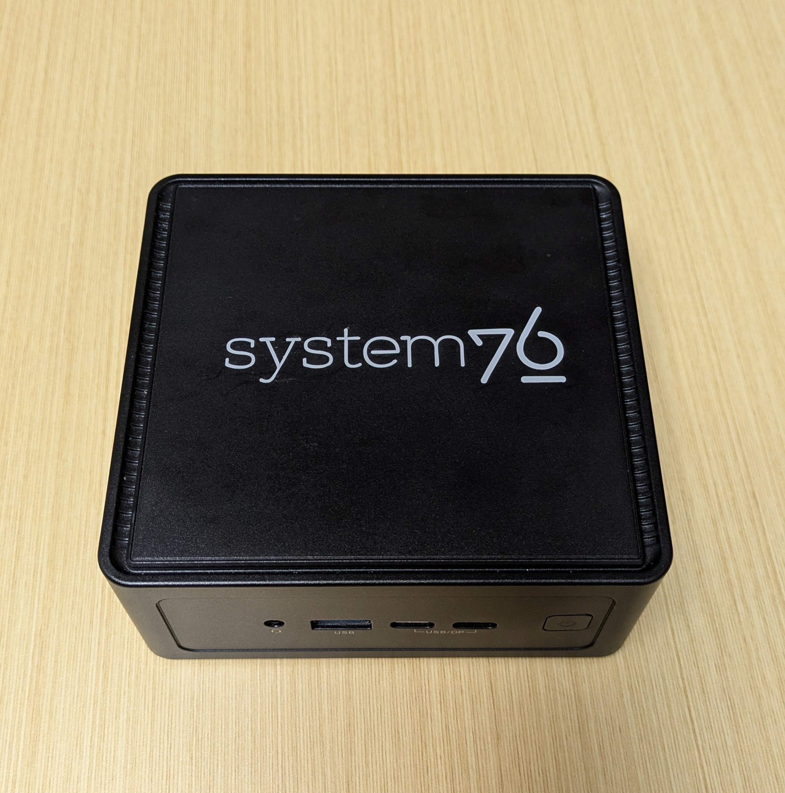
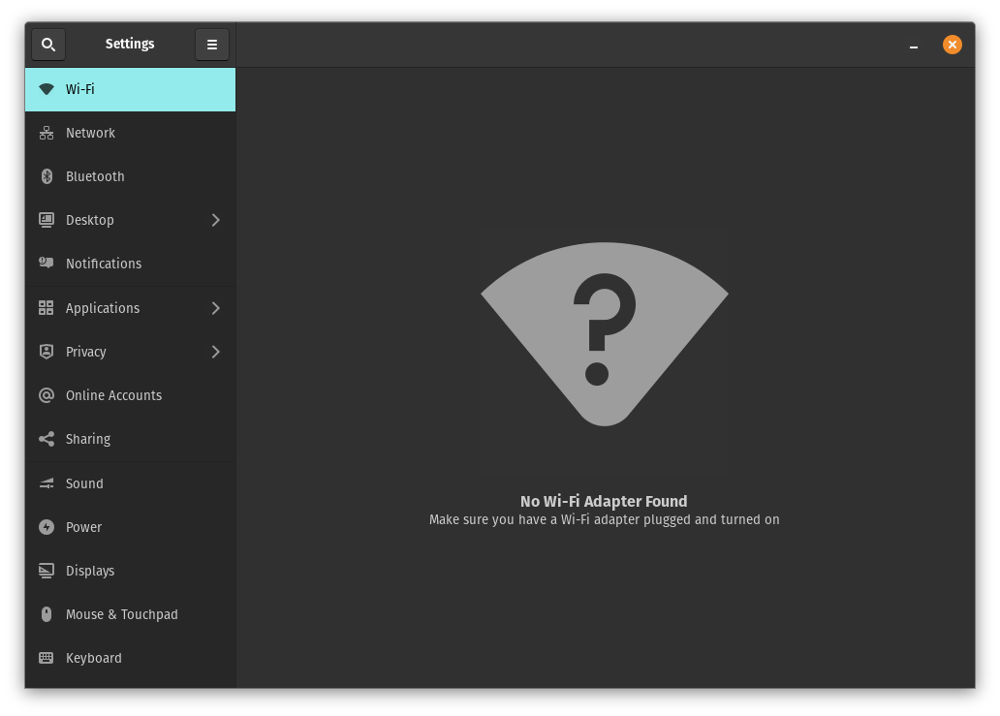

## 概要: iwlwifi driver のエラー

System76 Meerkat を購入して起動したところ、wifi の接続が不安定だったので調べたときのメモ。

https://system76.com/desktops/meerkat/

基本的には有線接続する予定ですが、wifi module が入っているので試しに wifi に接続したところ boot 直後に一瞬つながるもののその後切れてしまいました。

その後 wifi 設定を開くと `No Wi-Fi Adapter Found` と表示されている。



journalctl でログを確認すると、以下のようなエラーが出続けているのがわかった。

```
kernel: iwlwifi 0000:00:14.3: Queue 1 is stuck 1 3
kernel: iwlwifi 0000:00:14.3: Microcode SW error detected. Restarting 0x0.
...
```

<details>

<summary>journalctl</summary>

```
Mar 16 10:59:02 pop-os kernel: iwlwifi 0000:00:14.3: Queue 1 is stuck 1 3
Mar 16 10:59:02 pop-os kernel: iwlwifi 0000:00:14.3: Microcode SW error detected. Restarting 0x0.
Mar 16 10:59:02 pop-os kernel: iwlwifi 0000:00:14.3: Start IWL Error Log Dump:
Mar 16 10:59:02 pop-os kernel: iwlwifi 0000:00:14.3: Transport status: 0x0000004A, valid: 6
Mar 16 10:59:02 pop-os kernel: iwlwifi 0000:00:14.3: Loaded firmware version: 89.e9cec78e.0 ma-b0-gf-a0-89.ucode
Mar 16 10:59:02 pop-os kernel: iwlwifi 0000:00:14.3: 0x00000084 | NMI_INTERRUPT_UNKNOWN       
Mar 16 10:59:02 pop-os kernel: iwlwifi 0000:00:14.3: 0x00800AF4 | trm_hw_status0
Mar 16 10:59:02 pop-os kernel: iwlwifi 0000:00:14.3: 0x00000000 | trm_hw_status1
Mar 16 10:59:02 pop-os kernel: iwlwifi 0000:00:14.3: 0x002DDFC2 | branchlink2
Mar 16 10:59:02 pop-os kernel: iwlwifi 0000:00:14.3: 0x002D3A62 | interruptlink1
Mar 16 10:59:02 pop-os kernel: iwlwifi 0000:00:14.3: 0x002D3A62 | interruptlink2
Mar 16 10:59:02 pop-os kernel: iwlwifi 0000:00:14.3: 0x0000841E | data1
Mar 16 10:59:02 pop-os kernel: iwlwifi 0000:00:14.3: 0x01000000 | data2
Mar 16 10:59:02 pop-os kernel: iwlwifi 0000:00:14.3: 0x00000000 | data3
Mar 16 10:59:02 pop-os kernel: iwlwifi 0000:00:14.3: 0x3B809C27 | beacon time
Mar 16 10:59:02 pop-os kernel: iwlwifi 0000:00:14.3: 0x9D2253DC | tsf low
Mar 16 10:59:02 pop-os kernel: iwlwifi 0000:00:14.3: 0x00000013 | tsf hi
Mar 16 10:59:02 pop-os kernel: iwlwifi 0000:00:14.3: 0x00000000 | time gp1
Mar 16 10:59:02 pop-os kernel: iwlwifi 0000:00:14.3: 0x017A9FE5 | time gp2
Mar 16 10:59:02 pop-os kernel: iwlwifi 0000:00:14.3: 0x00000001 | uCode revision type
Mar 16 10:59:02 pop-os kernel: iwlwifi 0000:00:14.3: 0x00000059 | uCode version major
Mar 16 10:59:02 pop-os kernel: iwlwifi 0000:00:14.3: 0xE9CEC78E | uCode version minor
Mar 16 10:59:02 pop-os kernel: iwlwifi 0000:00:14.3: 0x00000441 | hw version
Mar 16 10:59:02 pop-os kernel: iwlwifi 0000:00:14.3: 0x00C80002 | board version
Mar 16 10:59:02 pop-os kernel: iwlwifi 0000:00:14.3: 0x0101001C | hcmd
Mar 16 10:59:02 pop-os kernel: iwlwifi 0000:00:14.3: 0x80020000 | isr0
Mar 16 10:59:02 pop-os kernel: iwlwifi 0000:00:14.3: 0x00000000 | isr1
Mar 16 10:59:02 pop-os kernel: iwlwifi 0000:00:14.3: 0x48F00002 | isr2
Mar 16 10:59:02 pop-os kernel: iwlwifi 0000:00:14.3: 0x00C3200C | isr3
Mar 16 10:59:02 pop-os kernel: iwlwifi 0000:00:14.3: 0x00200000 | isr4
Mar 16 10:59:02 pop-os kernel: iwlwifi 0000:00:14.3: 0x0201001C | last cmd Id
Mar 16 10:59:02 pop-os kernel: iwlwifi 0000:00:14.3: 0x0000841E | wait_event
Mar 16 10:59:02 pop-os kernel: iwlwifi 0000:00:14.3: 0x00000094 | l2p_control
Mar 16 10:59:02 pop-os kernel: iwlwifi 0000:00:14.3: 0x00002020 | l2p_duration
Mar 16 10:59:02 pop-os kernel: iwlwifi 0000:00:14.3: 0x0000000F | l2p_mhvalid
Mar 16 10:59:02 pop-os kernel: iwlwifi 0000:00:14.3: 0x00060098 | l2p_addr_match
Mar 16 10:59:02 pop-os kernel: iwlwifi 0000:00:14.3: 0x00000009 | lmpm_pmg_sel
Mar 16 10:59:02 pop-os kernel: iwlwifi 0000:00:14.3: 0x00000000 | timestamp
Mar 16 10:59:02 pop-os kernel: iwlwifi 0000:00:14.3: 0x000078B4 | flow_handler
Mar 16 10:59:02 pop-os kernel: iwlwifi 0000:00:14.3: Start IWL Error Log Dump:
Mar 16 10:59:02 pop-os kernel: iwlwifi 0000:00:14.3: Transport status: 0x0000004A, valid: 7
Mar 16 10:59:02 pop-os kernel: iwlwifi 0000:00:14.3: 0x20000066 | NMI_INTERRUPT_HOST
Mar 16 10:59:02 pop-os kernel: iwlwifi 0000:00:14.3: 0x00000000 | umac branchlink1
Mar 16 10:59:02 pop-os kernel: iwlwifi 0000:00:14.3: 0x8025FE96 | umac branchlink2
Mar 16 10:59:02 pop-os kernel: iwlwifi 0000:00:14.3: 0x8028481E | umac interruptlink1
Mar 16 10:59:02 pop-os kernel: iwlwifi 0000:00:14.3: 0x8028481E | umac interruptlink2
Mar 16 10:59:02 pop-os kernel: iwlwifi 0000:00:14.3: 0x01000000 | umac data1
Mar 16 10:59:02 pop-os kernel: iwlwifi 0000:00:14.3: 0x8028481E | umac data2
Mar 16 10:59:02 pop-os kernel: iwlwifi 0000:00:14.3: 0x00000000 | umac data3
Mar 16 10:59:02 pop-os kernel: iwlwifi 0000:00:14.3: 0x00000059 | umac major
Mar 16 10:59:02 pop-os kernel: iwlwifi 0000:00:14.3: 0xE9CEC78E | umac minor
Mar 16 10:59:02 pop-os kernel: iwlwifi 0000:00:14.3: 0x017A9FE3 | frame pointer
Mar 16 10:59:02 pop-os kernel: iwlwifi 0000:00:14.3: 0xC0886260 | stack pointer
Mar 16 10:59:02 pop-os kernel: iwlwifi 0000:00:14.3: 0x005701D2 | last host cmd
Mar 16 10:59:02 pop-os kernel: iwlwifi 0000:00:14.3: 0x00000400 | isr status reg
Mar 16 10:59:02 pop-os kernel: iwlwifi 0000:00:14.3: IML/ROM dump:
Mar 16 10:59:02 pop-os kernel: iwlwifi 0000:00:14.3: 0x00000B03 | IML/ROM error/state
Mar 16 10:59:02 pop-os kernel: iwlwifi 0000:00:14.3: 0x000082D5 | IML/ROM data1
Mar 16 10:59:02 pop-os kernel: iwlwifi 0000:00:14.3: 0x00000080 | IML/ROM WFPM_AUTH_KEY_0
Mar 16 10:59:02 pop-os kernel: iwlwifi 0000:00:14.3: Fseq Registers:
Mar 16 10:59:02 pop-os kernel: iwlwifi 0000:00:14.3: 0x65B00000 | FSEQ_ERROR_CODE
Mar 16 10:59:02 pop-os kernel: iwlwifi 0000:00:14.3: 0x80840002 | FSEQ_TOP_INIT_VERSION
Mar 16 10:59:02 pop-os kernel: iwlwifi 0000:00:14.3: 0x003B0000 | FSEQ_CNVIO_INIT_VERSION
Mar 16 10:59:02 pop-os kernel: iwlwifi 0000:00:14.3: 0x0000A652 | FSEQ_OTP_VERSION
Mar 16 10:59:02 pop-os kernel: iwlwifi 0000:00:14.3: 0x00000003 | FSEQ_TOP_CONTENT_VERSION
Mar 16 10:59:02 pop-os kernel: iwlwifi 0000:00:14.3: 0x4552414E | FSEQ_ALIVE_TOKEN
Mar 16 10:59:02 pop-os kernel: iwlwifi 0000:00:14.3: 0x01080800 | FSEQ_CNVI_ID
Mar 16 10:59:02 pop-os kernel: iwlwifi 0000:00:14.3: 0x00400410 | FSEQ_CNVR_ID
Mar 16 10:59:02 pop-os kernel: iwlwifi 0000:00:14.3: 0x01080800 | CNVI_AUX_MISC_CHIP
Mar 16 10:59:02 pop-os kernel: iwlwifi 0000:00:14.3: 0x00400410 | CNVR_AUX_MISC_CHIP
Mar 16 10:59:02 pop-os kernel: iwlwifi 0000:00:14.3: 0x00009061 | CNVR_SCU_SD_REGS_SD_REG_DIG_DCDC_VTRIM
Mar 16 10:59:02 pop-os kernel: iwlwifi 0000:00:14.3: 0x00000061 | CNVR_SCU_SD_REGS_SD_REG_ACTIVE_VDIG_MIRROR
Mar 16 10:59:02 pop-os kernel: iwlwifi 0000:00:14.3: 0x003B0000 | FSEQ_PREV_CNVIO_INIT_VERSION
Mar 16 10:59:02 pop-os kernel: iwlwifi 0000:00:14.3: 0x00840002 | FSEQ_WIFI_FSEQ_VERSION
Mar 16 10:59:02 pop-os kernel: iwlwifi 0000:00:14.3: 0x00840002 | FSEQ_BT_FSEQ_VERSION
Mar 16 10:59:02 pop-os kernel: iwlwifi 0000:00:14.3: 0x000000E6 | FSEQ_CLASS_TP_VERSION
Mar 16 10:59:02 pop-os kernel: iwlwifi 0000:00:14.3: UMAC CURRENT PC: 0x802842dc
Mar 16 10:59:02 pop-os kernel: iwlwifi 0000:00:14.3: LMAC1 CURRENT PC: 0xd0
Mar 16 10:59:02 pop-os kernel: iwlwifi 0000:00:14.3: WRT: Collecting data: ini trigger 4 fired (delay=0ms).
Mar 16 10:59:02 pop-os kernel: ieee80211 phy0: Hardware restart was requested
Mar 16 10:59:02 pop-os kernel: iwlwifi 0000:00:14.3: WRT: Invalid buffer destination
Mar 16 10:59:03 pop-os kernel: iwlwifi 0000:00:14.3: Not valid error log pointer 0x0024B5C0 for RT uCode
Mar 16 10:59:03 pop-os kernel: iwlwifi 0000:00:14.3: WFPM_UMAC_PD_NOTIFICATION: 0x1f
Mar 16 10:59:03 pop-os kernel: iwlwifi 0000:00:14.3: WFPM_LMAC2_PD_NOTIFICATION: 0x1f
Mar 16 10:59:03 pop-os kernel: iwlwifi 0000:00:14.3: WFPM_AUTH_KEY_0: 0x80
Mar 16 10:59:03 pop-os kernel: iwlwifi 0000:00:14.3: CNVI_SCU_SEQ_DATA_DW9: 0x0
Mar 16 10:59:03 pop-os kernel: iwlwifi 0000:00:14.3: RFIm is deactivated, reason = 4
```

</details>

問題が発生した環境は以下の通り。

```
$ cat /etc/os-release
NAME="Pop!_OS"
VERSION="22.04 LTS"
ID=pop
ID_LIKE="ubuntu debian"
PRETTY_NAME="Pop!_OS 22.04 LTS"
VERSION_ID="22.04"
HOME_URL="https://pop.system76.com"
SUPPORT_URL="https://support.system76.com"
BUG_REPORT_URL="https://github.com/pop-os/pop/issues"
PRIVACY_POLICY_URL="https://system76.com/privacy"
VERSION_CODENAME=jammy
UBUNTU_CODENAME=jammy
LOGO=distributor-logo-pop-os

$ uname -a
Linux pop-os 6.9.3-76060903-generic #202405300957~1738770968~22.04~d5f7c84 SMP PREEMPT_DYNAMIC Wed F x86_64 x86_64 x86_64 GNU/Linux
```

見つけた情報↓

- https://support.system76.com
  - https://support.system76.com/articles/wireless/
- Arch Linux Forum
  - https://bbs.archlinux.org/viewtopic.php?id=257900
  - https://bbs.archlinux.org/viewtopic.php?id=254766
- https://community.intel.com/t5/Wireless/AX210-System-Crash-after-iwlwifi-Queue-Stuck-Error-Issue/m-p/1562147

結論から言うと以下の２パターンで解決できた。

1. iwlwifi の設定で `11n_disable=1` を設定する (https://support.system76.com/articles/wireless/#n-mode)
2. 2.5GHz の wifi を使用する

## Solution1: iwlwifi の設定で `11n_disable=1` を設定する

`/etc/modprobe.d/iwlwifi.conf` に以下のように `11n_disable=1` を追加する。

```text
# /etc/modprobe.d/iwlwifi.conf
options iwlwifi power_save=0
options iwlwifi 11n_disable=1
# iwlwifi will dyamically load either iwldvm or iwlmvm depending on the
# microcode file installed on the system.  When removing iwlwifi, first
# remove the iwl?vm module and then iwlwifi.
remove iwlwifi \
(/sbin/lsmod | grep -o -e ^iwlmvm -e ^iwldvm -e ^iwlwifi | xargs /sbin/rmmod) \
&& /sbin/modprobe -r mac80211
```

この設定の意味はざっくりとしかわかっていないが、wifi 規格の 802.11n の機能を有効・無効にするものらしい。

```
$ modinfo iwlwifi | grep 11n_disable
parm:           11n_disable:disable 11n functionality, bitmap: 1: full, 2: disable agg TX, 4: disable agg RX, 8 enable agg TX (uint)
```

https://elixir.bootlin.com/linux/v6.9.3/source/drivers/net/wireless/intel/iwlwifi/iwl-modparams.h#L23-L28

1 を設定すると 11n の機能を全て無効にするため、速度は遅くなるが安定するらしい。

ちなみに 2, 4, 6 (2+4), 8 でも動作確認したが、エラーは出続けた。

## Solution2: 2.5GHz の wifi を使用する

これは単純に 2.5GHz の wifi を選ぶだけ。

2.5GHz の場合は iwlwifi.conf の設定を変更しなくても問題なく接続できた。

2.5GHz には機能がそもそもないのか実装が違うのかなどは不明。

## まとめ

どちらの解決策を選んでもネットワークは遅くなってしまうが、動くことのほうが優先なので仕方ない…。