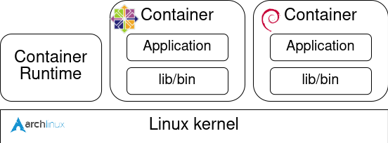

## 概要

Docker などのコンテナ技術では、ホスト OS のカーネルを共有してコンテナイメージにディストリビューションやアプリケーションの依存関係を含めることで、異なる実行環境を再現しています。



このとき、ホスト OS とコンテナイメージのディストリビューションが異なるとカーネルの違いによって原理的には互換性の問題が発生するはずです。
今回は実際に古いカーネルを使用しているホスト OS 上で比較的新しいカーネルを使用しているディストリビューションを使用してアプリケーションを実行してどのような問題が起こるのか試してみました。

## 実行環境

- env1
  - Host OS:
    - ```text
      [mmori@localhost ~]$ cat /etc/redhat-release
      CentOS Linux release 7.9.2009 (Core)
      [mmori@localhost ~]$ uname -a
      Linux localhost.localdomain 3.10.0-1160.71.1.el7.x86_64 #1 SMP Tue Jun 28 15:37:28 UTC 2022 x86_64 x86_64 x86_64 GNU/Linux
      ```
  - Container:
    - ```text
      [mmori@localhost ~]$ sudo docker image ls
      REPOSITORY    TAG       IMAGE ID       CREATED         SIZE
      rockylinux    9.3       b72d2d915008   5 months ago    176MB
      ```

- env2
  - Host OS:
    - ```text
      [mmori@localhost ~]$ cat /etc/redhat-release
      Rocky Linux release 9.3 (Blue Onyx)
      [mmori@localhost ~]$ uname -a
      Linux localhost.localdomain 5.14.0-362.8.1.el9_3.x86_64 #1 SMP PREEMPT_DYNAMIC Wed Nov 8 17:36:32 UTC 2023 x86_64 x86_64 x86_64 GNU/Linux
      ```
  - Container:
    - ```text
      [mmori@localhost ~]$ sudo podman image ls
      REPOSITORY             TAG             IMAGE ID      CREATED      SIZE
      quay.io/centos/centos  centos7.9.2009  8652b9f0cb4c  3 years ago  212 MB
      ```

## 方針

カーネルのバージョンを確認して実装されているシステムコールの差分から互換性の問題を調査する。

[Red Hat Enterprise Linux のリリース日](https://access.redhat.com/ja/articles/16476) を見ると、RHEL 7 と RHEL 9 のカーネルバージョンは以下の通り。

| リリース | カーネルバージョン |
| --- | --- |
|RHEL 7.9 | 3.10.0-1160|
|RHEL 9.3 | 5.14.0-362.8.1.el9_3|

Linux v3.10.0 と v5.14.0 のシステムコールのテーブルを確認する。

- v3.10.0: https://elixir.bootlin.com/linux/v3.10/source/arch/x86/syscalls/syscall_64.tbl

```text
...
309	common	getcpu			sys_getcpu
310	64	process_vm_readv	sys_process_vm_readv
311	64	process_vm_writev	sys_process_vm_writev
312	common	kcmp			sys_kcmp
313	common	finit_module		sys_finit_module

#
# x32-specific system call numbers start at 512 to avoid cache impact
# for native 64-bit operation.
#
512	x32	rt_sigaction		compat_sys_rt_sigaction
513	x32	rt_sigreturn		stub_x32_rt_sigreturn
514	x32	ioctl			compat_sys_ioctl
515	x32	readv			compat_sys_readv
516	x32	writev			compat_sys_writev
...
```

- 5.14.0: https://elixir.bootlin.com/linux/v5.14/source/arch/x86/entry/syscalls/syscall_64.tbl

```text
...
309	common	getcpu			sys_getcpu
310	64	process_vm_readv	sys_process_vm_readv
311	64	process_vm_writev	sys_process_vm_writev
312	common	kcmp			sys_kcmp
313	common	finit_module		sys_finit_module
314	common	sched_setattr		sys_sched_setattr
315	common	sched_getattr		sys_sched_getattr
316	common	renameat2		sys_renameat2
317	common	seccomp			sys_seccomp
318	common	getrandom		sys_getrandom
319	common	memfd_create		sys_memfd_create
320	common	kexec_file_load		sys_kexec_file_load
321	common	bpf			sys_bpf
322	64	execveat		sys_execveat
323	common	userfaultfd		sys_userfaultfd
324	common	membarrier		sys_membarrier
325	common	mlock2			sys_mlock2
326	common	copy_file_range		sys_copy_file_range
327	64	preadv2			sys_preadv2
328	64	pwritev2		sys_pwritev2
329	common	pkey_mprotect		sys_pkey_mprotect
330	common	pkey_alloc		sys_pkey_alloc
331	common	pkey_free		sys_pkey_free
332	common	statx			sys_statx
333	common	io_pgetevents		sys_io_pgetevents
334	common	rseq			sys_rseq
# don't use numbers 387 through 423, add new calls after the last
# 'common' entry
424	common	pidfd_send_signal	sys_pidfd_send_signal
425	common	io_uring_setup		sys_io_uring_setup
426	common	io_uring_enter		sys_io_uring_enter
427	common	io_uring_register	sys_io_uring_register
428	common	open_tree		sys_open_tree
429	common	move_mount		sys_move_mount
430	common	fsopen			sys_fsopen
431	common	fsconfig		sys_fsconfig
432	common	fsmount			sys_fsmount
433	common	fspick			sys_fspick
434	common	pidfd_open		sys_pidfd_open
435	common	clone3			sys_clone3
436	common	close_range		sys_close_range
437	common	openat2			sys_openat2
438	common	pidfd_getfd		sys_pidfd_getfd
439	common	faccessat2		sys_faccessat2
440	common	process_madvise		sys_process_madvise
441	common	epoll_pwait2		sys_epoll_pwait2
442	common	mount_setattr		sys_mount_setattr
443	common	quotactl_fd		sys_quotactl_fd
444	common	landlock_create_ruleset	sys_landlock_create_ruleset
445	common	landlock_add_rule	sys_landlock_add_rule
446	common	landlock_restrict_self	sys_landlock_restrict_self
447	common	memfd_secret		sys_memfd_secret

#
# Due to a historical design error, certain syscalls are numbered differently
# in x32 as compared to native x86_64.  These syscalls have numbers 512-547.
# Do not add new syscalls to this range.  Numbers 548 and above are available
# for non-x32 use.
#
512	x32	rt_sigaction		compat_sys_rt_sigaction
513	x32	rt_sigreturn		compat_sys_x32_rt_sigreturn
514	x32	ioctl			compat_sys_ioctl
515	x32	readv			sys_readv
516	x32	writev			sys_writev
...
```

簡単に使えそうなシステムコールとして 318 番の `getrandom` があるのでこれを使ってみる。

## 調査、テストコード

### getrandom

- https://www.man7.org/linux/man-pages/man2/getrandom.2.html
- file: [drivers/char/random.c](https://elixir.bootlin.com/linux/v5.14/source/drivers/char/random.c#L1983)

```c
SYSCALL_DEFINE3(getrandom, char __user *, ubuf, size_t, len, unsigned int, flags)
{
	struct iov_iter iter;
	int ret;

	if (flags & ~(GRND_NONBLOCK | GRND_RANDOM | GRND_INSECURE))
		return -EINVAL;

	/*
	 * Requesting insecure and blocking randomness at the same time makes
	 * no sense.
	 */
	if ((flags & (GRND_INSECURE | GRND_RANDOM)) == (GRND_INSECURE | GRND_RANDOM))
		return -EINVAL;

	if (!crng_ready() && !(flags & GRND_INSECURE)) {
		if (flags & GRND_NONBLOCK)
			return -EAGAIN;
		ret = wait_for_random_bytes();
		if (unlikely(ret))
			return ret;
	}

	ret = import_ubuf(ITER_DEST, ubuf, len, &iter);
	if (unlikely(ret))
		return ret;
	return get_random_bytes_user(&iter);
}
```

- test code

```c
#include <stdio.h>
#include <stdlib.h>
#include <string.h>
#include <unistd.h>
#include <sys/syscall.h>

#define BUF_SIZE 16

void print_buf(char *buf, int size) {
	printf("buf = ");
	for (int i = 0; i < size; i++) {
		printf("%02x,", (unsigned char)buf[i]);
	}
	printf("\n");
}

int main() {
	int ret;
	char *buf = (char *) malloc(sizeof(char) * BUF_SIZE);
	memset(buf, 0, BUF_SIZE);
	print_buf(buf, BUF_SIZE);
	ret = syscall(SYS_getrandom, buf, BUF_SIZE, 0);
	printf("ret = %d\n", ret);
	print_buf(buf, BUF_SIZE);
}
```

### pidfd_open

最初は getrandom だけで試すつもりだったが、実際に実行すると centos7 のカーネルでも getrandom が使えてしまった。
（RHEL 7 のベースとなるバージョンは Linux v3.10.0 で getrandom は実装されていないはずだが、3.10.0-1160.71.1.el7.x86_64 では追加のパッチがあたっているのだろう。）

追加で pidfd_open を試してみる。

存在する pid を引数にして実行すると process を参照する file descriptor を取得できる。
man page の use case を見ると使いみちが色々とある。

```text
   Use cases for PID file descriptors
       A PID file descriptor returned by pidfd_open() (or by clone(2)
       with the CLONE_PID flag) can be used for the following purposes:

       •  The pidfd_send_signal(2) system call can be used to send a
          signal to the process referred to by a PID file descriptor.

       •  A PID file descriptor can be monitored using poll(2),
          select(2), and epoll(7).  When the process that it refers to
          terminates, these interfaces indicate the file descriptor as
          readable.  Note, however, that in the current implementation,
          nothing can be read from the file descriptor (read(2) on the
          file descriptor fails with the error EINVAL).

       •  If the PID file descriptor refers to a child of the calling
          process, then it can be waited on using waitid(2).

       •  The pidfd_getfd(2) system call can be used to obtain a
          duplicate of a file descriptor of another process referred to
          by a PID file descriptor.

       •  A PID file descriptor can be used as the argument of setns(2)
          in order to move into one or more of the same namespaces as
          the process referred to by the file descriptor.

       •  A PID file descriptor can be used as the argument of
          process_madvise(2) in order to provide advice on the memory
          usage patterns of the process referred to by the file
          descriptor.
```

process の監視などに使えそう。
調べてみると python の新しい機能として pidfd が使われるようになっているらしい。

- [噂のpidfdをRustで試してみた](https://qiita.com/ksato9700/items/6481e1132e40a7e0c91d)

実装や man page については以下の通り。

- https://man7.org/linux/man-pages/man2/pidfd_open.2.html
- file: [kernel/pid.c](https://elixir.bootlin.com/linux/v5.14/source/kernel/pid.c#L584)

```c
/**
 * sys_pidfd_open() - Open new pid file descriptor.
 *
 * @pid:   pid for which to retrieve a pidfd
 * @flags: flags to pass
 *
 * This creates a new pid file descriptor with the O_CLOEXEC flag set for
 * the task identified by @pid. Without PIDFD_THREAD flag the target task
 * must be a thread-group leader.
 *
 * Return: On success, a cloexec pidfd is returned.
 *         On error, a negative errno number will be returned.
 */
SYSCALL_DEFINE2(pidfd_open, pid_t, pid, unsigned int, flags)
{
	int fd;
	struct pid *p;

	if (flags & ~(PIDFD_NONBLOCK | PIDFD_THREAD))
		return -EINVAL;

	if (pid <= 0)
		return -EINVAL;

	p = find_get_pid(pid);
	if (!p)
		return -ESRCH;

	fd = pidfd_create(p, flags);

	put_pid(p);
	return fd;
}
```

- test code (ただ呼び出すだけのコード)

```c
#include <stdio.h>
#include <stdlib.h>
#include <sys/syscall.h>
#include <unistd.h>

int main(int argc, char *argv[]) {
	int pid = getpid();
	if (argc != 1) {
		pid = atoi(argv[1]);
	}
	printf("pid: %d\n", pid);
	int pidfd = syscall(SYS_pidfd_open, pid, 0);
	if (pidfd < 0) {
		perror("pidfd_open");
		return 1;
	}
	printf("pidfd: %d\n", pidfd);
	sleep(1000);
	close(pidfd);
	return 0;
}
```

- test code (man page のコード)
  - 監視対象のプロセスが終了すると poll で検知できる

```c
#define _GNU_SOURCE
#include <poll.h>
#include <stdio.h>
#include <stdlib.h>
#include <sys/syscall.h>
#include <unistd.h>

static int
pidfd_open(pid_t pid, unsigned int flags)
{
	return syscall(SYS_pidfd_open, pid, flags);
}

int
main(int argc, char *argv[])
{
	int            pidfd, ready;
	struct pollfd  pollfd;

	if (argc != 2) {
		fprintf(stderr, "Usage: %s <pid>\n", argv[0]);
		exit(EXIT_SUCCESS);
	}

	pidfd = pidfd_open(atoi(argv[1]), 0);
	if (pidfd == -1) {
		perror("pidfd_open");
		exit(EXIT_FAILURE);
	}

	pollfd.fd = pidfd;
	pollfd.events = POLLIN;

	ready = poll(&pollfd, 1, -1);
	if (ready == -1) {
		perror("poll");
		exit(EXIT_FAILURE);
	}

	printf("Events (%#x): POLLIN is %sset\n", pollfd.revents,
			(pollfd.revents & POLLIN) ? "" : "not ");

	close(pidfd);
	exit(EXIT_SUCCESS);
}
```

## 実験

### getrandom

getrandom を実行してみる。
（どちらでも実行できてしまったので今回の趣旨とは異なるが、一応載せておく）

#### env1

```text
[root@4871234db7f8 workspace]# gcc getrandom.c
[root@4871234db7f8 workspace]# ./a.out
buf = 00,00,00,00,00,00,00,00,00,00,00,00,00,00,00,00,
ret = 16
buf = 82,92,6f,1b,87,18,1e,8a,d8,ac,7e,5a,f7,9b,59,18,
```

#### env2

```text
[root@4b84690c185e workspace]# gcc getrandom.c
[root@4b84690c185e workspace]# ./a.out
buf = 00,00,00,00,00,00,00,00,00,00,00,00,00,00,00,00,
ret = 16
buf = 19,95,66,4c,43,bb,5f,83,b5,44,2e,6c,db,92,90,66,
```

### pidfd_open

sleep するだけのプロセスを起動して pidfd_open で file descriptor を取得してみる。

```c
#include <stdio.h>
#include <unistd.h>

int main() {
	printf("pid: %d\n", getpid());
	sleep(1000);
}
```

#### env1

host OS が centos でシステムコールが実装されていないのでエラーになる。

```text
[root@4871234db7f8 workspace]# ./sleep
pid: 80
```

```text
[root@4871234db7f8 workspace]# ./pidfd_open 80
pid: 80
pidfd_open: Function not implemented
```

v3.10 では do_syscall64 がなく、[arch/x86/kernel/entry_64.S](https://elixir.bootlin.com/linux/v3.10/source/arch/x86/kernel/entry_64.S#L608) で syscall table を[直接 call している](https://elixir.bootlin.com/linux/v3.10/source/arch/x86/kernel/entry_64.S#L644)。
直前で NR_syscall のバリデーションをしているのでここでエラーハンドリング用の `badsys` に飛ばされる。

飛ばされたあとはリターンしてユーザプロセスに実行が遷移し、libc の syscall() でエラーハンドリングされているはず。

#### env2

centos のコンテナではライブラリが古いので SYS_pidfd_open が定義されておらず、コンパイルエラーになる。

```text
[root@4b84690c185e workspace]# gcc pidfd_open.c -o pidfd_open
pidfd_open.c: In function 'main':
pidfd_open.c:12:22: error: 'SYS_pidfd_open' undeclared (first use in this function)
  int pidfd = syscall(SYS_pidfd_open, pid, 0);
                      ^
pidfd_open.c:12:22: note: each undeclared identifier is reported only once for each function it appears in
```

pidfd_open は 434 番なので自分で定数を定義してコンパイルする。

```diff
#include <stdio.h>
#include <stdlib.h>
#include <sys/syscall.h>
#include <unistd.h>

+#define SYS_pidfd_open  434
+
int main(int argc, char *argv[]) {
        int pid = getpid();
        if (argc != 1) {
                pid = atoi(argv[1]);
        }
        printf("pid: %d\n", pid);
        int pidfd = syscall(SYS_pidfd_open, pid, 0);
        if (pidfd < 0) {
                perror("pidfd_open");
                return 1;
        }
        printf("pidfd: %d\n", pidfd);
        sleep(1000);
        close(pidfd);
        return 0;
}
```

実行できた。

```text
[root@4b84690c185e workspace]# ./sleep
pid: 165
```

```text
[root@4b84690c185e workspace]# ./pidfd_open 165
pid: 165
pidfd: 3
```

このとき、開かれた fd は procfs でみると下記のようにリンクが張られている。

```text
[root@4b84690c185e workspace]# ls -la /proc/166/fd
total 0
dr-x------. 2 root root  0 May  3 05:28 .
dr-xr-xr-x. 9 root root  0 May  3 05:23 ..
lrwx------. 1 root root 64 May  3 05:28 0 -> /dev/pts/2
lrwx------. 1 root root 64 May  3 05:28 1 -> /dev/pts/2
lrwx------. 1 root root 64 May  3 05:28 2 -> /dev/pts/2
lrwx------. 1 root root 64 May  3 05:28 3 -> anon_inode:[pidfd]
```

### pidfd_open + poll

man page にあるコードを使用してプロセスの監視を行ってみる。

#### env1

実行できないのはわかっているのでスキップ

#### env2

先ほどと同様に sleep するプロセスを起動して監視してみる。

```text
[root@4b84690c185e workspace]# ./sleep
pid: 185
^C
```

ctrl+c で終了させると poll が検知して終了した。

```text
[root@4b84690c185e workspace]# ./pidfd_open_poll 185
Events (0x1): POLLIN is set
```

### 追加 (pidfd_send_signal)

pidfd_send_signal を使ってみる。

- https://man7.org/linux/man-pages/man2/pidfd_send_signal.2.html
- https://man7.org/linux/man-pages/man7/signal.7.html
  - signal の番号などについて

こちらも試すだけなら man page のコードを使うだけで良さそう。

```c
#define _GNU_SOURCE
#include <fcntl.h>
#include <limits.h>
#include <signal.h>
#include <stdio.h>
#include <stdlib.h>
#include <string.h>
#include <sys/syscall.h>
#include <unistd.h>

static int pidfd_send_signal(int pidfd, int sig, siginfo_t *info,
		unsigned int flags)
{
	return syscall(SYS_pidfd_send_signal, pidfd, sig, info, flags);
}

int main(int argc, char *argv[])
{
	int        pidfd, sig;
	char       path[PATH_MAX];
	siginfo_t  info;

	if (argc != 3) {
		fprintf(stderr, "Usage: %s <pid> <signal>\n", argv[0]);
		exit(EXIT_FAILURE);
	}

	sig = atoi(argv[2]);

	/* Obtain a PID file descriptor by opening the /proc/PID directory
	   of the target process. */

	snprintf(path, sizeof(path), "/proc/%s", argv[1]);

	pidfd = open(path, O_RDONLY);
	if (pidfd == -1) {
		perror("open");
		exit(EXIT_FAILURE);
	}

	/* Populate a 'siginfo_t' structure for use with
	   pidfd_send_signal(). */

	memset(&info, 0, sizeof(info));
	info.si_code = SI_QUEUE;
	info.si_signo = sig;
	info.si_errno = 0;
	info.si_uid = getuid();
	info.si_pid = getpid();
	info.si_value.sival_int = 1234;

	/* Send the signal. */

	if (pidfd_send_signal(pidfd, sig, &info, 0) == -1) {
		perror("pidfd_send_signal");
		exit(EXIT_FAILURE);
	}

	exit(EXIT_SUCCESS);
}
```

sleep プロセスを作成して SIGTERM(15) を送信したところプロセスを終了させることができた。

```text
[root@4b84690c185e workspace]# ./sleep
pid: 222
Terminated
```

```text
[root@4b84690c185e workspace]# ./pidfd_send_signal 222 15
```

## まとめ

- Container では host os のカーネルを共有しているため、期待されるカーネルバージョンの違いによってうまく動作しないアプリケーションがある。
- Systemcall の実装状況も影響するため、互換性を確認する際には注意が必要。
- 自分の周囲ではこの問題がそこまで指摘されていない（顕在化していないのは）ホストOS のバージョンが比較的新しいことや新しいシステムコールなどがそこまで使用されていないからかもしれない。
  - python3.9 では pidfd が使われているようなので、centos 上のコンテナで新しい python を使うと問題が起こるかもしれない
- pidfd + poll を使ったプロセス監視や signal の送信などが単純に面白かった
