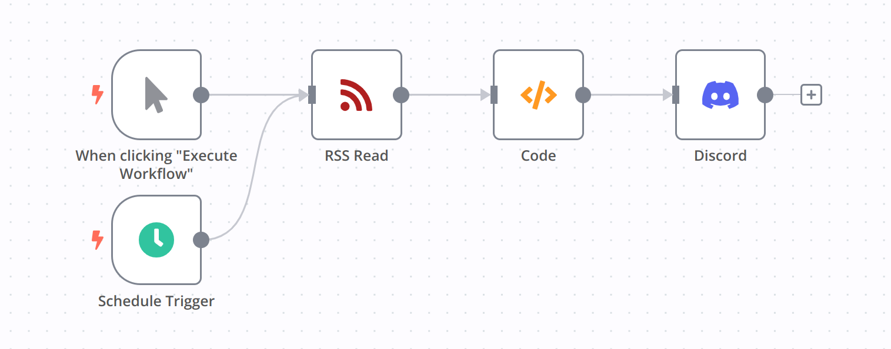

## 目的

[n8n](https://github.com/n8n-io/n8n) を Raspberry Pi 4B にデプロイして RSS feed を Discord に送信する。

## 背景

最近までは同じことを [IFTTT](https://ifttt.com/explore) で行っていたのですが、2023/05/23 から無料プランでは実行できるアプリケーションの数が2つまでに制限されてしまいました。
似たようなサービスとしては [Zapier](https://zapier.com/)、[make](https://www.make.com/)、[Readybot.io](https://readybot.io/) などがあり、2023/05/27 時点で使える範囲は下のような感じ。

- Zapier
  - アプリケーション（Zaps）は 5 つまで
  - one trigger, one action まで設定可能
  - 100 tasks/month
  - 最短 15 分間隔で実行可能
- make
  - アプリケーション（scenario）は 2 つまで
  - 1000 ops/month
  - 最短 15 分間隔で実行可能
- Readybot.io
  - Discord 特化
  - アプリケーション（bot）は 5 つまで
  - 最短 10 分間隔で実行可能

Zapier と make は一日の実行回数や作れるアプリケーションの数からして自分のニーズには合わないものでした。
Readybot.io は自分の用途にぴったりで、一つの bot で複数の RSS フィードを管理できることなども相まってかなり良かったです。
しかし、あまり拡張性がなくDiscord への通知内容をカスタマイズしたりできないなど、自由度が足りないという印象でした。

そこで今回利用するのが OSS の [n8n](https://n8n.io/) （[github](https://github.com/n8n-io/n8n)）です。
n8n 側でホスティングしてもらう場合には無料プランなどがないためお金がかかりますが、セルフホスティングする場合にはかなり自由に使えます。
電気代や自分で管理する手間はあるのですが、単純に使ってみたいという興味もあるのでやってみます。

## n8n のデプロイ

今回は Docker を使用するので下のコマンド実行のみでデプロイできます。

```sh
docker run -d --rm --name n8n -p 5678:5678 -v ~/.n8n:/home/node/.n8n docker.n8n.io/n8nio/n8n
```

<http://[ip]:5678/> にアクセスしてログイン画面が出れば成功です。初回アクセス時は確か Sign Up の画面だったと思います。


## ワークフローの作成

IFTTT などのサービスを使った経験があれば特に問題なくワークフローを作成できると思います。
`Schedule Trigger` で好きなタイミングで実行し、`RSS Read` でターゲットのURL を指定します。
Discord のチャンネルの webhook を `Discord` に登録すれば完成です。

しかし、最初に下のようにノードを組んだところ、`RSS Read` で出た情報を毎回すべて `Discord` に送信するようになってしまいました。


つまり、前回実行したときに得られたコンテンツと照合して新しい内容だけ配信するという処理が行われていないということですね。

修正したワークフローはこちらです。



変更点は Code のノードを追加したことです。
Code では JS のコードを書くことができ、[Documentation](https://docs.n8n.io/code-examples/)を見ると n8n が提供している関数などがあります。
今回は [`$getWorkflowStaticData(type)`](https://docs.n8n.io/code-examples/methods-variables-examples/get-workflow-static-data/) を使って前回の実行を記録しておいて新しいものだけを出力するようにしました。

```js
const workflowStaticData = $getWorkflowStaticData('global');
const lastRssLog = workflowStaticData.lastRssLog;

if (lastRssLog == null) {
  workflowStaticData.lastRssLog = $('RSS Read').first();
  return $('RSS Read').all().reverse();
}

let ret = []

for (let item of $('RSS Read').all()) {
  if (item.json['guid'] == lastRssLog.json['guid']) {
    break;
  }
  ret.push(item);
}

workflowStaticData.lastRssLog = $('RSS Read').first();

return ret.reverse();
```

## Raspberry Pi のリソース使用状況

調べた限りではスペック的な問題はなさそうなのですが、一応イベントが発生したときのリソース使用状況を確認してみました。
RSS のチェックは2つのアプリケーションで5分間隔で実行しています。

平常時:


イベント発生時:


## おわり

IFTTT っぽい他のサービスも色々と調べてみたのですが、無料版の制限や自由度の高さを考えると現状ではこの環境が一番良さそうだったのでやってみました。
オープンソースの似たようなアプリケーションとしては [Huginn](https://github.com/huginn/huginn) というものも見つけましたが、CPU アーキテクチャの問題で Docker イメージを実行できなかったので断念…。
最近何かとアーキテクチャの都合でコンテナが使えないのですが、Docker をもっと使いこなせるようになったらビルドし直したりして解決できるんだろうか。
