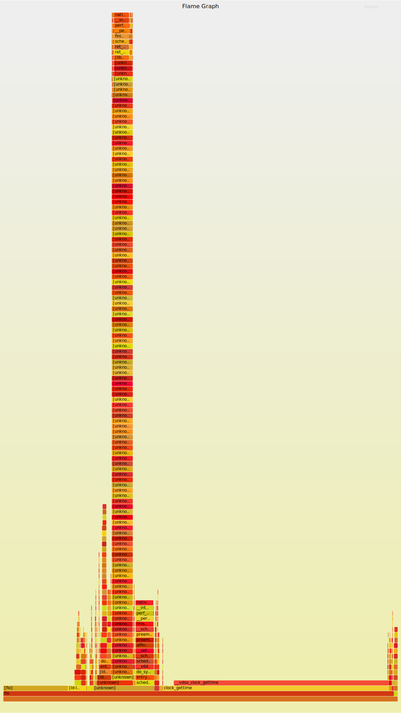
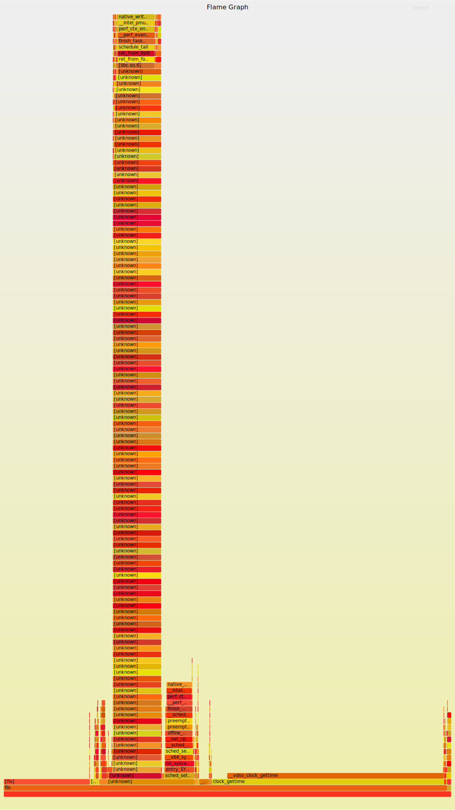
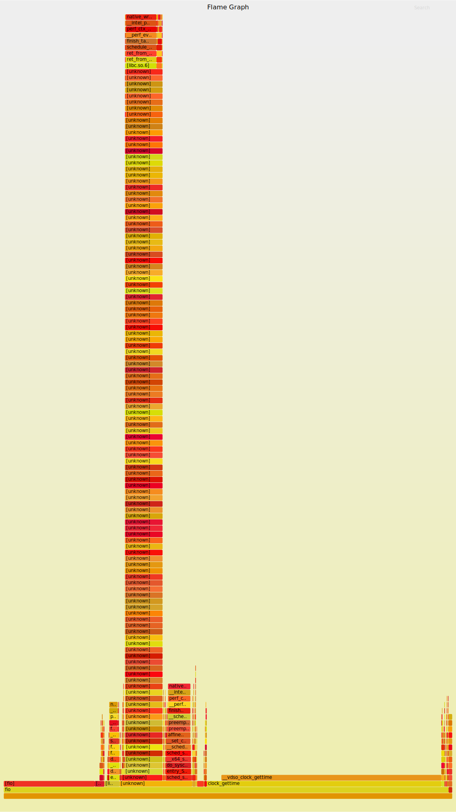

## Overview

便利そうだとは思いながら、使っていなかったツールの一つとして perf がある。
今回は perf の最低限の使い方を学ぶ。

## Goal

- 適当なアプリケーションを perf で解析する
- flamegraph にすることができるらしいのでやってみたい
- GUI で使えそうなものがあったら調べる

## Preparation

### perf 関連

必要なパッケージをインストールする。
perf だけで良ければこれでインストールできる。

```sh
sudo pacman -S perf
```

arch だと linux-tools のグループの中に色々入っているのでこれで入れても良さそう。

```text
% paru -Sg linux-tools
linux-tools bootconfig
linux-tools bpf
linux-tools cgroup_event_listener
linux-tools cpupower
linux-tools hyperv
linux-tools perf
linux-tools tmon
linux-tools turbostat
linux-tools usbip
linux-tools x86_energy_perf_policy
```

flamegraph を作成する上で必要なパッケージもインストールする (AUR にある)。

```sh
paru -S flamegraph
```

perf でカーネルの解析をするためには perf_event_paranoid というカーネルパラメータを変更する必要がある。
これはカーネルのパフォーマンスイベントを取得するためのパラメータでデフォルトでは 2 になっているが、それだとカーネルのイベントを取得できないので -1 に変更する。

FYI: https://www.kernel.org/doc/html/latest/admin-guide/perf-security.html#unprivileged-users

```sh
cat /proc/sys/kernel/perf_event_paranoid
echo -1 | sudo tee /proc/sys/kernel/perf_event_paranoid
```

### fio

今回は I/O のベンチマークを取るためのツールである fio をテスト用のアプリケーションとして使用する。

```sh
sudo pacman -S fio
```

fio の使い方を調べていて、ioengine という設定項目があることがわかった。
せっかくなのでこの ioengine を色々と変えたときにどのような挙動の違いがあるかを perf で解析してみる。

ちなみに、fio の man を見ると設定できる ioengine はかなり色々あることがわかる。

FYI: https://manpages.org/fio

特にこだわりはないが、今回は libaio, sync, mmap で試してみる。

## Memo about perf

- `perf stat` で実行時間や CPU の使用率などを表示する
  - 試しに pwd を実行したときの結果を以下に示す
  - ```text
    % perf stat pwd
    /home/mori/workspace/perf
    
     Performance counter stats for 'pwd':
    
                  1.83 msec task-clock:u                     #    0.161 CPUs utilized
                     0      context-switches:u               #    0.000 /sec
                     0      cpu-migrations:u                 #    0.000 /sec
                    67      page-faults:u                    #   36.526 K/sec
               317,835      cycles:u                         #    0.173 GHz
               232,109      instructions:u                   #    0.73  insn per cycle
                52,250      branches:u                       #   28.485 M/sec
                 3,235      branch-misses:u                  #    6.19% of all branches
    
           0.011358294 seconds time elapsed
    
           0.000000000 seconds user
           0.003322000 seconds sys
    ```
  - branch-misses は投機実行の失敗のことを指しているらしい
  - context-switches はスケジューラが切り替えた回数のことではないらしい
  - sleep コマンドでも、pthread を使ったプログラムでも、0 になった
- `perf bench` はいくつかのベンチマークツールを提供している
  - ```text
    % perf bench
    Usage:
            perf bench [<common options>] <collection> <benchmark> [<options>]
    
            # List of all available benchmark collections:
    
             sched: Scheduler and IPC benchmarks
           syscall: System call benchmarks
               mem: Memory access benchmarks
              numa: NUMA scheduling and MM benchmarks
             futex: Futex stressing benchmarks
             epoll: Epoll stressing benchmarks
         internals: Perf-internals benchmarks
        breakpoint: Breakpoint benchmarks
            uprobe: uprobe benchmarks
               all: All benchmarks
    ```
- プログラムの詳細な分析には `perf record` を使い、結果を表示するには `perf report` を使う
  - `perf record` を実行すると perf.data というファイルに結果が保存される（-o オプションで変更可能）
  - -e オプションでイベントを指定することができ、指定できるイベントは `perf list` で確認できる
  - -g オプションをつけると call graph を取得することができ、後で使う flamegraph を作成するためには必要
  - `perf report` で -i オプションをつけて record で取得した perf.data を指定すると結果を表示することができる
- `perf top` はリアルタイムの `perf report` のようなもの
- `perf script` は `perf recoed` の結果をスクリプトとして出力する
  - タイムスタンプとイベントの名前とイベントの詳細が出力される
  - flamegraph はこれをもとに作成される
- `perf annotate` でアセンブリコードにアノテーションを付ける
- `perf diff` は perf.data を比較するために使用する
  - パフォーマンス改善を行ったときに効果を検証するために使用できる
- `perf kvm` は KVM に関するプロファイルを取得するために使用する
  - `perf kvm --guest record` でゲストマシンのプロファイルを取得できるらしいが、少し試したところうまくできなかったのでまた後で調べる
  
## Example

実際に fio に対して perf を使用してみる。

スクリプトや作成した flamegraph は [Forest0923/perf-flamegraph-test](https://github.com/Forest0923/perf-flamegraph-test/) に上げたが、以下にも簡単に載せておく。

ioengine を libaio にしたときの perf.data を取得するコマンドは以下のようになった。

```sh
perf record -o /tmp/perf_libaio.data -g fio configs/seq_read_libaio.ini
```

これで得られたパフォーマンスデータを flamegraph にするには以下のようにする。

```sh
perf script -i /tmp/perf_libaio.data | stackcollapse-perf.pl | flamegraph.pl > images/perf_libaio.svg
```

record の際に -g をつけないと call graph を取得できないので注意。

ioengine を libaio, sync, mmap に変えたときの flamegraph は以下のようになった。

libaio:



sync:



mmap:



unknown となっている部分が多いが、fio を自前でビルドしてデバッグ情報をつけるようにすればおそらく解決する。

しっかり調査したい場合はビルドをし直して flamegraph や perf report, perf diff を使ってそれぞれの違いを調べたり改善したときに効果を確認すると良さそう。

## Other tools

- https://github.com/KDAB/hotspot

割と最近知ったツールで hotspot というものがある。
これは perf の結果を GUI で表示するためのツールで、flamegraph にも対応しているらしい。
(arch では aur にあるが、入れてみたところビルドエラーになった)

- https://profiler.firefox.com/

perf について調べていたときに qiita で紹介されていたツール。
下記コマンドで得られた test.perf をアップロードすると下の画像のように表示される。

```sh
perf script -i /tmp/perf_libaio.data -F +pid > test.perf
```


## Wrap up

OS アップデートやアプリケーションのアップデートでパフォーマンスに影響が出たときに perf を使ってボトルネックの調査をしたり、改善するためのヒントを得ることができそうなので積極的に使っていきたい。

## Links

- https://qiita.com/k0kubun/items/b094c4b9bd4fe0027a48
- https://qiita.com/saikoro-steak/items/bf066241eeef1141ef5f
- https://qiita.com/ryuichi1208/items/87658621d332d31b9450