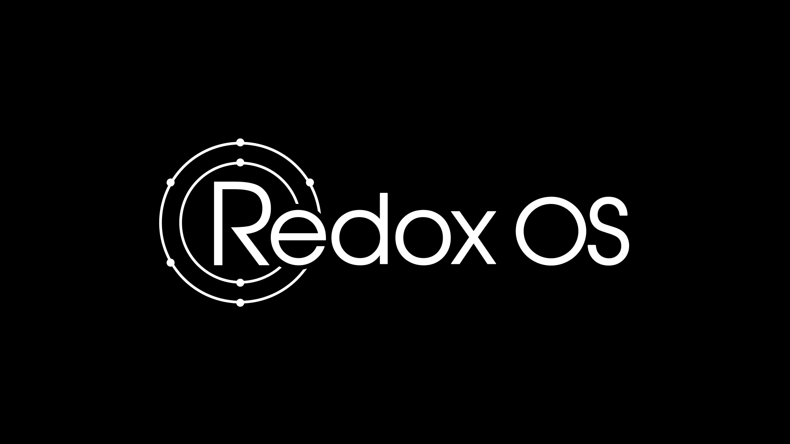
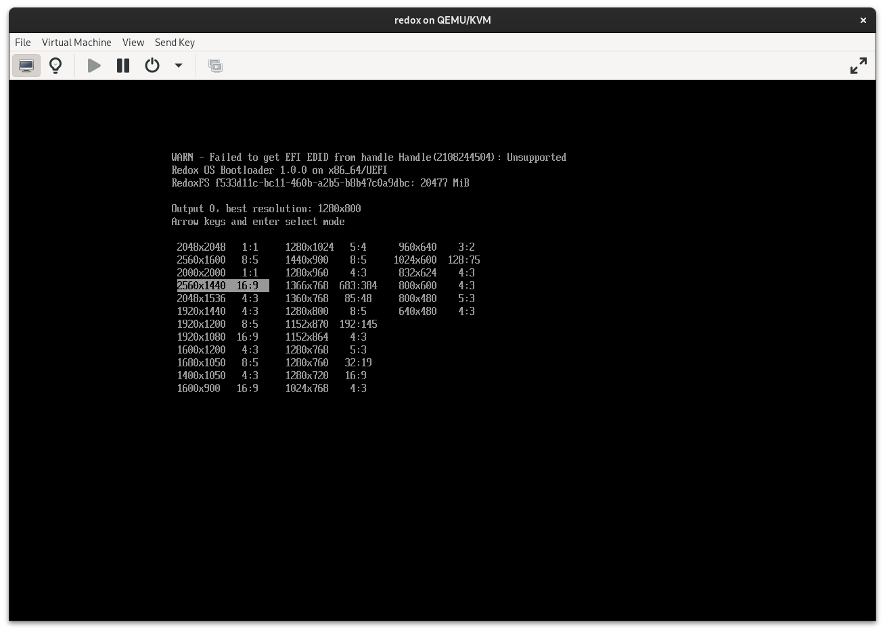
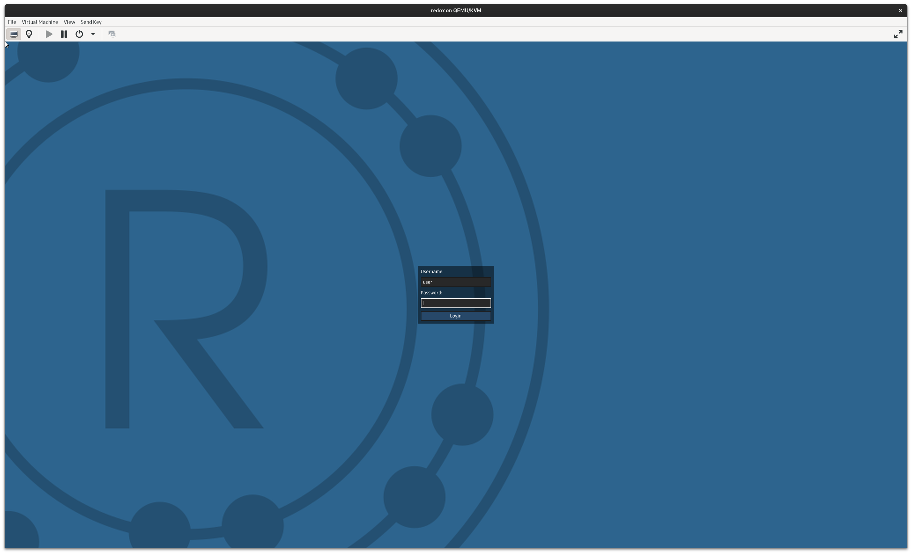
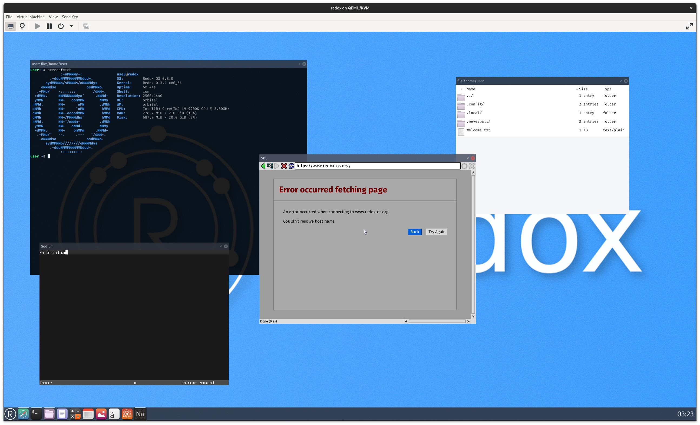
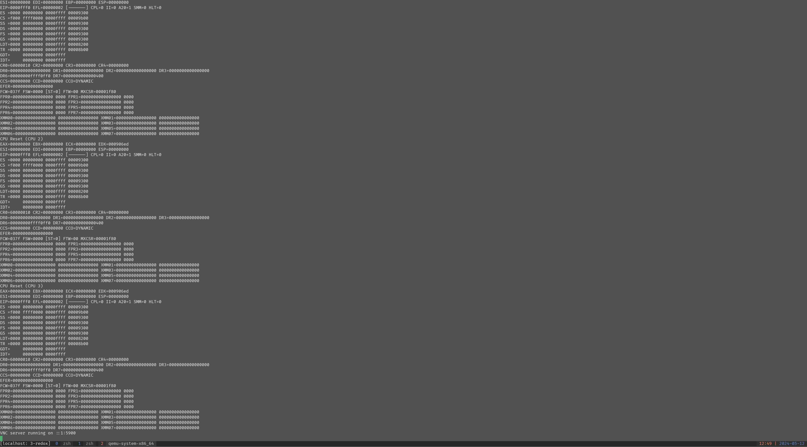
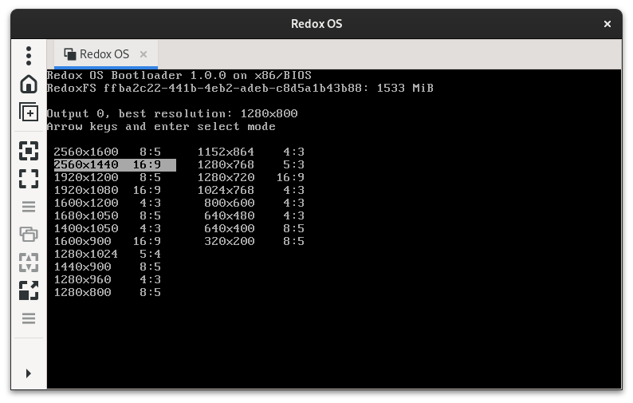
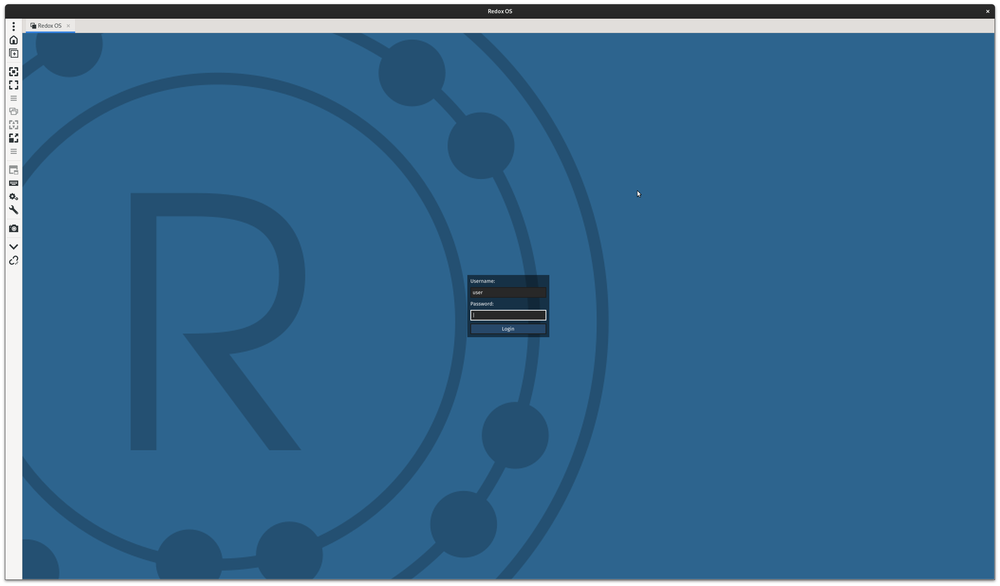
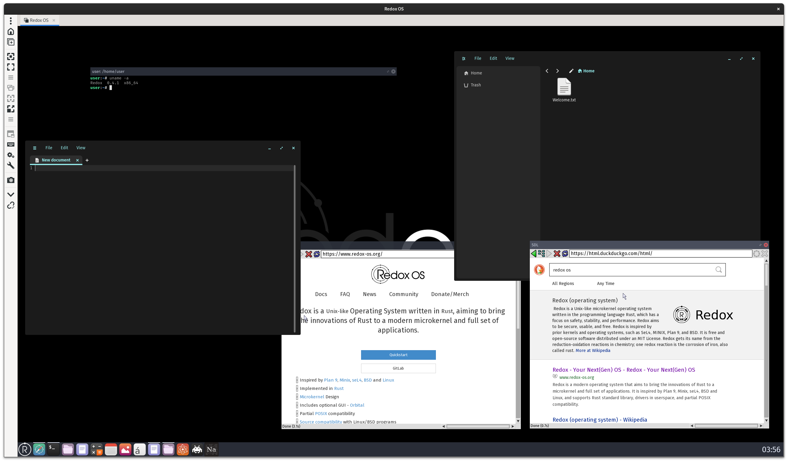
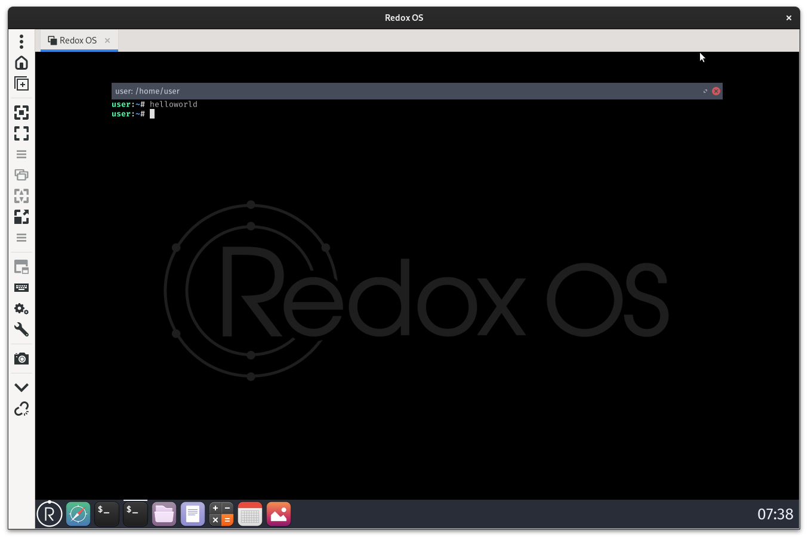

Image source: https://gitlab.redox-os.org/redox-os/backgrounds/-/tree/master

## 概要

[Redox OS](https://www.redox-os.org) は Rust で書かれた Unix ライクなオペレーティングシステムです。

カーネルのアーキテクチャがマイクロカーネルであることや Scheme 、*Everything is URL* など、設計にも尖った特徴があります。

今回は [Building Redox](https://doc.redox-os.org/book/ch02-05-building-redox.html) を参考に Redox OS をビルドして QEMU 上で動かしてみます。

（実機で動かそうとしたら失敗した…）

## Prebuild image で動かす

下記に Redox OS の image が置かれているので redox_demo.* のイメージを使って動かしてみる。

https://static.redox-os.org/img/x86_64/

先に結果を言うと、下記のドキュメントにあるように qemu で動かすのが一番簡単だった。

https://doc.redox-os.org/book/ch02-01-running-vm.html

### virt-manager + liveiso (or harddrive)

liveiso と harddrive でバージョンが違う場合があるようなので動かない場合は別の方法を試したほうが良さそう。

自分が試したときは harddrive のほうがバージョンが新しく、COSMIC デスクトップからポートされたエディタやファイルマネージャが使えるようになっていた。

起動したときの画面はこんな感じ。



解像度を設定する画面



ログイン画面。デフォルトユーザの情報は下記にある。

https://doc.redox-os.org/book/ch02-01-running-vm.html#using-the-emulation



デスクトップ画面。使用感は結構もっさりしていて、UI のふるさもある。

orbital というデスクトップ環境が使われていて、Terminal が透過しているが、おそらくそのせいでターミナルウィンドウを動かすと遅い。

また、自分がネットワーク周りの設定を理解していないからかもしれないが、ブラウザでネットワークに接続できなかった。

- メリット
  - gui で比較的簡単に操作できる
- デメリット
  - ネットワークの設定が少し複雑？
  - デスクトップ環境が重い

### qemu + harddrive

下記のドキュメントを参考に qemu で動かす。

https://doc.redox-os.org/book/ch02-01-running-vm.html

image のパスだけ修正した下記コマンドを実行。

```bash
SDL_VIDEO_X11_DGAMOUSE=0 qemu-system-x86_64 -d cpu_reset,guest_errors -smp 4 -m 2048 \
    -chardev stdio,id=debug,signal=off,mux=on,"" -serial chardev:debug -mon chardev=debug \
    -machine q35 -device ich9-intel-hda -device hda-duplex -netdev user,id=net0 \
    -device e1000,netdev=net0 -device nec-usb-xhci,id=xhci -enable-kvm -cpu host \
    -drive file=`echo $HOME/os_imgs/redox_demo_x86_64_2024-05-01_993_harddrive.img`,format=raw
```

実行するとこんな出力が出る。



最後に `VNC server running on ::1:5900` と出たので remmina で接続したところ virt-manager と同じく解像度の設定画面 -> ログイン画面 -> デスクトップ画面の流れで動かせた。



解像度設定画面



ログイン画面



デスクトップ画面

virt-manager と比べて動作は軽く、ネットワークも問題なく接続できた。

virt-manager が悪いとかではなくバージョンが違うせいかもしれない。（liveiso => v0.3.4, harddrive => v0.4.1）

- メリット
  - ドキュメントに書いてあるとおりにやれば基本的に動く
  - ネットワークの設定をコマンドオプションで指定しただけでつながる
  - (デスクトップ環境が軽い)
- デメリット
  - GUI がある desktop のイメージを動かすときに VNC client が必要 (server なら関係ない)

## build して動かす

### Redox のビルドシステム・ディレクトリ構成

Redox OS は [redox-os/redox](https://gitlab.redox-os.org/redox-os/redox) がメインのリポジトリでその下に submodule として filesystem のリポジトリや build システムの cookbook がある。

```text
redox
├── bootstrap.sh*         <-- ビルド環境を構築するスクリプト
├── build/                <-- build して生成された image ファイルなどが置かれる
├── build.sh*             <-- イメージのビルドに使えるスクリプト（直接 make でビルドしたので今回は使わなかった）
├── config/               <-- ビルド時に含めるパッケージ情報がある
├── CONTRIBUTING.md
├── cookbook/             <-- kernel やアプリケーションのビルドスクリプトなどが submodule として置かれている
├── docker/
├── HARDWARE.md
├── installer/            <-- make でビルドするときに config を読んで package のリストを取得するために使われている
├── LICENSE
├── Makefile
├── mk/                   <-- Makefile で include されるファイル
├── podman/
├── podman_bootstrap.sh*
├── prefix/
├── README.md
├── redoxfs/              <-- filesystem のリポジトリ
├── relibc/               <-- redox の libc
├── rust/
├── rust-toolchain.toml
└── scripts/
```

cookbook の中に recipe.toml があり、カーネルやアプリケーションのビルド方法が書かれている。

[redox-os/cookbook](https://gitlab.redox-os.org/redox-os/cookbook) 

### ビルド

ビルドは下記のように実行する。

```bash
make all CONFIG_NAME=<config>

# image が生成されて qemu で実行される
make qemu CONFIG_NAME=<config>
```

CONFIG_NAME は config/ にある toml ファイルの名前を指定する。(e.g. server.toml => server)

```text
config/
├── aarch64/
│  └── ...
├── acid.toml
├── base.toml
├── desktop-minimal.toml
├── desktop.toml
├── dev.toml
├── i686/
│  └── ...
├── net.toml
├── redoxer-gui.toml
├── redoxer.toml
├── resist.toml
├── server-minimal.toml
├── server.toml
└── x86_64/
   ├── <config>.toml
   ├── acid.toml
   ├── ci.toml
   ├── demo.toml
   ├── desktop-contain.toml
   ├── desktop-minimal.toml
   ├── desktop.toml
   ├── dev.toml
   ├── jeremy.toml
   ├── resist.toml
   ├── server-minimal.toml
   └── server.toml
```

[Building Redox](https://doc.redox-os.org/book/ch02-05-building-redox.html)

## 試しに systemcall を追加してみる

"hello world" を出力するだけの system call を追加してみる。

ref. https://gitlab.redox-os.org/Forest0923/redox/-/tree/add-helloworld-syscall?ref_type=heads

一度 `make all` でビルドした場合、redox リポジトリ下の `cookbook/recipes/core/kernel/source/syscall` に kernel のソースコードがダウンロードされるので下記の caller, handler を追加する。

また、追加したシステムコールを呼び出すアプリケーションを boot した redox 上でコンパイルして実行する方法がぱっと見てわからなかったので、ビルド段階でテスト用のアプリケーションを追加することにした。

### caller (library)

アプリケーション側から呼び出すためのライブラリが [redox-os/syscall](https://gitlab.redox-os.org/redox-os/syscall) にある。

src/caller.rs に system call の呼び出しを行う関数が定義されているのでここに helloworld() を追加。

```rust
/// Hello world
pub fn helloworld() -> Result<usize> {
    unsafe { syscall0(SYS_HELLOWORLD) }
}
```

src/number.rs に system call の番号を定義する。

```rust
pub const SYS_HELLOWORLD: usize = 999;
```

ちなみに syscall0 の関数は x86_64 向けの場合はマクロで下記のように定義されている。

ref. https://gitlab.redox-os.org/Forest0923/syscall/-/blob/add-helloworld-syscall/src/arch/x86_64.rs?ref_type=heads#L9-49

```rust
macro_rules! syscall {
    ($($name:ident($a:ident, $($b:ident, $($c:ident, $($d:ident, $($e:ident, $($f:ident, )?)?)?)?)?);)+) => {
        $(
            pub unsafe fn $name(mut $a: usize, $($b: usize, $($c: usize, $($d: usize, $($e: usize, $($f: usize)?)?)?)?)?) -> Result<usize> {
                asm!(
                    "syscall",
                    inout("rax") $a,
                    $(
                        in("rdi") $b,
                        $(
                            in("rsi") $c,
                            $(
                                in("rdx") $d,
                                $(
                                    in("r10") $e,
                                    $(
                                        in("r8") $f,
                                    )?
                                )?
                            )?
                        )?
                    )?
                    out("rcx") _,
                    out("r11") _,
                    options(nostack),
                );

                Error::demux($a)
            }
        )+
    };
}

syscall! {
    syscall0(a,);
    syscall1(a, b,);
    syscall2(a, b, c,);
    syscall3(a, b, c, d,);
    syscall4(a, b, c, d, e,);
    syscall5(a, b, c, d, e, f,);
}
```

### syscall handler

kernel 側では syscall 命令が実行されたとき用にハンドラの実装が必要で [redox-os/kernel](https://gitlab.redox-os.org/redox-os/kernel) にカーネル側のコードがある。

x86_64 の場合、MSR_LSTAR にシステムコールハンドラのアドレスを設定する。
その処理を行っているのは [src/arch/x86_64/interrupt/syscall.rs](https://gitlab.redox-os.org/Forest0923/kernel/-/blob/add-helloworld-syscall/src/arch/x86_64/interrupt/syscall.rs?ref_type=heads#L26) で下記のように wrmsr で syscall_instruction を登録している。

```rust
pub unsafe fn init() {
    // IA32_STAR[31:0] are reserved.

    // The base selector of the two consecutive segments for kernel code and the immediately
    // suceeding stack (data).
    let syscall_cs_ss_base = (gdt::GDT_KERNEL_CODE as u16) << 3;
    // The base selector of the three consecutive segments (of which two are used) for user code
    // and user data. It points to a 32-bit code segment, which must be followed by a data segment
    // (stack), and a 64-bit code segment.
    let sysret_cs_ss_base = ((gdt::GDT_USER_CODE32_UNUSED as u16) << 3) | 3;
    let star_high = u32::from(syscall_cs_ss_base) | (u32::from(sysret_cs_ss_base) << 16);

    msr::wrmsr(msr::IA32_STAR, u64::from(star_high) << 32);
    msr::wrmsr(msr::IA32_LSTAR, syscall_instruction as u64);
    ...
```

syscall_instruction は linux の entry_SYSCALL_64 で見たことがありそうな感じ。

```rust
#[no_mangle]
pub unsafe extern "C" fn __inner_syscall_instruction(stack: *mut InterruptStack) {
    let allowed = ptrace::breakpoint_callback(PTRACE_STOP_PRE_SYSCALL, None)
        .and_then(|_| ptrace::next_breakpoint().map(|f| !f.contains(PTRACE_FLAG_IGNORE)));

    if allowed.unwrap_or(true) {
        let scratch = &(*stack).scratch;

        syscall::syscall(
            scratch.rax,
            scratch.rdi,
            scratch.rsi,
            scratch.rdx,
            scratch.r10,
            scratch.r8,
            &mut *stack,
        );
    }

    ptrace::breakpoint_callback(PTRACE_STOP_POST_SYSCALL, None);
}

#[naked]
#[allow(named_asm_labels)]
pub unsafe extern "C" fn syscall_instruction() {
    core::arch::asm!(concat!(
    // Yes, this is magic. No, you don't need to understand
    "swapgs;",                    // Swap KGSBASE with GSBASE, allowing fast TSS access.
    "mov gs:[{sp}], rsp;",        // Save userspace stack pointer
    "mov rsp, gs:[{ksp}];",       // Load kernel stack pointer
    "push QWORD PTR {ss_sel};",   // Push fake userspace SS (resembling iret frame)
    "push QWORD PTR gs:[{sp}];",  // Push userspace rsp
    "push r11;",                  // Push rflags
    "push QWORD PTR {cs_sel};",   // Push fake CS (resembling iret stack frame)
    "push rcx;",                  // Push userspace return pointer

    // Push context registers
    "push rax;",
    push_scratch!(),
    push_preserved!(),

    // TODO: Map PTI
    // $crate::arch::x86_64::pti::map();

    // Call inner funtion
    "mov rdi, rsp;",
    "call __inner_syscall_instruction;",
    ...
```

`__inner_syscall_instruction` の `syscall::syscall` は下記のように実装されている。[syscall::syscall()](https://gitlab.redox-os.org/Forest0923/kernel/-/blob/add-helloworld-syscall/src/syscall/mod.rs?ref_type=heads#L63)

```rust
/// This function is the syscall handler of the kernel, it is composed of an inner function that returns a `Result<usize>`. After the inner function runs, the syscall
/// function calls [`Error::mux`] on it.
pub fn syscall(
    a: usize,
    b: usize,
    c: usize,
    d: usize,
    e: usize,
    f: usize,
    stack: &mut InterruptStack,
) {
    #[inline(always)]
    fn inner(a: usize, b: usize, c: usize, d: usize, e: usize, f: usize) -> Result<usize> {
        //SYS_* is declared in kernel/syscall/src/number.rs
        match a & SYS_CLASS {
            SYS_CLASS_FILE => {
                let fd = FileHandle::from(b);
                match a & SYS_ARG {
                    SYS_ARG_SLICE => match a {
                        SYS_WRITE => file_op_generic(fd, |scheme, number| {
                            scheme.kwrite(number, UserSlice::ro(c, d)?)
                        }),
                        ...
                        _ => return Err(Error::new(ENOSYS)),
                    },
                    SYS_ARG_MSLICE => match a {
                        SYS_READ => file_op_generic(fd, |scheme, number| {
                            scheme.kread(number, UserSlice::wo(c, d)?)
                        }),
                        ...
                        _ => return Err(Error::new(ENOSYS)),
                    },
                    _ => match a {
                        ...
                        SYS_CLOSE => close(fd).map(|()| 0),
                        _ => return Err(Error::new(ENOSYS)),
                    },
                }
            }
            SYS_CLASS_PATH => match a {
                SYS_OPEN => open(UserSlice::ro(b, c)?, d).map(FileHandle::into),
                ...
                _ => Err(Error::new(ENOSYS)),
            },
            _ => match a {
                ...
                SYS_HELLOWORLD => helloworld().map(|()| 0),

                _ => Err(Error::new(ENOSYS)),
            },
        }
    }
    ...
}
```

`SYS_HELLOWORLD` のときの実際の処理は helloworld() で下記のように定義

ref. https://gitlab.redox-os.org/Forest0923/kernel/-/blob/4c750d4acb233777e12ded8a4a19dff99fb28f0b/src/syscall/hello.rs

```rust
use crate::syscall::error::*;
pub fn helloworld() -> Result<()> {
    println!("SYS_HELLOWORLD: Hello, world!");
    Ok(())
}
```

### sample application

sys_helloworld を呼び出すアプリケーションを追加する。

https://gitlab.redox-os.org/Forest0923/helloworld

recipe の書き方は下記のようになっている。

https://doc.redox-os.org/book/ch09-01-including-programs.html#setting-up-the-recipe

```toml
[source]
git = "<repository url>"
branch = "<branch name>"

[build]
template = "custom" # custom, cargo, ...
script = """
echo "build script"
"""
```

redox-os/redox で config/x86_64/forest0923.toml に

```toml
include = ["../desktop.toml"]

[packages]
helloworld = {}
orbterm = {}
```

実行したところ QEMU のログに `SYS_HELLOWORLD: Hello, world!` と出力され、追加したシステムコールを呼び出すことができた。



```text
% make qemu CONFIG_NAME=forest0923
SDL_VIDEO_X11_DGAMOUSE=0 qemu-system-x86_64 -d guest_errors -name "Redox OS x86_64" -device nec-usb-xhci,id=xhci -smp 4 -m 2048 -chardev stdio,id=debug,signal=off,mux=on,"" -serial chardev:debug -mon chardev=debug -machine q35 -device ich9-intel-hda -device hda-output -netdev user,id=net0 -device e1000,netdev=net0 -object filter-dump,id=f1,netdev=net0,file=build/x86_64/forest0923/network.pcap -enable-kvm -cpu host \
        -drive file=build/x86_64/forest0923/harddrive.img,format=raw \
        -drive file=build/x86_64/forest0923/extra.img,format=raw
VNC server running on ::1:5900

...

########## Redox OS ##########
# Login with the following:  #
# `user`                     #
# `root`:`password`          #
##############################

redox login: DHCP: Offer IP: [10, 0, 2, 15], Server IP: [10, 0, 2, 2]
DHCP: Message Type: [2]
DHCP: Server ID: [10, 0, 2, 2]
DHCP: Subnet Mask: [255, 255, 255, 0]
DHCP: Router: [10, 0, 2, 2]
DHCP: Domain Name Server: [10, 0, 2, 3]
DHCP: Lease Time: [0, 1, 81, 128]
DHCP: New IP: 10.0.2.15/24
DHCP: New Router: default via 10.0.2.2 dev eth0 src 10.0.2.15
127.0.0.0/8  dev loopback src 127.0.0.1
10.0.2.0/24  dev eth0 src 10.0.2.15
DHCP: New DNS: 10.0.2.3
DHCP: Sent Request
DHCP: Ack IP: [10, 0, 2, 15], Server IP: [10, 0, 2, 2]
SYS_HELLOWORLD: Hello, world!
```

## おわり

Redox OS はまだ開発段階で不足している機能が多いですが、コンセプトも面白いし、継続的に開発もされているので引き続き注目していきたい。

## おまけ

Linux などと比べたときの機能の違い

- https://doc.redox-os.org/book/ch04-11-features.html?highlight=comparison

Rust で書かれた OS たち

- https://github.com/flosse/rust-os-comparison
