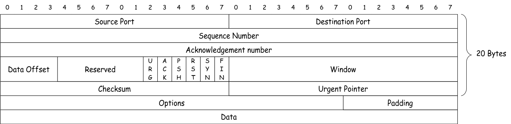

## TCP・ネットワーク関連

### Socket

- stream socket: TCP
- datagram socket: UDP
- raw socket: データリンク層のフレームを直接操作する
- packet socket: ネットワーク層のパケットを直接操作する

### TCP header



- TCP header は 20 バイト
- Data offset は 4 bit で TCP header の長さを示す。最小値は 5 で 20 バイト(Options がない場合)、最大値は 15 で 60 バイト
- URG (urgent)
  - 緊急のデータであることを示して先に処理させる
- ACK (acknowledgment)
- PSH (push)
  - データをバッファリングせずに送信させる
- RST (reset)
  - 予期しない状況やエラー時に接続をリセットする
- SYN (synchronize)
- FIN (finish)
- Window size は受信側のバッファサイズを通知する
- Checksum はヘッダとデータの整合性を確認するためのもので計算には送信元 IP と宛先 IP も必要
- Urgent pointer は URG フラグが立っている場合に使用されるもので、緊急のデータの位置を示す
- Options は可変長で window scale や timestamp などが含まれる
- Padding は Options の長さが 32 bit の倍数になるように埋めるためのもの

### スライディングウィンドウ

- ある程度のセグメントを ACK を待たずに送信することで効率的に通信を行う仕組み
  - 制限なしにパケットを送信し続けてしまうと受信側のバッファがオーバーフローしてしまう
  - しかし、ACK を毎回待っていると通信効率が悪くなる
- データ送信したらその分 Window を消費し、ACK を受け取ったら Window を回復する

### TCP の問題点、QUIC

- HoL (Head of Line) Blocking
  - パケットロスが発生した場合にその後のパケットも待たされてしまう問題
- シーケンス番号の使い回し
  - パケットロスが発生したときに再送されたパケットは同じシーケンス番号を持つため、確認応答がもとのパケットと紛らわしい
  - 再送タイムアウト時間の推定に悪影響（←あまり良くわかってない）
- QUICK
  - 一つのコネクションで複数のストリームを扱うため、HoL Blocking を回避できる
  - 扱うデータごとにストリームを分けることで再送によるブロッキングを回避
  - セグメントのID とシーケンス番号を分けることでシーケンス番号の使い回しを回避

## Rust 関連

### Error Handling

[Rust エラー処理](https://cha-shu00.hatenablog.com/entry/2020/12/08/060000)

### thread

[std::thread](https://doc.rust-lang.org/std/thread/)

### Arc

[std::sync::Arc](https://doc.rust-lang.org/std/sync/struct.Arc.html)

## ツール関連

### WireShark

- Install

```sh
paru -S wireshark-qt

sudo usermod -aG wireshark $USER
```

- loop back デバイスの 5000 番ポートへの TCP 通信をキャプチャする

```sh
tshark -i lo -f "tcp port 5000"
```

- キャプチャ例: nc で 5000 番ポートに接続

```text
% tshark -i lo -f "tcp port 5000"
Capturing on 'Loopback: lo'
    1 0.000000000          ::1 → ::1          TCP 94 45276 → 5000 [SYN] Seq=0 Win=33280 Len=0 MSS=65476 SACK_PERM TSval=1034799462 TSecr=0 WS=128
    2 0.000007955          ::1 → ::1          TCP 74 5000 → 45276 [RST, ACK] Seq=1 Ack=1 Win=0 Len=0
    3 0.000057822    127.0.0.1 → 127.0.0.1    TCP 74 52950 → 5000 [SYN] Seq=0 Win=33280 Len=0 MSS=65495 SACK_PERM TSval=2869984391 TSecr=0 WS=128
    4 0.000068765    127.0.0.1 → 127.0.0.1    TCP 54 5000 → 52950 [RST, ACK] Seq=1 Ack=1 Win=0 Len=0
```

### nc

- リスニング状態で待機

```sh
nc -l 5000
```

- 5000 番ポートに接続

```sh
nc localhost 5000
```

```text
% nc -l 5000
hello

% nc localhost 5000
hello
```

- ポートスキャン

```sh
nc -zv localhost <port>-<port>
```

```text
% nc -zv localhost 22
Connection to localhost (::1) 22 port [tcp/ssh] succeeded!
```

### ip

- Network namespace の作成

```sh
sudo ip netns add host0
sudo ip netns add host1
```

- Virtual Ethernet Device の作成
  - veth type のデバイスを作成し、veth0 と veth1 という名前でペアを作成する
  - 仮想的に 2 つのネットワークインタフェースが接続された状態になる
  - veth のドライバが必要

```sh
sudo ip link add name veth0 type veth peer name veth1
```

- namespace に作成したネットワークインタフェースを割り当てる
  - veth1 を host1 という namespace に割り当てる

```sh
sudo ip link set veth1 netns host1
```

- namespace 内でのコマンド実行

```sh
sudo ip netns exec host1 <command>
```

- ネットワークインタフェースを有効にする

```sh
sudo ip netns exec host1 ip link set veth1 up
```

### ethtool

### iptables
