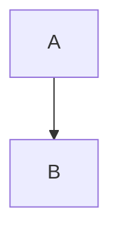
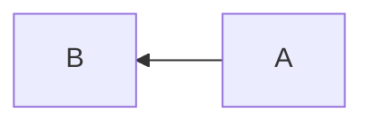

# Mermaid

Mermaid.js は Markdown のようなテキストベースで図形やグラフを表示するツールです．ここでは導入方法と文法を紹介します．

## 導入方法

[Mermaid.js](https://mermaid-js.github.io/mermaid/) を参考に以下のようなスクリプトをページに追加することで利用できるようになります．

```html
<script src="https://cdn.jsdelivr.net/npm/mermaid/dist/mermaid.min.js"></script>
<script>
    mermaid.initialize({ startOnLoad: true });
</script>
```

図は `<div class="mermaid">` の中に記述することで Mermaid.js に描画されます．

```html
<div class="mermaid">
  flowchart
      A-->B
</div>
```

## 文法

### **フローチャート**

フローチャートは `flowchart` を利用することで書くことができます．流れる方向は T (top), B (bottom), L (left), R (right) を `flowchart` の後ろにつけることで指定できます．





<--->


flowchart TB
    A-->B








<--->


flowchart RL
    A-->B



