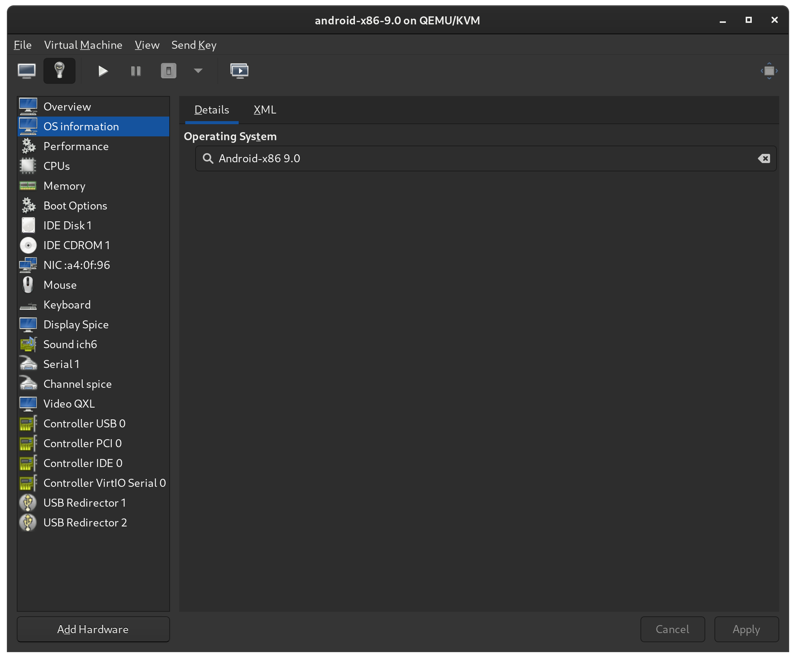
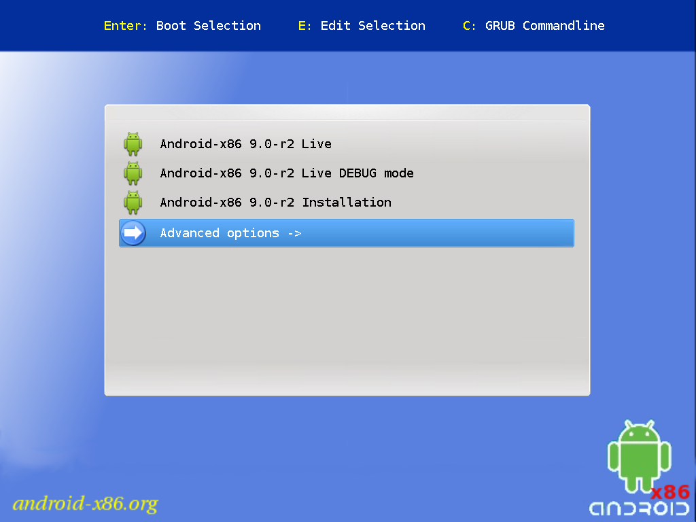
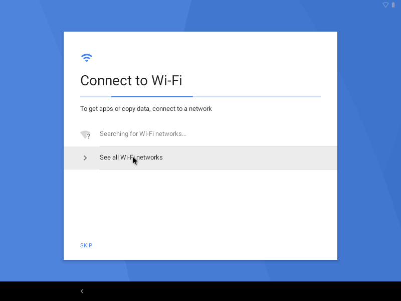
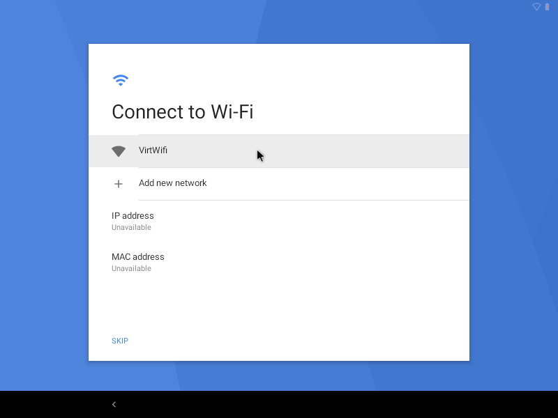

# Install Android x86

## System

- Host: Linux KVM
- Guest: Android x86, Lineage OS

## Installation

- Download \*.iso from <https://www.android-x86.org/>
- KVM config:

- Auto install:

> Android emulator: [NoxPlayer](https://jp.bignox.com/)
