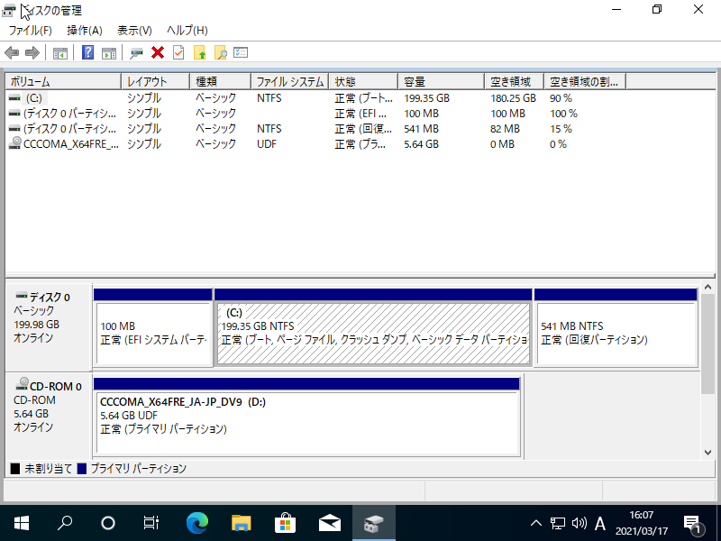
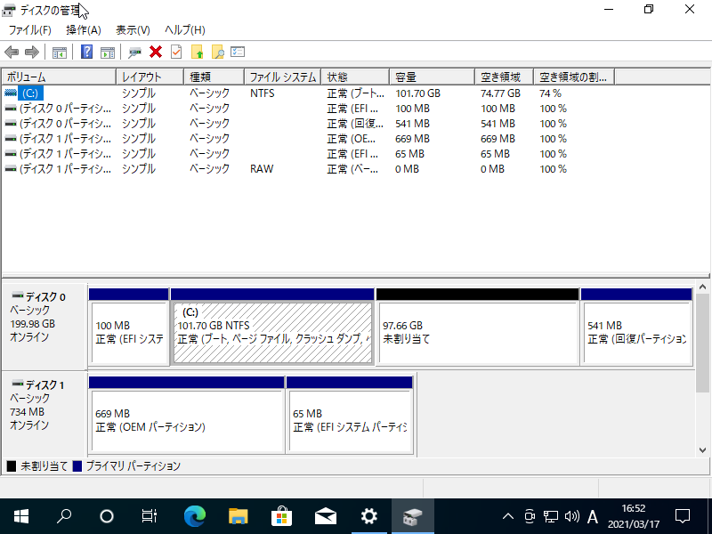

# Dual Booting on Mono Disk (Windows10 and ArchLinux)

## Preparation

- Install Windows 10
- Disk layout:

- Create partition for linux:

- Boot with iso

## Commands

```sh
loadkeys jp106
timedatectl set-ntp true
pacman -Syy
pacman -S reflector
reflector -c Japan --sort rate --save /etc/pacman.d/mirrorlist
cfdisk /dev/sda
mkfs.btrfs /dev/sda6
mkfs.fat -F32 /dev/sda5
mount /dev/sda6 /mnt
btrfs su cr /mnt/@
btrfs su cr /mnt/@home
btrfs su cr /mnt/@snapshots
btrfs su cr /mnt/@var_log
umount /mnt
mount -o noatime,compress=lzo,space_cache=v2,subvol=@ /dev/sda6 /mnt
mkdir -p /mnt/{boot,home,.snapshots,var/log}
mount -o noatime,compress=lzo,space_cache=v2,subvol=@home /dev/sda6 /mnt/home
mount -o noatime,compress=lzo,space_cache=v2,subvol=@snapshots /dev/sda6 /mnt/.snapshots
mount -o noatime,compress=lzo,space_cache=v2,subvol=@var_log /dev/sda6 /mnt/var/log
mount /dev/sda5 /mnt/boot
pacstrap /mnt base linux linux-firmware intel-ucode vim
genfstab -U /mnt >> /mnt/etc/fstab
arch-chroot /mnt
ln -sf /usr/share/zoneinfo/Asia/Tokyo /etc/localtime
hwclock --systohc

vim /etc/locale.gen
- # en_US.UTF-8
+ en_US.UTF-8

locale-gen
echo LANG=en_US.UTF-8 >> /etc/locale.conf
echo KEYMAP=jp106 >> /etc/vconsole.conf

vim /etc/hostname
+ arch

vim /etc/hosts
+ 127.0.0.1   localhost
+ ::1         localhost
+ 127.0.1.1   arch.localdomain    arch

passwd

pacman -S grub efibootmgr networkmanager network-manager-applet \
 dialog os-prober mtools dosfstools base-devel linux-headers snapper \
reflector cron git xdg-utils xdg-user-dirs ntfs-3g

vim /etc/mkinitcpio.conf
+ MODULES=(btrfs)

mkinitcpio -p linux

grub-install --target=x86_64-efi --efi-directory=/boot --bootloader-id=GRUB
grub-mkconfig -o /boot/grub/grub.cfg

systemctl enable NetworkManager
useradd -mG wheel mori
passwd mori

EDITOR=vim visudo
- # %wheel ALL=(ALL) ALL
+ %wheel ALL=(ALL) ALL

exit
umount -a
reboot
```

## Trouble shooting

- Boot entry of windows disappears from grub boot loader
  - Add `GRUB_DISABLE_OS_PROBER=false` to `/etc/default/grub` and recreate grub.cfg
  - The problem is deactivated os-prober. os-prober automatically finds operating systems and adds their boot entry, but sometimes it is deactivated. The option reactivate os-prober.
