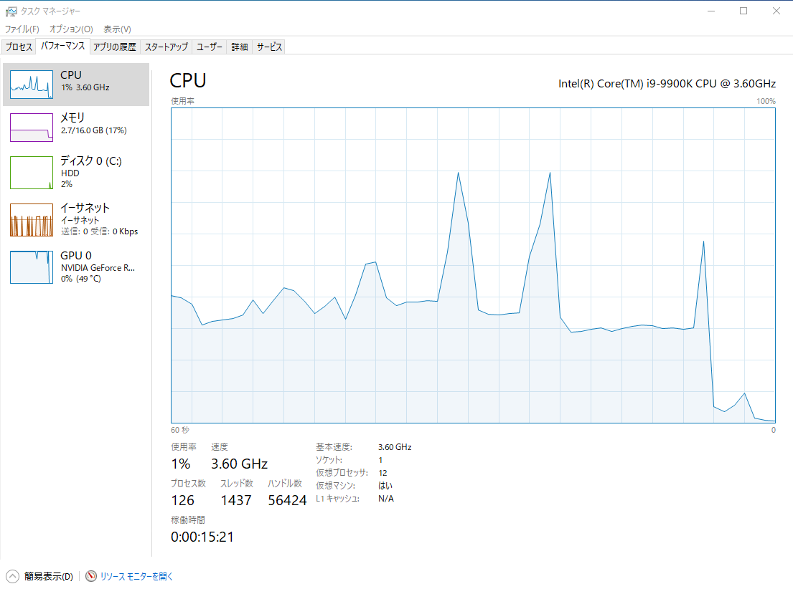

# Configurations for Gpu Passthrough

## System

- Arch Linux
- CPU: Intel Core-i9 9900K (8 cores, 16 threads)
- GPT: Nvidia RTX 2060

## Initialization

- /etc/default/grub

```diff
- GRUB_CMDLINE_LINUX_DEFAULT="loglevel=3 quiet"
+ GRUB_CMDLINE_LINUX_DEFAULT="loglevel=3 quiet intel_iommu=on vfio_iommu_type1.allow_unsafe_interrupts=1 iommu=pt"

```

- /etc/modules-load.d/vfio-pci.conf

```diff
+ pci_stub
+ vfio
+ vfio_iommu_type1
+ vfio_pci
+ kvm
+ kvm_intel
```

- Update grub.cfg:

```sh
sudo grub-mkconfig -o /boot/grub/grub.cfg
```

- Reboot

## Isolating the GPU

- Find the device ID of the GPU:

```sh
lspci -nn | grep NVIDIA
```

- Output:

```text
01:00.0 VGA compatible controller [0300]: NVIDIA Corporation TU106 [GeForce RTX 2060 Rev. A] [10de:1f08] (rev a1)
01:00.1 Audio device [0403]: NVIDIA Corporation TU106 High Definition Audio Controller [10de:10f9] (rev a1)
01:00.2 USB controller [0c03]: NVIDIA Corporation TU106 USB 3.1 Host Controller [10de:1ada] (rev a1)
01:00.3 Serial bus controller [0c80]: NVIDIA Corporation TU106 USB Type-C UCSI Controller [10de:1adb] (rev a1)
```

- ID: `10de:1f08`, `10de:10f9`, `10de:1ada`, `10de:1adb`

- /etc/modprobe.d/vfio.conf

```diff
+ options vfio-pci ids=10de:1f08, 10de:10f9, 10de:1ada, 10de:1adb
```

- /etc/mkinitcpio.conf

```diff
- MODULES=(btrfs)
+ MODULES=(btrfs vfio vfio_iommu_type1 vfio_pci vfio_virqfd nouveau)
```

- Update:

```sh
sudo mkinitcpio -g /boot/linux-custom.img
```

- Reboot

## Create VM

- Overview
  - Chipset: Q35
  - Firmware: UEFI
- CPU
  - Uncheck `Copy host CPU configuration` and choose `host-passthrough` as model.
  - Manualy set CPU topology
    - Sockets: 1
    - Cores: 7
    - Threads: 2
- Memory
  - 16384 MiB
- NIC
  - Network source: Virtual network 'bridge100'
  - Device model: e1000e
- Add usb devices for VM.
- Add PCI devices (GPU).
- Edit XML:

```diff
  <features>
    <acpi/>
    <apic/>
    <hyperv>
      <relaxed state="on"/>
      <vapic state="on"/>
      <spinlocks state="on" retries="8191"/>
+     <vendor_id state="on" value="0123456789ab"/>
    </hyperv>
+   <kvm>
+     <hidden state="on"/>
+   </kvm>
    <vmport state="off"/>
+   <ioapic driver="kvm"/>
  </features>
```

## Benchmark

- Core i9-9900K native:


- Core i9-9900K VM:




---

> References
>
> <https://zenn.dev/190ikp/articles/vagrant_libvirt_gpu>
>
> <https://github.com/vanities/GPU-Passthrough-Arch-Linux-to-Windows10>
>
> <https://github.com/bryansteiner/gpu-passthrough-tutorial>
>
> <https://access.redhat.com/documentation/ja-jp/red_hat_enterprise_linux/7/html/virtualization_getting_started_guide/sec-virtualization_getting_started-products-virtualized-hardware-devices>
>
> <https://access.redhat.com/documentation/ja-jp/red_hat_enterprise_linux/7/html/virtualization_deployment_and_administration_guide/sect-pci_devices-pci_passthrough>
