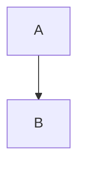
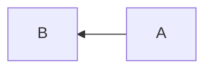

Mermaid.js is a tool for displaying diagrams or graphs in a text-based format similar to Markdown. This article explains how to install it and its syntax.

## Setup

It can be used by adding the following script to the page, referring to [Mermaid.js](https://mermaid-js.github.io/mermaid/).

```html
<script src="https://cdn.jsdelivr.net/npm/mermaid/dist/mermaid.min.js"></script>
<script>
    mermaid.initialize({ startOnLoad: true });
</script>
```

Figures can be drawn by Mermaid.js by writing them in `<div class="mermaid">`.

```html
<div class="mermaid">
  flowchart
      A-->B
</div>
```

## Syntax

### **Flowchart**

A flowchart can be written by using `flowchart`. The flow direction can be specified by appending T (top), B (bottom), L (left), or R (right) after `flowchart`.





<--->








<--->



