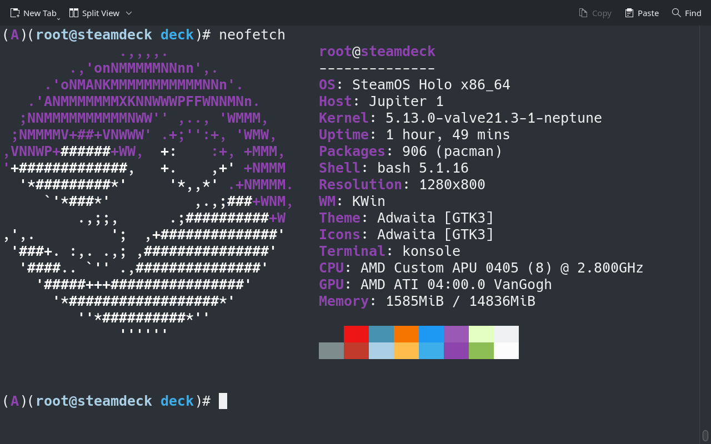
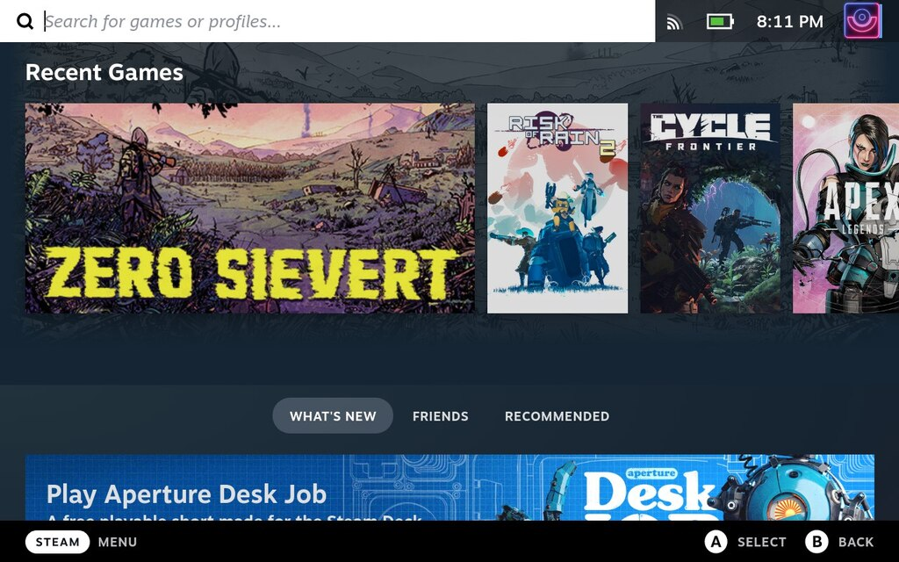
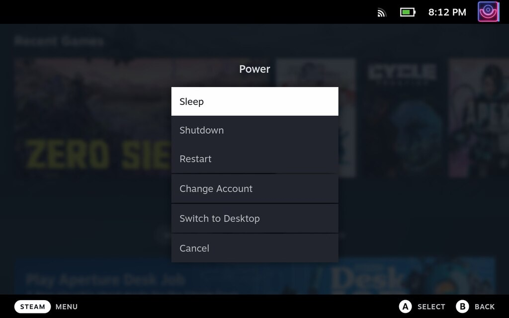
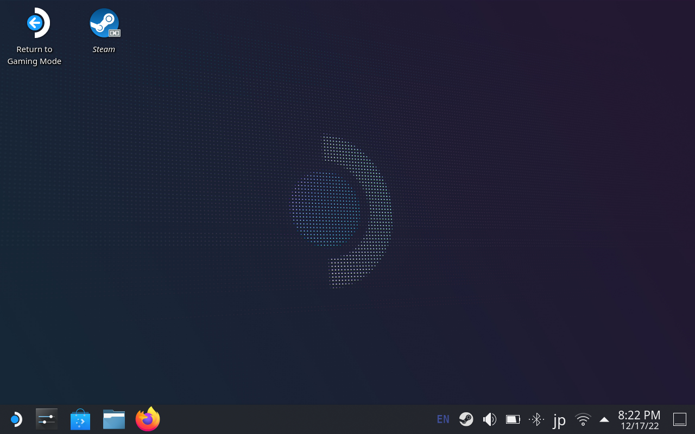
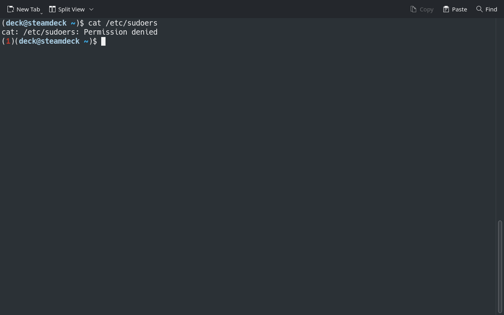

+++
title = "Steam Deck が発売されたので中身を見ていく‼"
description = ""
date = 2022-12-17T19:37:53+09:00
tags = [
  "Steam Deck", "Linux"
]
categories = [

]
draft = false
+++



## はじめに

Steam Deck は Valve が開発したゲーム機のふりをした Linux マシンで Arch Linux をベースにした SteamOS を搭載しています．

Arch ユーザとしてはさわらずにはいられないなのでこの記事ではデスクトップモードにして Steam Deck の中身を見ていきます．

## デスクトップモード

Steam Deck を起動するとゲーム用のモードで起動するので，まずは KDE のデスクトップに入る必要があります．



電源ボタンを長押しするとこのようなメニューが出てくるので，Switch to Desktop を選択します．



これで KDE のデスクトップに切り替わります！



Konsole がインストールされていたので，早速 SteamOS のインストールされた状態を見てみましょう．

## ログインユーザの状態（などなど）

ログインユーザ名は deck で id, groups の結果はこんな感じでした．いたって普通ですね．

```text
(deck@steamdeck ~)$ id
uid=1000(deck) gid=1000(deck) groups=1000(deck),998(wheel)
(deck@steamdeck ~)$ groups
wheel deck
```

ちなみにシェルは bash ですが，エラーコードが出るなどプロンプトは見やすくなってます．



ただ，.bashrc と .bash_profile はまっさらでした．

```sh
#
# ~/.bashrc
#

# If not running interactively, don't do anything
[[ $- != *i* ]] && return
```

```sh
#  SPDX-License-Identifier: MIT
#
#  Copyright © 2020 Collabora Ltd.
#  Copyright © 2020 Valve Corporation.
#
#  This file is part of steamos-image-recipes.
#
#  steamos-image-recipes is free software; you can redistribute it and/or modify
#  it under the terms of the GNU Lesser General Public License as published
#  by the Free Software Foundation; either version 2.1 of the License, or
#  (at your option) any later version.

#
# ~/.bash_profile
#

[[ -f ~/.bashrc ]] && . ~/.bashrc
```

どこか別の場所でプロンプトの環境変数だけ設定しているみたいですね．

```text
(deck@steamdeck ~)$ echo $PS
$PS1  $PS2  $PS4
(deck@steamdeck ~)$ echo $PS1
(\[\033[1;32m\]\u@\h\[\033[1;34m\] \W\[\033[0m\])\$
(deck@steamdeck ~)$ echo $PS2
>
(deck@steamdeck ~)$ echo $PS4
+
```

脱線ついでに，tty の切り替えをやってみましたが，画面が真っ暗になるだけでログインプロンプトは表示されませんでした．

## プリインストールされているパッケージ

それでは次にインストールされているパッケージを確認しようと思います．

Arch ベースなので `sudo pacman -Q` を実行したいのですが，その前にパスワードの設定をします．

```sh
passwd
```

パッケージリストはそこそこ多かったので gists に入れておきます．

[SteamOS_preinstalled_pkgs.log](https://gist.github.com/Forest0923/2d2f2ac6e34a79406848f925fd0b03ad)

なんとなく目についたのはこのあたり．

- AMD のチップだから amd-ucode が入ってる
- btrfs-progs が入ってるけど Btrfs なの？
- holo-\* と steam\* 関連は SteamOS 特有のなにか
- holo-sudo は何ができるのか？
- networkmanager は安定
- openssh と openvpn がもともと入ってる
- sshfs どこで使うんだろう？
- なぜか zsh がすでに入ってる

AUR helper は yay が入っているようです．

```text
(deck@steamdeck ~)$ yay -V
yay v10.3.0.r0.g4a93199 - libalpm v13.0.1
```

AUR からインストールされているパッケージはないみたい．「使いたいユーザは勝手に使えば？」みたいな感じなのかな…．

## ミラーリスト

ミラーリストは Steam Deck 用のサーバのみのようです．

```text
(deck@steamdeck ~)$ cat /etc/pacman.d/mirrorlist
Server = https://steamdeck-packages.steamos.cloud/archlinux-mirror/$repo/os/$arch
```

Manjaro と同じで Arch のミラーよりもワンクッションおいて安定性を求める感じかなと妄想してみる．

ちなみにカーネルのバージョンは v5.13.0 のカスタムカーネルのようです．2022年10月3日なので2ヶ月位遅いのかな？（カスタムしたのが2ヶ月前なだけでベースバージョンはもっと前のやつかも）

```text
(deck@steamdeck ~)$ uname -a
Linux steamdeck 5.13.0-valve21.3-1-neptune #1 SMP PREEMPT Mon, 03 Oct 2022 23:17:36 +0000 x86_64 GNU/Linux
```

Arch の現在のカーネルバージョンは v6.0.12 なので割と差が開いていますね．

```text
mori@thinkpad-arch ~ % uname -a
Linux thinkpad-arch 6.0.12-arch1-1 #1 SMP PREEMPT_DYNAMIC Thu, 08 Dec 2022 11:03:38 +0000 x86_64 GNU/Linux
```

## autostart, systemd

起動時に自動で実行されるアプリケーションを見てみます．ここで Steam Client が実行されているはず（多分）．

```text
(deck@steamdeck ~)$ ls -la .config/autostart/
total 8
drwxr-xr-x  2 deck deck 4096 Dec 17 17:34 .
drwxr-xr-x 17 deck deck 4096 Dec 17 20:57 ..
lrwxrwxrwx  1 deck deck   58 Dec 17 17:34 steamos-update-os-notifier.desktop -> /usr/share/applications/steamos-update-os-notifier.desktop
```

アップデートがあるときに通知するだけのやつみたいです．

```text
[Desktop Entry]
Name=SteamOS Update Operating System Notifier
Comment=KUpdate Notifier for the new systemtray specification
Exec=/usr/lib/steamos/steamos-update-os-notifier
Icon=system-software-update
Type=Application
NoDisplay=true
OnlyShowIn=KDE
Keywords=kupdate-notifier;system;update;updater
```

じゃあ systemd にあるのかと思って `systemctl list-units` したけど特に見当たらず…．というか user が実行しそうな気がするからそもそも systemd に登録するはずないか…？

Steam client の実行については今の所不明ですが，systemd のターゲットの中に cryptsetup を見つけました．

```text{hl_lines=[5]}
...
home-swapfile.swap     loaded active active  Swap
basic.target           loaded active active  Basic System
bluetooth.target       loaded active active  Bluetooth Support
cryptsetup.target      loaded active active  Local Encrypted Volumes
getty.target           loaded active active  Login Prompts
graphical.target       loaded active active  Graphical Interface
integritysetup.target  loaded active active  Local Integrity Protected Volumes
...
```

ディスク暗号化してるのかと思いましたが，パッケージリストにはそれらしきものはないので結局よくわかりませんでした．

dm-crypt であれば mkinitcpio のコンフィグになにかあるかと思いましたが，そもそも /etc/mkinitcpio.conf が存在しませんでした．

どうやって initramfs を作っているのか…？

## ディスクとパーティション

接続されたデバイスは 512 GB の SSD のみでした．

なにやら複数のパーティションが作られていますね．

```test
(deck@steamdeck ~)$ lsblk
NAME        MAJ:MIN RM   SIZE RO TYPE MOUNTPOINTS
nvme0n1     259:0    0 476.9G  0 disk
├─nvme0n1p1 259:1    0    64M  0 part
├─nvme0n1p2 259:2    0    32M  0 part
├─nvme0n1p3 259:3    0    32M  0 part
├─nvme0n1p4 259:4    0     5G  0 part /
├─nvme0n1p5 259:5    0     5G  0 part
├─nvme0n1p6 259:6    0   256M  0 part /var
├─nvme0n1p7 259:7    0   256M  0 part
└─nvme0n1p8 259:8    0 466.3G  0 part /var/tmp
                                      /var/log
                                      /var/lib/systemd/coredump
                                      /var/lib/flatpak
                                      /var/lib/docker
                                      /var/cache/pacman
                                      /srv
                                      /root
                                      /opt
                                      /home
```

fstab ファイルの中身を確認するとこんな感じでした．

```text
(deck@steamdeck ~)$ cat /etc/fstab
# Static information about the filesystems.
# See fstab(5) for details.

# <file system> <dir> <type> <options> <dump> <pass>
# SteamOS partitions
#/dev/disk/by-partsets/self/rootfs /       ext4    defaults                0       1
#/dev/disk/by-partsets/self/var    /var    ext4    defaults                0       2
/dev/disk/by-partsets/self/efi    /efi    vfat    defaults,nofail,umask=0077,x-systemd.automount,x-systemd.idle-timeout=1min 0       2
/dev/disk/by-partsets/shared/esp  /esp    vfat    defaults,nofail,umask=0077,x-systemd.automount,x-systemd.idle-timeout=1min 0       2
/dev/disk/by-partsets/shared/home /home   ext4    defaults,nofail,x-systemd.growfs 0       2
```

とりあえず ext4 でフォーマットしてるのかな？

lsblk したときの nvme0n1p8 の表記が btrfs のサブボリュームの表記の仕方に似ていたので btrfs なのかと思ったけど違いました．

cf:

```text
mori@thinkpad-arch ~ % lsblk
NAME        MAJ:MIN RM   SIZE RO TYPE MOUNTPOINTS
nvme0n1     259:0    0 476.9G  0 disk
├─nvme0n1p1 259:1    0   100M  0 part /boot
├─nvme0n1p2 259:2    0    16M  0 part
├─nvme0n1p3 259:3    0 220.3G  0 part
├─nvme0n1p4 259:4    0   548M  0 part
└─nvme0n1p5 259:5    0   256G  0 part /var/log
                                      /home
                                      /.snapshots
                                      /
mori@thinkpad-arch ~ % cat /etc/fstab
───────┬──────────────────────────────────────────────────────────────────────────────────────────────────────────────────────────────────────────────────────────────────────────────────────────────
       │ File: /etc/fstab
───────┼──────────────────────────────────────────────────────────────────────────────────────────────────────────────────────────────────────────────────────────────────────────────────────────────
   1   │ # Static information about the filesystems.
   2   │ # See fstab(5) for details.
   3   │
   4   │ # <file system> <dir> <type> <options> <dump> <pass>
   5   │ # /dev/nvme0n1p5
   6   │ UUID=ed5e0803-dd6b-434e-8094-635498d65036   /           btrfs       rw,noatime,compress=lzo,ssd,space_cache=v2,subvolid=256,subvol=/@,subvol=@  0 0
   7   │
   8   │ # /dev/nvme0n1p1
   9   │ UUID=3C4A-3D26          /boot       vfat        rw,relatime,fmask=0022,dmask=0022,codepage=437,iocharset=iso8859-1,shortname=mixed,utf8,errors=remount-ro   0 2
  10   │
  11   │ # /dev/nvme0n1p5
  12   │ UUID=ed5e0803-dd6b-434e-8094-635498d65036   /home       btrfs       rw,noatime,compress=lzo,ssd,space_cache=v2,subvolid=257,subvol=/@home,subvol=@home  0 0
  13   │
  14   │ # /dev/nvme0n1p5
  15   │ UUID=ed5e0803-dd6b-434e-8094-635498d65036   /.snapshots btrfs       rw,noatime,compress=lzo,ssd,space_cache=v2,subvolid=258,subvol=/@snapshots,subvol=@snapshots    0 0
  16   │
  17   │ # /dev/nvme0n1p5
  18   │ UUID=ed5e0803-dd6b-434e-8094-635498d65036   /var/log    btrfs       rw,noatime,compress=lzo,ssd,space_cache=v2,subvolid=259,subvol=/@var_log,subvol=@var_log    0 0
  19   │
───────┴──────────────────────────────────────────────────────────────────────────────────────────────────────────────────────────────────────────────────────────────────────────────────────────────

```

## Kernel

最後にカーネルのソースコードを見ようかと思ったのですが，/usr/src 下にコードはありませんでした…．

## パッケージの追加

pacman は使えそうなのでためしに neofetch をインストールしてみます．ロゴは Arch なのかSteamOS なのか…．

まずはパッケージのデータベースを更新します．（jupiter と holo はArch では見たことがない名前ですね．）

```text
(deck@steamdeck src)$ sudo pacman -Sy
[sudo] password for deck:
:: Synchronizing package databases...
 jupiter is up to date
 holo is up to date
 core is up to date
 extra is up to date
 community is up to date
 multilib is up to date
```

次に neofetch をインストールします．

...失敗しましたね．

```text
(deck@steamdeck src)$ sudo pacman -S neofetch
resolving dependencies...
looking for conflicting packages...

Packages (1) neofetch-7.1.0-2

Total Installed Size:  0.33 MiB

:: Proceed with installation? [Y/n]
(1/1) checking keys in keyring                                                                                         [########################################################################] 100%
(1/1) checking package integrity                                                                                       [########################################################################] 100%
(1/1) loading package files                                                                                            [########################################################################] 100%
(1/1) checking for file conflicts                                                                                      [########################################################################] 100%
(1/1) checking available disk space                                                                                    [########################################################################] 100%
:: Processing package changes...
(1/1) installing neofetch                                                                                              [########################################################################] 100%
warning: warning given when extracting /usr/bin/neofetch (Can't create '/usr/bin/neofetch')
warning: warning given when extracting /usr/share/licenses/neofetch/ (Can't create '/usr/share/licenses/neofetch')
warning: warning given when extracting /usr/share/licenses/neofetch/LICENSE.md (Failed to create dir '/usr/share/licenses/neofetch')
warning: warning given when extracting /usr/share/man/man1/neofetch.1.gz (Can't create '/usr/share/man/man1/neofetch.1.gz')
Optional dependencies for neofetch
    catimg: Display Images
    chafa: Image to text support
    feh: Wallpaper Display
    imagemagick: Image cropping / Thumbnail creation / Take a screenshot
    jp2a: Display Images
    libcaca: Display Images
    nitrogen: Wallpaper Display
    w3m: Display Images
    xdotool: See https://github.com/dylanaraps/neofetch/wiki/Images-in-the-terminal [installed]
    xorg-xdpyinfo: Resolution detection (Single Monitor) [installed]
    xorg-xprop: Desktop Environment and Window Manager [installed]
    xorg-xrandr: Resolution detection (Multi Monitor + Refresh rates) [installed]
    xorg-xwininfo: See https://github.com/dylanaraps/neofetch/wiki/Images-in-the-terminal [installed]
:: Running post-transaction hooks...
(1/1) Arming ConditionNeedsUpdate...
touch: setting times of '/usr': Read-only file system
error: command failed to execute correctly
```

ファイルを持ってくることはできたけど /usr 以下に書き込めなかったという感じでしょうか．

しかし，`ls -l /` した限りでは root なら書き込めそうです．

```text{hl_lines=[21]}
(deck@steamdeck src)$ ls -l /
total 71
lrwxrwxrwx   1 root root     7 Apr 29  2022 bin -> usr/bin
drwxr-xr-x   1 root root   136 Dec 14 08:40 boot
drwxr-xr-x  21 root root  4120 Dec 17 21:49 dev
drwx------   4 root root 16384 Jan  1  1970 efi
drwx------   4 root root 16384 Jan  1  1970 esp
drwxr-xr-x   1 root root  1024 Dec 17 23:24 etc
drwxr-xr-x   5 root root  4096 Dec 17 17:34 home
lrwxrwxrwx   1 root root     7 Apr 29  2022 lib -> usr/lib
lrwxrwxrwx   1 root root     7 Apr 29  2022 lib64 -> usr/lib
lrwxrwxrwx   1 root root     7 Apr 29  2022 mnt -> var/mnt
drwxr-xr-x   2 root root  4096 Dec 17 17:34 opt
dr-xr-xr-x 332 root root     0 Dec 17 17:39 proc
drwxr-x---   6 root root  4096 Dec 17 22:43 root
drwxr-xr-x  25 root root   600 Dec 17 20:28 run
lrwxrwxrwx   1 root root     7 Apr 29  2022 sbin -> usr/bin
drwxr-xr-x   4 root root  4096 Dec 17 17:34 srv
dr-xr-xr-x  12 root root     0 Dec 17 17:39 sys
drwxrwxrwt  15 root root   580 Dec 17 21:46 tmp
drwxr-xr-x   1 root root    80 Dec 17 23:23 usr
drwxr-xr-x  14 root root  1024 Dec 17 19:02 var
```

`'/usr': Read-only file system` とあるので，アクセス権限以前の問題でしょうか？

調べてみると他のユーザも同じ状況のようです．

[How to solve the read only system /usr](https://steamcommunity.com/app/1675200/discussions/1/3461596283592111821/)

Developper Mode にしても Read-only は消えないようですね．

[Steam Deck Developer Mode does not turn off the read-only filesystem](https://www.gamingonlinux.com/2022/04/steam-deck-developer-mode-does-not-turn-off-the-read-only-filesystem/)

ただし，上記2つの URL の先でも示されているのですが，解決策はあるようです．

公式による解決策:

- [Steam Deck Desktop: FAQ](https://help.steampowered.com/en/faqs/view/671A-4453-E8D2-323C)

>What if I want to do more than what’s available by flatpak?
>
>Totally fine, though it comes with several caveats. Make sure you know what you’re doing and be careful about running random commands / scripts you find on the internet - you may get your Steam Deck into a bad state or compromise your data. In addition, anything you install outside of flatpak (via pacman for instance) may be wiped with the next SteamOS update.
>
>With that out of the way, if you are going outside flatpak and need to edit the read-only image, you can enable that with the following command:
>
>```sh
>sudo steamos-readonly disable
>```
>
>See below for instructions on using sudo with Steam Deck. One more warning to complete the warning sandwich – don’t do the above unless you know what you’re doing.

そのとおりにやってみたところうまく行きました．

```text
(deck@steamdeck src)$ sudo steamos-readonly disable
[sudo] password for deck:
(deck@steamdeck src)$ sudo pacman -S neofetch
resolving dependencies...
looking for conflicting packages...

Packages (1) neofetch-7.1.0-2

Total Installed Size:  0.33 MiB

:: Proceed with installation? [Y/n]
(1/1) checking keys in keyring                                                                                         [########################################################################] 100%
(1/1) checking package integrity                                                                                       [########################################################################] 100%
(1/1) loading package files                                                                                            [########################################################################] 100%
(1/1) checking for file conflicts                                                                                      [########################################################################] 100%
(1/1) checking available disk space                                                                                    [########################################################################] 100%
:: Processing package changes...
(1/1) installing neofetch                                                                                              [########################################################################] 100%
Optional dependencies for neofetch
    catimg: Display Images
    chafa: Image to text support
    feh: Wallpaper Display
    imagemagick: Image cropping / Thumbnail creation / Take a screenshot
    jp2a: Display Images
    libcaca: Display Images
    nitrogen: Wallpaper Display
    w3m: Display Images
    xdotool: See https://github.com/dylanaraps/neofetch/wiki/Images-in-the-terminal [installed]
    xorg-xdpyinfo: Resolution detection (Single Monitor) [installed]
    xorg-xprop: Desktop Environment and Window Manager [installed]
    xorg-xrandr: Resolution detection (Multi Monitor + Refresh rates) [installed]
    xorg-xwininfo: See https://github.com/dylanaraps/neofetch/wiki/Images-in-the-terminal [installed]
:: Running post-transaction hooks...
(1/1) Arming ConditionNeedsUpdate...
```

この方法でインストールしたパッケージは SteamOS のアプデートで消える可能性があるようなので Flatpak を使ったほうが良いみたいですが，とりあえずこれで何でもできますね．

neofetch の実行結果は冒頭の通りでした．Steam のロゴマークでしたね．

## おわり

Steam Deck は（一応）一般向けのゲーム機という位置づけなのでシステムが壊れないようにある程度の制限はあるようです．

また，全体的にディレクトリ構造がデフォルトとは違う，パーティションなどが複雑に分割されている，mkinitcpio などあるはずのものがないなど，普段使っている Arch の環境と違うことが多かったです．

Linux の勉強も兼ねてまた今度じっくり中身を見てみようと思います．
