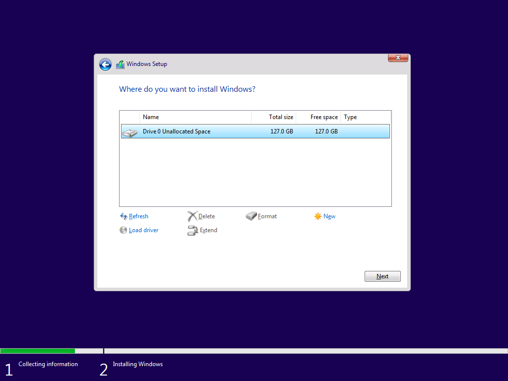
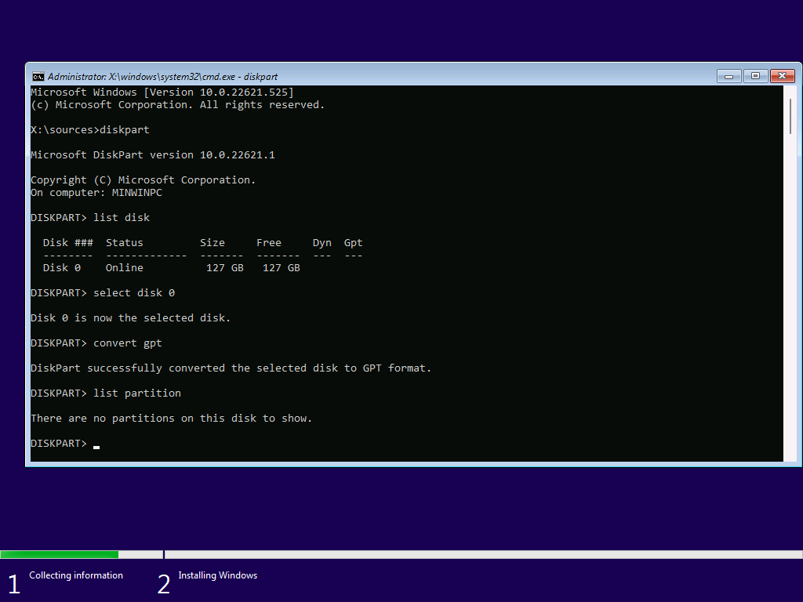
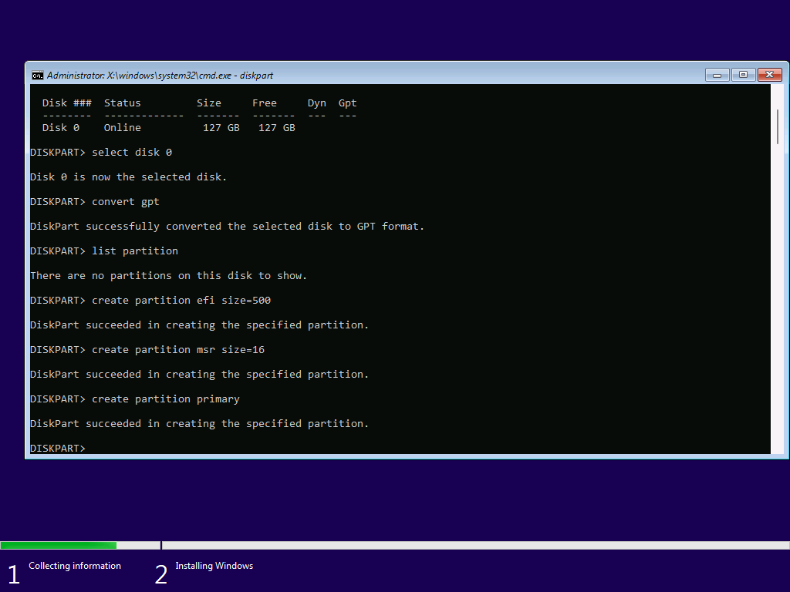
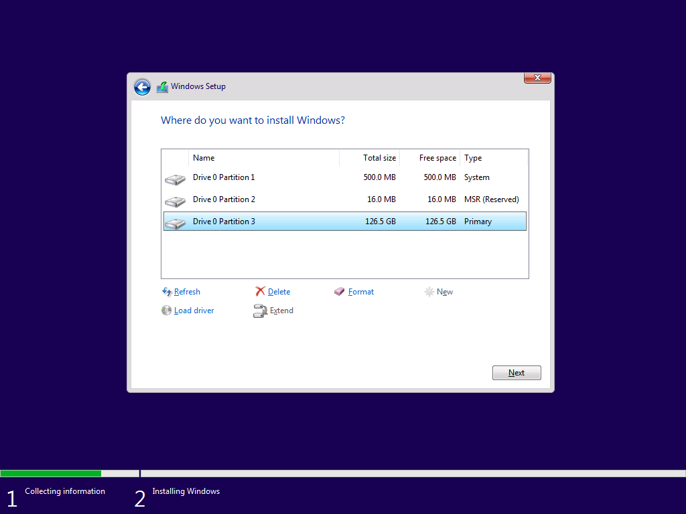
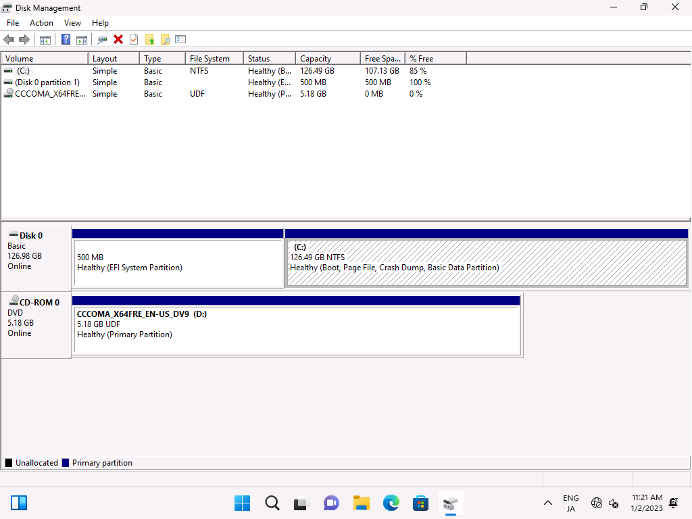
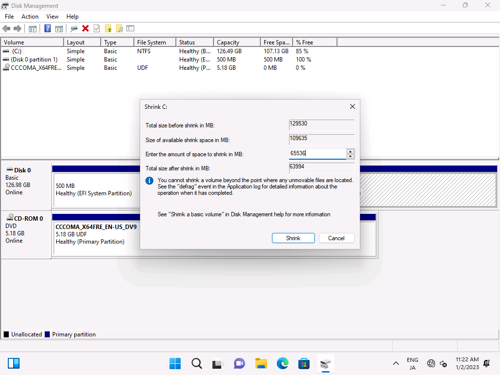
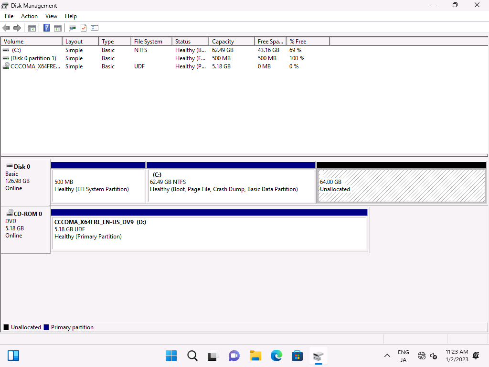

Install Arch Linux with the following settings.

| Settings        |                 |
| --------------- | --------------- |
| Dual Booting    | Windows 11      |
| Filesystem      | Btrfs           |
| Boot Loader     | Systemd-boot    |
| Disk            | single-disk     |
| Disk Encryption | dm-crypt (LUKS) |

## Install Windows 11

### diskpart

At first, install Windows 11.

Boot from ISO which can be downloaded from [here](https://www.microsoft.com/en-us/software-download/windows11), and choose drive to install Windows 11.

You can install with the default layout, but I recommend to use custom layout.
This is because the size of the default EFI partition is 100 MB.

It is possible to manage linux and windows images in that size of partition, but some tweaks is needed, for example, compressing initramfs with xz.

In this example I will allocate 500 MB for the EFI partition.

When the following installation screen appears, press shift + F10 to open cmd.



Then, use diskpart for partitioning.
Select a disk with SELECT and convert it to GPT if necessary.



Run CREATE to create partitions.



Each command is explained by running help, so if you do not understand a command, you can look it up as needed.

After partitioning, exit diskpart and cmd.

Press Refresh and install Windows 11 on the primary partition.



### Bypass sign-in (option)


When you see sign-in window like above, press Shift + F10 and run:

```sh
ipconfig /release
```

It will disconnect the network to make the sign in fail. After that, click `Create one!` to create local account.


### Shrink

We need to get a free disk for Linux, so we start the disk manager and shrink the disk.







Finally, downloads Arch Linux ISO from [here](https://archlinux.org/download/) and start installation.

## Install Arch Linux

### ISO

[Arch Linux Downloads](https://archlinux.org/download/)

### Commands

```sh
loadkeys jp106
fdisk /dev/sda
cryptsetup luksFormat /dev/sda4
cryptsetup luksOpen /dev/sda4 luksroot
mkfs.btrfs /dev/mapper/luksroot
mount /dev/mapper/luksroot /mnt
btrfs su cr /mnt/@
btrfs su cr /mnt/@home
btrfs su cr /mnt/@snapshots
btrfs su cr /mnt/@var_log
umount /mnt
mount -o noatime,compress=zstd,space_cache=v2,subvol=@ /dev/mapper/luksroot /mnt
mkdir -p /mnt/{boot,home,.snapshots,var/log}
mount -o noatime,compress=zstd,space_cache=v2,subvol=@home /dev/mapper/luksroot /mnt/home
mount -o noatime,compress=zstd,space_cache=v2,subvol=@snapshots /dev/mapper/luksroot /mnt/.snapshots
mount -o noatime,compress=zstd,space_cache=v2,subvol=@var_log /dev/mapper/luksroot /mnt/var/log
mount /dev/sda1 /mnt/boot
pacman -Syy
pacman -S archlinux-keyring
pacstrap /mnt base linux linux-firmware vim intel-ucode # or amd-ucode

genfstab -U /mnt >> /mnt/etc/fstab
arch-chroot /mnt

ln -sf /usr/share/zoneinfo/Asia/Tokyo /etc/localtime
hwclock --systohc

vim /etc/locale.gen
locale-gen
echo LANG=en_US.UTF-8 >> /etc/locale.conf
echo KEYMAP=jp106 >> /etc/vconsole.conf
echo arch > /etc/hostname
vim /etc/hosts
passwd

useradd -mG wheel mori
passwd mori

vim /etc/pacman.conf

pacman -S efibootmgr networkmanager network-manager-applet \
  dialog os-prober mtools dosfstools base-devel linux-headers \
  git xdg-utils xdg-user-dirs

systemctl enable NetworkManager

EDITOR=vim visudo

vim /etc/mkinitcpio.conf
# btrfs, encrypt
mkinitcpio -p linux

bootctl --path=/boot install
echo -e "timeout 10
default arch" > /boot/loader/loader.conf
echo -e "title Arch Linux
linux   /vmlinuz-linux
initrd  /initramfs-linux.img
options cryptdevice=UUID=xxxx:root root=UUID=xxxx rootflags=subvol=@ rw" > /boot/loader/entries/arch.conf
echo -e "title Arch Linux
linux   /vmlinuz-linux
initrd  /initramfs-linux-fallback.img
options cryptdevice=UUID=xxxx:root root=UUID=xxxx rootflags=subvol=@ rw" > /boot/loader/entries/arch-fallback.conf

exit
umount -a
reboot
```
