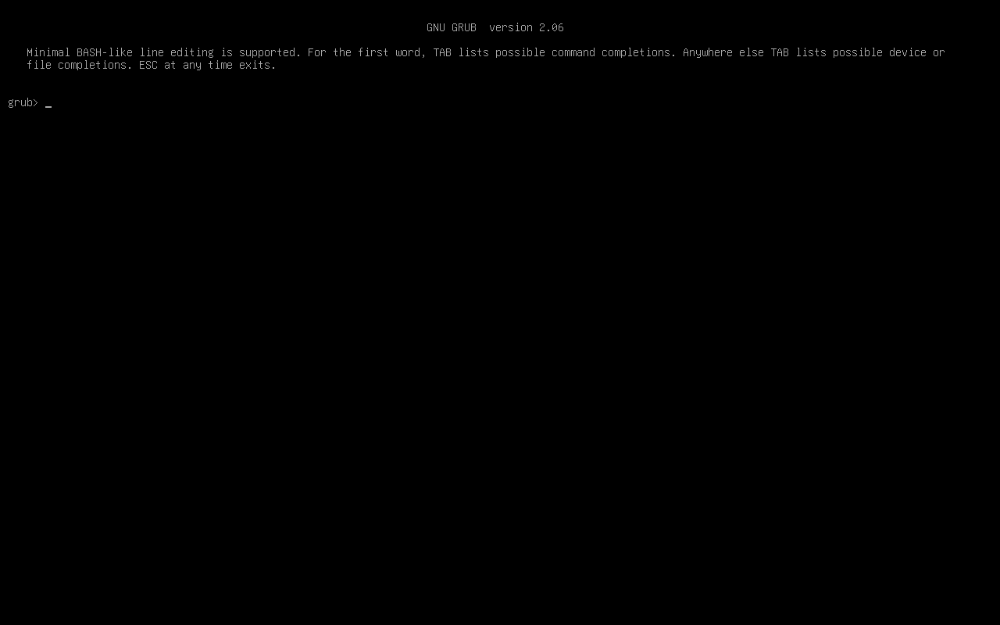

## 環境

- Arch
- CUI

## 使用できる解像度の確認

使用できる解像度を確認するために，GRUB のターミナルを開きます．




ターミナルで videoinfo を実行すると選択可能な解像度のリストが表示されます．


## 解像度の設定

確認した解像度のリストを参考に /etc/default/grub を修正して解像度を設定します．基本的には GRUB_GFXMODE と GRUB_GFX_PAYLOAD_LINUX を下記のように変更すれば良いはずですが，私の実行環境ではGRUB_CMDLINE_LINUX_DEFAULT に nomodeset を追加しないとカーネル起動後に解像度が低いままになってしまいました．

```text
...
GRUB_CMDLINE_LINUX_DEFAULT="loglevel=3 quiet nomodeset"
...
# The resolution used on graphical terminal
# note that you can use only modes which your graphic card supports via VBE
# you can see them in real GRUB with the command `vbeinfo'
GRUB_GFXMODE=1920x1080x32

# Uncomment to allow the kernel use the same resolution used by grub
GRUB_GFXPAYLOAD_LINUX=keep
...
```
