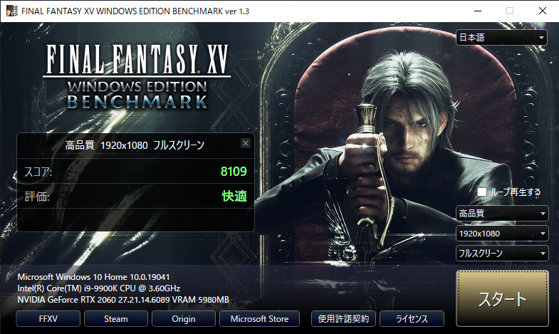

# KVM における GPU パススルーの設定

GPU パススルーは VM が直接ハードウェア（GPU）にアクセスすることができるようにする技術で仮想化環境でも高いグラフィック性能が期待できます．このページでは KVM 上の Windows 10 に Nvidia の GPU をパススルーする方法をメモしています．

## 環境

- Host: Arch Linux
- Guest: Windows 10
- CPU: Intel Core-i9 9900K (8 cores, 16 threads)
- GPT: Nvidia RTX 2060
- Memory: 32 GB

## Grub

Grub の設定を変更して，grub-mkconfig で config ファイルを生成します．

```sh
sudo vim /etc/default/grub
```

```diff
- GRUB_CMDLINE_LINUX_DEFAULT="loglevel=3 quiet"
+ GRUB_CMDLINE_LINUX_DEFAULT="loglevel=3 quiet intel_iommu=on vfio_iommu_type1.allow_unsafe_interrupts=1 iommu=pt"

```

```sh
sudo vim /etc/modules-load.d/vfio-pci.conf
```

```diff
+ pci_stub
+ vfio
+ vfio_iommu_type1
+ vfio_pci
+ kvm
+ kvm_intel
```

```sh
sudo grub-mkconfig -o /boot/grub/grub.cfg
reboot
```

## Isolating the GPU

パススルーしたいデバイスの ID を見つけます．PCI デバイスの NVIDIA と書かれたデバイスは下記のように探すことができます．

```sh
lspci -nn | grep NVIDIA
```

```text
01:00.0 VGA compatible controller [0300]: NVIDIA Corporation TU106 [GeForce RTX 2060 Rev. A] [10de:1f08] (rev a1)
01:00.1 Audio device [0403]: NVIDIA Corporation TU106 High Definition Audio Controller [10de:10f9] (rev a1)
01:00.2 USB controller [0c03]: NVIDIA Corporation TU106 USB 3.1 Host Controller [10de:1ada] (rev a1)
01:00.3 Serial bus controller [0c80]: NVIDIA Corporation TU106 USB Type-C UCSI Controller [10de:1adb] (rev a1)
```

この出力から，ID は `10de:1f08`, `10de:10f9`, `10de:1ada`, `10de:1adb` だとわかります．これをもとに vfio の設定を行います．

```sh
sudo vim /etc/modprobe.d/vfio.conf
```

```diff
+ options vfio-pci ids=10de:1f08, 10de:10f9, 10de:1ada, 10de:1adb
```

```sh
sudo vim /etc/mkinitcpio.conf
```

```diff
- MODULES=(btrfs)
+ MODULES=(btrfs vfio vfio_iommu_type1 vfio_pci vfio_virqfd nouveau)
```

Initial ramdisk を作成して再起動します．

```sh
sudo mkinitcpio -g /boot/linux-custom.img
Reboot
```

## Create VM

Virtual Machine Manager を用いて VM を作成します．設定内容は下記のとおりです．

- Overview
  - Chipset: Q35
  - Firmware: UEFI
- CPU
  - Uncheck `Copy host CPU configuration` and choose `host-passthrough` as model.
  - Manualy set CPU topology
    - Sockets: 1
    - Cores: 7
    - Threads: 2
- Memory
  - 16384 MiB
- NIC
  - Network source: Virtual network 'bridge100'
  - Device model: e1000e
- Add usb devices for VM.
- Add PCI devices (GPU).

Nvidia の GPU は仮想化環境で動作していることを検知すると動作を停止する仕様があるため，XML を編集して検知されないように設定します．

```diff
  <features>
    <acpi/>
    <apic/>
    <hyperv>
      <relaxed state="on"/>
      <vapic state="on"/>
      <spinlocks state="on" retries="8191"/>
+     <vendor_id state="on" value="0123456789ab"/>
    </hyperv>
+   <kvm>
+     <hidden state="on"/>
+   </kvm>
    <vmport state="off"/>
+   <ioapic driver="kvm"/>
  </features>
```

## Benchmark

FFBench を実行したときのネイティブと仮想化環境のスコアを比較すると次のようになります．

- Native:



- VM:


通信が必要なゲームなどでは GPU のみをパススルーしてもネットワーク速度の低下により快適に動作しません．その場合には NIC もパススルーすることでほぼネイティブと同等の環境で動作させることができます．

---

> References
>
> <https://zenn.dev/190ikp/articles/vagrant_libvirt_gpu>
>
> <https://github.com/vanities/GPU-Passthrough-Arch-Linux-to-Windows10>
>
> <https://github.com/bryansteiner/gpu-passthrough-tutorial>
>
> <https://access.redhat.com/documentation/ja-jp/red_hat_enterprise_linux/7/html/virtualization_getting_started_guide/sec-virtualization_getting_started-products-virtualized-hardware-devices>
>
> <https://access.redhat.com/documentation/ja-jp/red_hat_enterprise_linux/7/html/virtualization_deployment_and_administration_guide/sect-pci_devices-pci_passthrough>
