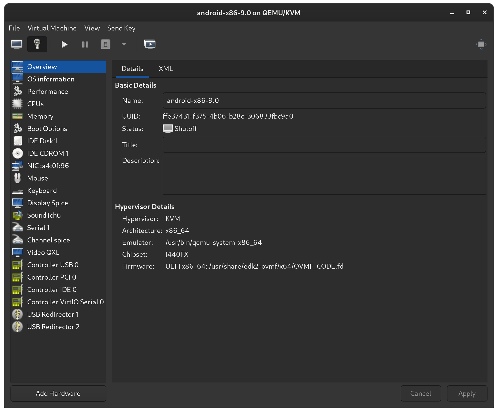
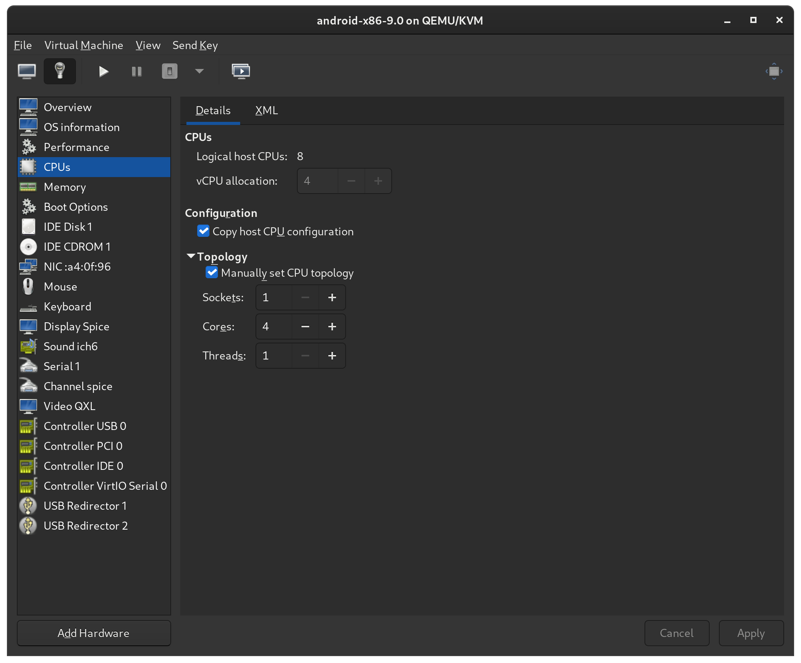

## 環境

- Host: Linux KVM
- Guest: Android x86, Lineage OS

## インストール

### **OS イメージのダウンロード**

[Android-x86](https://www.android-x86.org/) から \*.iso をダウンロードする．

### **Virtual Machine Manager の設定**

### **インストール**

