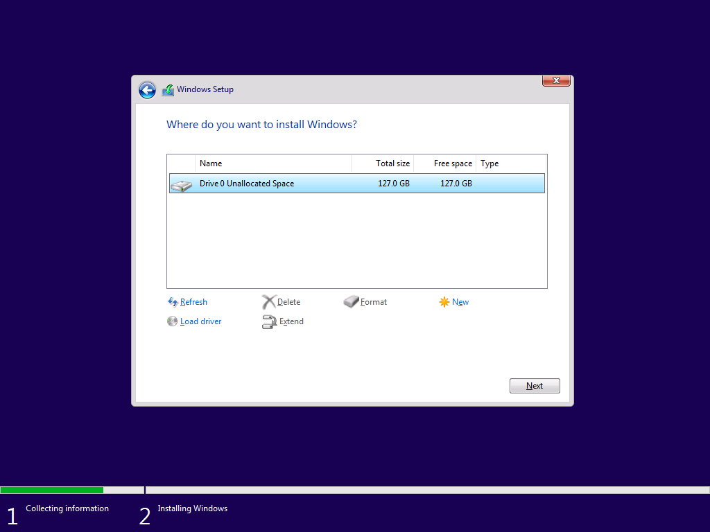
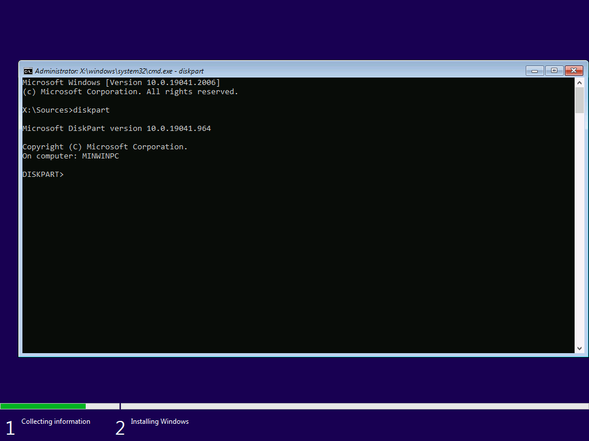
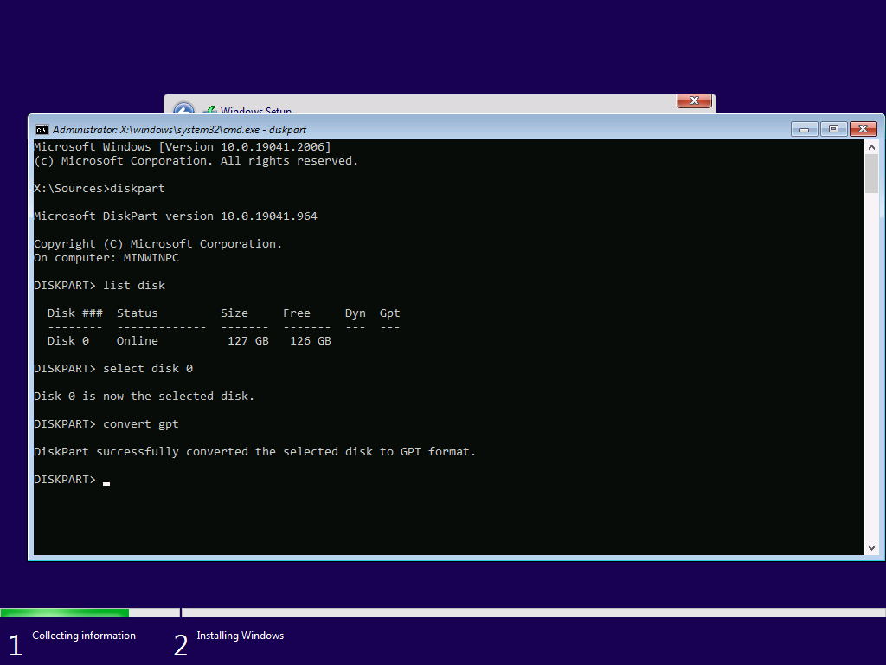
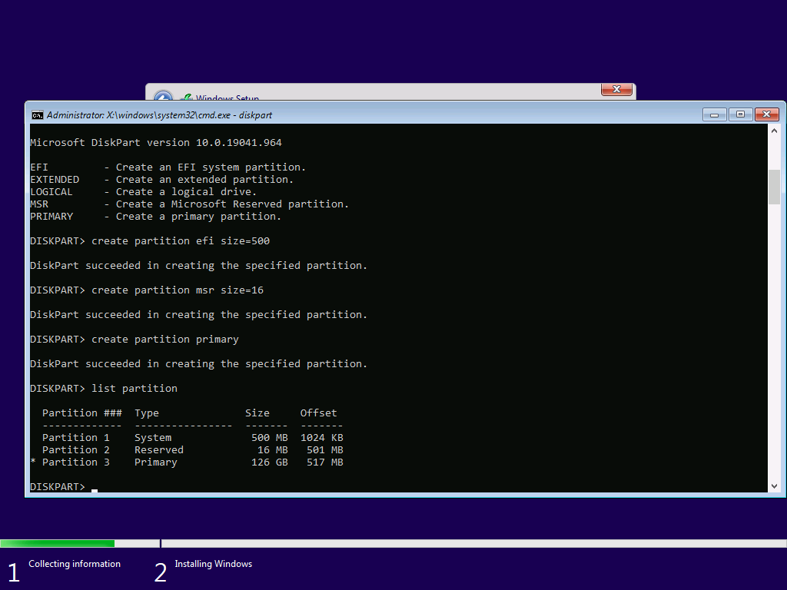
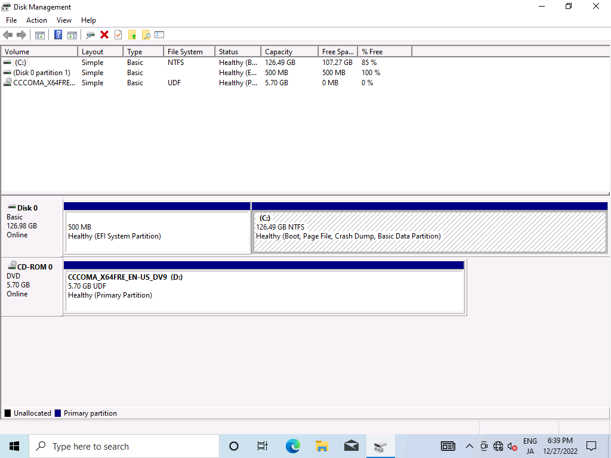
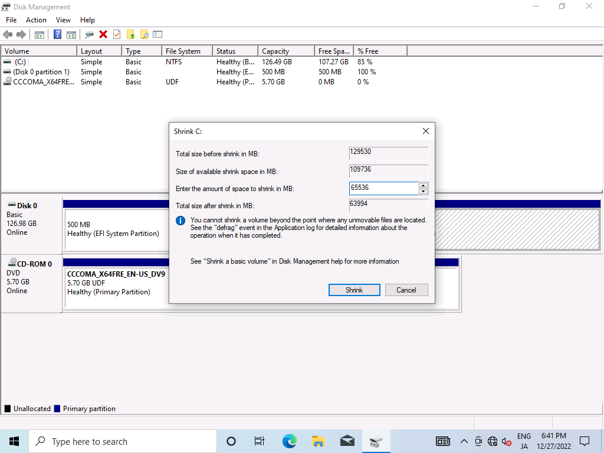
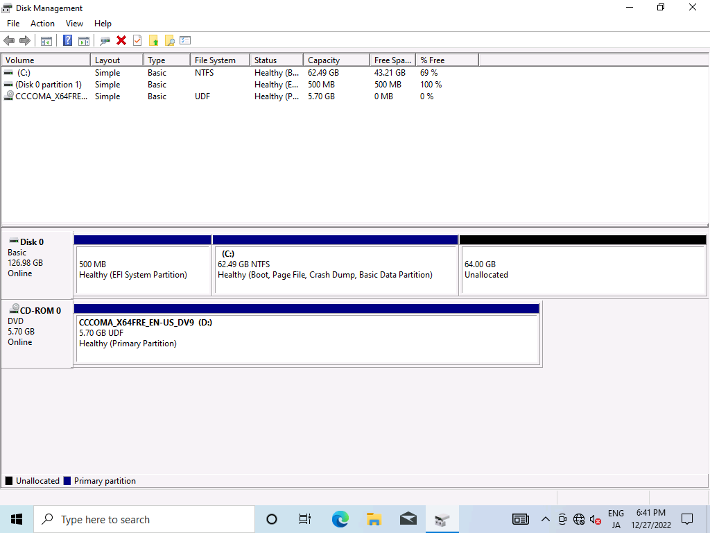

import Tabs from '@theme/Tabs';
import TabItem from '@theme/TabItem';

Install Arch Linux with the following settings.

| Settings        |             |
| --------------- | ----------- |
| Dual Booting    | Windows 10  |
| Filesystem      | Btrfs       |
| Boot Loader     | GRUB        |
| Disk            | single-disk |
| Disk Encryption | false       |

## Install Windows 10

### diskpart

At first, install Windows 10.

Boot from ISO which can be downloaded from [here](https://www.microsoft.com/en-us/software-download/windows10), and choose drive to install Windows 10.

You can install with the default layout, but I recommend to use custom layout.
This is because the size of the default EFI partition is 100 MB.

It is possible to manage linux and windows images in that size of partition, but some tweaks is needed, for example, compressing initramfs with xz.

In this example I will allocate 500 MB for the EFI partition.

When the following installation screen appears, press shift + F10 to open cmd.



Then, use diskpart for partitioning.



Select a disk with SELECT and convert it to GPT if necessary.



CREATE to create partitions.



Each command is explained by running help, so if you do not understand a command, you can look it up as needed.

After partitioning, exit diskpart and cmd.

Press Refresh and install Windows 10 on the primary partition.

### Bypass sign-in (option)


When you see sign-in window like above, press Shift + F10 and run:

```sh
ipconfig release
```

It will turn off the network so that sign-in fails and you can install with a local account.

### Shrink

We need to get a free disk for Linux, so we start the disk manager and shrink the disk.







After that, downloads Arch Linux ISO from [here](https://archlinux.org/download/) and boot.

## Install Arch Linux

### Change Keymaps

Change the keymap to the one you use for the installation. For a Japanese keyboard, use jp106.

```sh
loadkeys jp106
```

### Time Settings

Execute the following command to use the NTP (Network Time Protocol).

```sh
timedatectl set-ntp true
```

### Optimizing Mirrorlist

Optimize the mirror list using reflector to access mirror servers with fast access during installation.

```sh
pacman -Syy
pacman -S reflector # `python` might be required
reflector -c Japan --sort rate -a 6 --save /etc/pacman.d/mirrorlist
```

The meaning of the reflector option is as follows.

| Options                           | Description                                      |
| --------------------------------- | ------------------------------------------------ |
| `-c Japan`                        | Restrict mirrors to selected countries.          |
| `--sort rate`                     | Sort by download rate.                           |
| `-a 6`                            | Restrict to servers synchronized within 6 hours. |
| `--save /etc/pacman.d/mirrorlist` | Save the mirror list to the specified path.      |

### Disk Partitioning and Formatting

We will assume that the partition in `/dev/sda` is as follows.

```text
sda
├─sda1 <-- EFI Partition
├─sda2 <-- MSR
├─sda3 <-- Windows
└─sda4 <-- Empty Partition for Linux
```

First, update the partition table so that the empty partition you created is used as Linux Filesystem.

```sh
gdisk /dev/sda
```

Format the Linux filesystem partition with BTRFS, create a subvolume, and mount it.

```sh
mkfs.btrfs /dev/sda4
mount /dev/sda4 /mnt
btrfs su cr /mnt/@
btrfs su cr /mnt/@home
btrfs su cr /mnt/@snapshots
btrfs su cr /mnt/@var_log
umount /mnt
mount -o noatime,compress=zstd,space_cache=v2,subvol=@ /dev/sda4 /mnt
mkdir -p /mnt/{boot,home,.snapshots,var/log}
mount -o noatime,compress=zstd,space_cache=v2,subvol=@home /dev/sda4 /mnt/home
mount -o noatime,compress=zstd,space_cache=v2,subvol=@snapshots /dev/sda4 /mnt/.snapshots
mount -o noatime,compress=zstd,space_cache=v2,subvol=@var_log /dev/sda4 /mnt/var/log
mount /dev/sda4 /mnt/boot
```

### Base install

Install the package in the root directory, `/mnt`.

<Tabs groupId="cpu-vendor" queryString>
  <TabItem value="intel" label="Intel">

  ```sh
pacstrap /mnt base linux linux-firmware vim intel-ucode
  ```

  </TabItem>
  <TabItem value="amd" label="AMD">

  ```sh
pacstrap /mnt base linux linux-firmware vim amd-ucode
  ```

  </TabItem>
</Tabs>

### fstab

Generate the fstab file, which holds the information about which device to mount.

```sh
genfstab -U /mnt >> /mnt/etc/fstab
```

### Change the Root Directory

Use chroot to set `/mnt` as the root directory.

```sh
arch-chroot /mnt
```

### Localization

Create a symbolic link to `/etc/localtime` to change the time zone.

```sh
ln -sf /usr/share/zoneinfo/Asia/Tokyo /etc/localtime
```

Set the hardware clock to the current system clock. The system clock is the clock managed by the OS, and the hardware clock is the clock managed by the motherboard (hardware). when the OS is rebooted, the system clock stored in memory is lost, so the time is obtained from the hardware clock.

```sh
hwclock --systohc
```

To set the locale, first generate the locale. Uncomment the entries you want to use in `/etc/locale.gen` and run `locale-gen`.

```sh
vim /etc/locale.gen
```

```diff
- # en_US.UTF-8 UTF-8
+ en_US.UTF-8 UTF-8
```

```sh
locale-gen
```

Execute the following command to set the locale of the system.

```sh
echo LANG=en_US.UTF-8 >> /etc/locale.conf
echo KEYMAP=jp106 >> /etc/vconsole.conf
```

### Hostname

Register hostname in `/etc/hostname`.

```sh
vim /etc/hostname
```

```udiff
+ arch
```

Edit `/etc/hosts` and set IP address corresponding to hostname.

```sh
vim /etc/hosts
```

```diff
+ 127.0.0.1   localhost
+ ::1         localhost
+ 127.0.1.1   arch.localdomain    arch
```

### Root Password

Set the password of root user.

```sh
passwd
```

### Install Additional Packages

```sh
pacman -S grub efibootmgr networkmanager network-manager-applet \
 dialog os-prober mtools dosfstools base-devel linux-headers snapper \
 reflector cron git xdg-utils xdg-user-dirs ntfs-3g
```

### Configuring mkinitcpio

Change the configurations, and reflect the changes with mkinitcpio.

```sh
vim /etc/mkinitcpio.conf
```

```diff
- MODULES=()
+ MODULES=(btrfs)
```

```sh
mkinitcpio -p linux
```

### Bootloader

Install Grub and create config file.

```sh
grub-install --target=x86_64-efi --efi-directory=/boot --bootloader-id=GRUB
grub-mkconfig -o /boot/grub/grub.cfg
```

### Systemd

Enables NetworkManager.

```sh
systemctl enable NetworkManager
```

Enables Bluetooth.

```sh
systemctl enable bluetooth
```

Enables reflector. The execution options are written in `/etc/xdg/reflector/reflector.conf`.

```sh
systemctl enable reflector.service  # update mirrorlist every boot
```

```sh
systemctl enable reflector.timer    # update mirrorlist weekly
```

### Add User

Add user with useradd and set the password.

```sh
useradd -mG wheel mori
passwd mori
```

Give the user priviledges.

```sh
EDITOR=vim visudo
```

```diff
- # %wheel ALL=(ALL) ALL
+ %wheel ALL=(ALL) ALL
```

### Reboot

```sh
exit
umount -a
reboot
```

## Trouble shooting

- Boot entry for windows disappears from grub boot loader
  - Add `GRUB_DISABLE_OS_PROBER=false` to `/etc/default/grub` and recreate grub.cfg
  - The problem is deactivated os-prober. os-prober automatically finds operating systems and adds their boot entry, but sometimes it is deactivated. The option reactivate os-prober.
