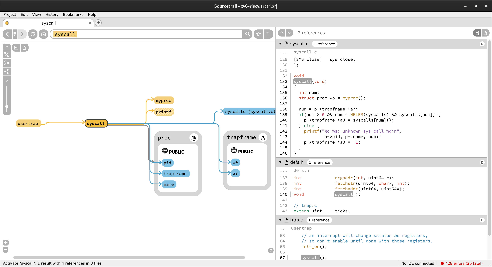

import Tabs from '@theme/Tabs';
import TabItem from '@theme/TabItem';

## Doxygen

### Install

<Tabs groupId="doxygen" queryString>
  <TabItem value="arch" label="Arch">
  ```sh
sudo pacman -S doxygen
  ```
  </TabItem>
  <TabItem value="ubuntu" label="Ubuntu">
  ```sh
sudo apt install doxygen
  ```
  </TabItem>
</Tabs>

### Configuration

`-g` のオプションをつけて doxygen コマンドを実行するとカレントディレクトリに Doxyfile という設定ファイルが生成されます．

```sh
doxygen -g
```

ここでは [xv6-riscv](https://github.com/mit-pdos/xv6-riscv) のドキュメントを作成する場合の例を示します．

```diff
35c35
< PROJECT_NAME           = "My Project"
---
> PROJECT_NAME           = "xv6 RISC-V"
61c61
< OUTPUT_DIRECTORY       =
---
> OUTPUT_DIRECTORY       = /home/mori/workspace/xv6-riscv-docs
71c71
< CREATE_SUBDIRS         = NO
---
> CREATE_SUBDIRS         = YES
480c480
< EXTRACT_ALL            = NO
---
> EXTRACT_ALL            = YES
486c486
< EXTRACT_PRIVATE        = NO
---
> EXTRACT_PRIVATE        = YES
504c504
< EXTRACT_STATIC         = NO
---
> EXTRACT_STATIC         = YES
877c877
< INPUT                  =
---
> INPUT                  = /home/mori/workspace/xv6-riscv
906,951c906
< FILE_PATTERNS          = *.c \
<                          *.cc \
<                          *.cxx \
<                          *.cpp \
<                          *.c++ \
<                          *.java \
<                          *.ii \
<                          *.ixx \
<                          *.ipp \
<                          *.i++ \
<                          *.inl \
<                          *.idl \
<                          *.ddl \
<                          *.odl \
<                          *.h \
<                          *.hh \
<                          *.hxx \
<                          *.hpp \
<                          *.h++ \
<                          *.l \
<                          *.cs \
<                          *.d \
<                          *.php \
<                          *.php4 \
<                          *.php5 \
<                          *.phtml \
<                          *.inc \
<                          *.m \
<                          *.markdown \
<                          *.md \
<                          *.mm \
<                          *.dox \
<                          *.py \
<                          *.pyw \
<                          *.f90 \
<                          *.f95 \
<                          *.f03 \
<                          *.f08 \
<                          *.f18 \
<                          *.f \
<                          *.for \
<                          *.vhd \
<                          *.vhdl \
<                          *.ucf \
<                          *.qsf \
<                          *.ice
---
> FILE_PATTERNS          = *.c *.h *.S
957c912
< RECURSIVE              = NO
---
> RECURSIVE              = YES
1088c1043
< SOURCE_BROWSER         = NO
---
> SOURCE_BROWSER         = YES
1094c1049
< INLINE_SOURCES         = NO
---
> INLINE_SOURCES         = YES
1107c1062
< REFERENCED_BY_RELATION = NO
---
> REFERENCED_BY_RELATION = YES
1113c1068
< REFERENCES_RELATION    = NO
---
> REFERENCES_RELATION    = YES
1197c1152
< HTML_OUTPUT            = html
---
> HTML_OUTPUT            = .
1820c1775
< GENERATE_LATEX         = YES
---
> GENERATE_LATEX         = NO
2416c2371
< UML_LOOK               = NO
---
> UML_LOOK               = YES
2489c2444
< CALL_GRAPH             = NO
---
> CALL_GRAPH             = YES
2501c2456
< CALLER_GRAPH           = NO
---
> CALLER_GRAPH           = YES
```

### Run Doxygen

ドキュメントの生成は Doxyfile のあるディレクトリで doxygen を実行するか，Doxyfile へのファイルパスを指定して実行すると行われます．

```sh
doxygen
```

```sh
doxygen foo/bar/Doxygen
```

### Sample

[xv6-riscv-docs](https://forest0923.gitlab.io/xv6-riscv-docs/)

## Sourcetrail

### Install

Arch Linux の場合は AUR からインストールできます．Ubuntu では [GitHub: CoatiSoftware/Sourcetrail](https://github.com/CoatiSoftware/Sourcetrail/releases) からダウンロードする必要があります．

<Tabs groupId="sourcetrail" queryString>
  <TabItem value="arch" label="Arch">
```sh
paru -S sourcetrail
```
  </TabItem>
</Tabs>

### Create Projects

Sourcetrail を起動すると次のような画面が表示されるので，プロジェクトの名前とソースコードが入っているディレクトリを指定します．ここでは doxygen の例と同様に RISC-V 版の xv6 についてドキュメントを作成してみます．


`Add Source Group` を押すと次の画面が表示されるのでソースコードに適したものを選んで `Next` を押します．


次の画面でドキュメントを作りたいディレクトリや無視したいディレクトリなどを指定します．


ファイルの拡張子の指定なども可能です．


最後に `Create` を押すとドキュメントが作られていきます．

### Sample

Doxygen のように HTML で出力することはできないようですが，グラフィカルにソースコードを見ることができます．


