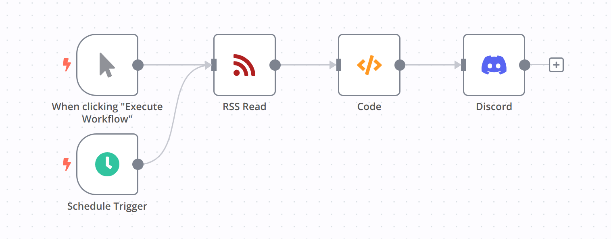
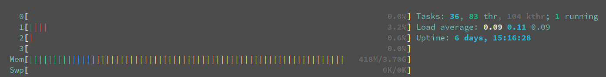

## Objective

Deploy [n8n](https://github.com/n8n-io/n8n) on Raspberry Pi 4B to send RSS feeds to Discord.

## Background

Until recently, I was using [IFTTT](https://ifttt.com/explore) for the same purpose, but as of May 23, 2023, the number of applications that can be run on the free plan has been limited to two. There are similar services like [Zapier](https://zapier.com/), [make](https://www.make.com/), [Readybot.io](https://readybot.io/), and as of May 27, 2023, the usage scope is as follows:

- Zapier
  - Up to 5 applications (Zaps)
  - Can set up to one trigger, one action
  - 100 tasks/month
  - Can be run at a minimum interval of 15 minutes
- make
  - Up to 2 applications (scenarios)
  - 1000 ops/month
  - Can be run at a minimum interval of 15 minutes
- Readybot.io
  - Specialized for Discord
  - Up to 5 applications (bots)
  - Can be run at a minimum interval of 10 minutes

Zapier and make did not meet my needs due to the daily execution limit and the number of applications that can be created. Readybot.io was perfect for my purpose, managing multiple RSS feeds with a single bot was quite good. However, it lacked flexibility, such as being unable to customize the content of notifications to Discord.

So this time, I am going to use the OSS [n8n](https://n8n.io/) ([github](https://github.com/n8n-io/n8n)). While there is no free plan when hosting with n8n, it can be used quite freely when self-hosting. There is the cost of electricity and the effort of managing it yourself, but I'm going to give it a try simply because I'm interested.

## Deploying n8n

This time, I'm using Docker, so you can deploy with just the following command:

```sh
docker run -d --rm --name n8n -p 5678:5678 -v ~/.n8n:/home/node/.n8n docker.n8n.io/n8nio/n8n
```

If you can access http://[ip]:5678/ and see the login screen, then the deployment was successful. I believe the screen was Sign Up on the first access.


## Creating the Workflow

If you have experience using services like IFTTT, creating the workflow should be straightforward. You run it at your preferred timing with `Schedule Trigger` and specify the target URL with `RSS Read`. Once you register the webhook of the Discord channel in `Discord`, it's complete.

However, when I first assembled the nodes as below, it ended up sending all the information outputted by `RSS Read` to `Discord` each time.


In other words, it wasn't comparing the content obtained at the last execution and distributing only the new content.

Here is the corrected workflow.



The change is the addition of the Code node. In Code, you can write JS code, and if you look at the [Documentation](https://docs.n8n.io/code-examples/), you will see that n8n provides functions or variables. This time, I used [`$getWorkflowStaticData(type)`](https://docs.n8n.io/code-examples/methods-variables-examples/get-workflow-static-data/) to record the last execution and only output new items.

```js
const workflowStaticData = $getWorkflowStaticData('global');
const lastRssLog = workflowStaticData.lastRssLog;

if (lastRssLog == null) {
  workflowStaticData.lastRssLog = $('RSS Read').first();
  return $('RSS Read').all().reverse();
}

let ret = []

for (let item of $('RSS Read').all()) {
  if (item.json['guid'] == lastRssLog.json['guid']) {
    break;
  }
  ret.push(item);
}

workflowStaticData.lastRssLog = $('RSS Read').first();

return ret.reverse();
```

## Raspberry Pi Resource Usage

As far as I have researched, there doesn't seem to be any issues with the specs, but just in case, I checked the resource usage when an event occurs. I'm running the RSS check at 5-minute intervals for two applications.

During normal times:



At the time of events:


## Ending

Although I checked out various other services similar to IFTTT, considering the limitations of the free version and the level of freedom, this setup seems to be the best at the moment. I also found a similar open source application called [Huginn](https://github.com/huginn/huginn), but I had to give up because I couldn't run the Docker image due to CPU architecture issues... I've been unable to use containers due to architecture issues lately, but I wonder if I can solve this by rebuilding them once I get better at using Docker.
