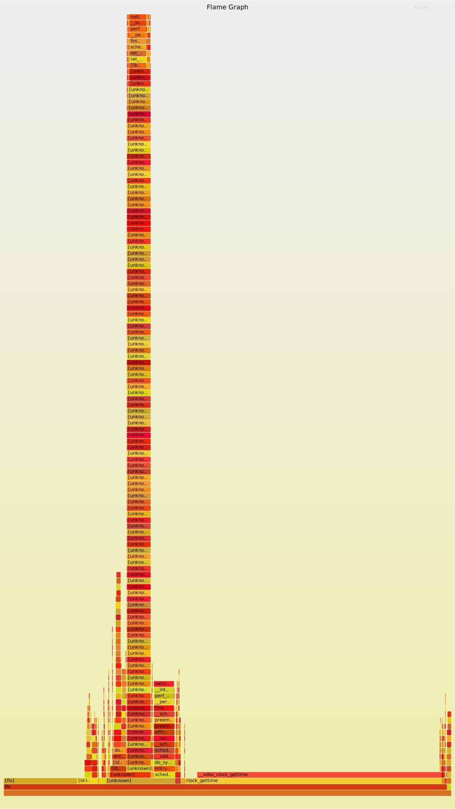
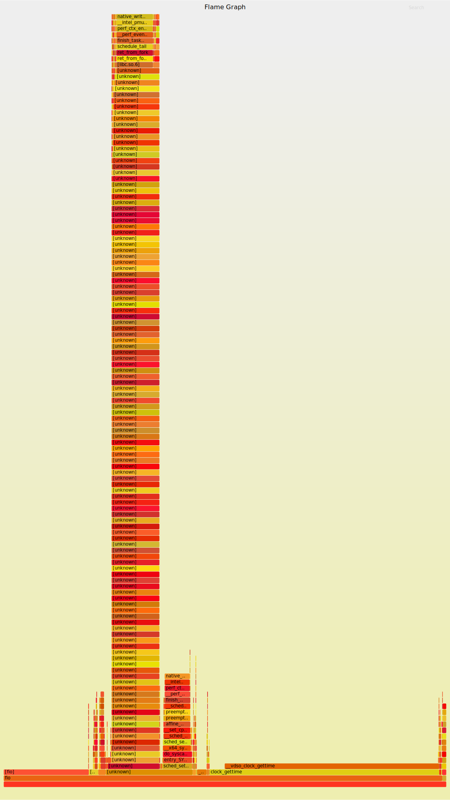
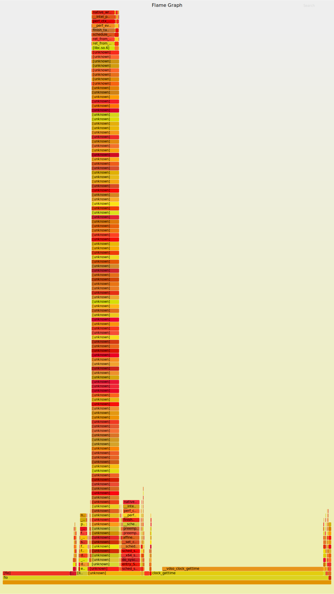

## Overview

One of the tools that seemed useful but wasn't used is `perf`. This time, let's learn the basics of using `perf`.

## Goal

- Analyze a application using `perf`.
- Attempt to create a flamegraph because it seems possible.
- Investigate if there is anything usable in a GUI.

## Preparation

### `perf` and related packages

Install the necessary packages. If only `perf` is needed, it can be installed with the following:

```sh
sudo pacman -S perf
```

For Arch Linux, various tools are included in the `linux-tools` group, so it seems good to install them with:

```sh
paru -Sg linux-tools
```

Install the required packages for creating flamegraphs (available in AUR):

```sh
paru -S flamegraph
```

To analyze the kernel with `perf`, you need to change a kernel parameter called `perf_event_paranoid`. 
This parameter controls access to performance events, and its default value is 2.
However, this prevents capturing kernel events, so we need to change it to -1.

FYI: [Kernel Documentation - perf-security](https://www.kernel.org/doc/html/latest/admin-guide/perf-security.html#unprivileged-users)

```sh
cat /proc/sys/kernel/perf_event_paranoid
echo -1 | sudo tee /proc/sys/kernel/perf_event_paranoid
```

### `fio`

In this article, we will use `fio`, a tool for taking I/O benchmarks, as a test application.

```sh
sudo pacman -S fio
```

While researching how to use `fio`, it was found that there is a configuration item called `ioengine`.
To see how the behavior changes when this `ioengine` is changed, we will analyze it with `perf`.

By the way, looking at the man page for `fio` reveals that there are many different `ioengine` options that can be configured.

FYI: [fio Man Page](https://manpages.org/fio)

Although there is no particular preference, we will try `libaio`, `sync`, and `mmap` this time.

## Memo about `perf`

- Use `perf stat` to display metrics such as execution time and CPU usage.
  - For example, the result when running `pwd` is shown below:
    ```text
    % perf stat pwd
    /home/mori/workspace/perf
    
     Performance counter stats for 'pwd':
    
                  1.83 msec task-clock:u                     #    0.161 CPUs utilized
                     0      context-switches:u               #    0.000 /sec
                     0      cpu-migrations:u                 #    0.000 /sec
                    67      page-faults:u                    #   36.526 K/sec
               317,835      cycles:u                         #    0.173 GHz
               232,109      instructions:u                   #    0.73  insn per cycle
                52,250      branches:u                       #   28.485 M/sec
                 3,235      branch-misses:u                  #    6.19% of all branches
    
           0.011358294 seconds time elapsed
    
           0.000000000 seconds user
           0.003322000 seconds sys
    ```
    - `branch-misses` refers to failed speculative execution.
    - `context-switches` does not indicate the number of times the scheduler switches.
    - It remained 0 even with the `sleep` command or a program using `pthread`.
- `perf bench` provides several benchmark tools.
  ```text
  % perf bench
  Usage:
          perf bench [<common options>] <collection> <benchmark> [<options>]
  
          # List of all available benchmark collections:
  
           sched: Scheduler and IPC benchmarks
         syscall: System call benchmarks
             mem: Memory access benchmarks
            numa: NUMA scheduling and MM benchmarks
           futex: Futex stressing benchmarks
           epoll: Epoll stressing benchmarks
       internals: Perf-internals benchmarks
      breakpoint: Breakpoint benchmarks
          uprobe: uprobe benchmarks
             all: All benchmarks
  ```
- For detailed program analysis, use `perf record` and view the results with `perf report`.
  - When you run `perf record`, the results are saved in a file called `perf.data` (can be changed with the `-o` option).
  - You can specify events with the `-e` option; check the available events with `perf list`.
  - Adding the `-g` option allows you to obtain a call graph, which is necessary for creating a flamegraph later.
  - Use `perf report -i` with the `perf.data` obtained from `perf record` to display the results.
- `perf top` is similar to a real-time `perf report`.
- `perf script` outputs the results of `perf record` as a script.
  - It shows timestamps, event names, and event details.
  - Flamegraphs are created based on this script.
- Use `perf annotate` to annotate assembly code.
- `perf diff` is used to compare `perf.data` files.
  - It can be used to verify the effects when making performance improvements.
- `perf kvm` is used to profile KVM.
  - You can use `perf kvm --guest record` to profile the guest machine, but I had trouble getting it to work, so I'll look into it later.

## Example

Let's use `perf` to analyze `fio`.

The command to capture the `perf.data` is as follows:

```sh
perf record -o /tmp/perf_libaio.data -g fio configs/seq_read_libaio.ini
```

To create a flamegraph from the obtained performance data:

```sh
perf script -i /tmp/per

f_libaio.data | stackcollapse-perf.pl | flamegraph.pl > images/perf_libaio.svg
```

Note: Be sure to include the `-g` option when recording with `perf record` to obtain the call graph.

Flamegraphs for changing the `ioengine` to `libaio`, `sync`, and `mmap` respectively:

libaio:



sync:



mmap:



There are many parts marked as "unknown," but this can likely be resolved by building `fio` with debugging information.

For a more thorough investigation, consider rebuilding and using tools like flamegraphs, `perf report`, and `perf diff` to examine the differences and confirm improvements when making changes.

## Other Tools

- [hotspot](https://github.com/KDAB/hotspot)

A relatively recent tool discovered is `hotspot`, a tool for displaying `perf` results in a GUI, supporting flamegraphs as well.
(Found in AUR for Arch, but encountered a build error when attempting to install)

- [Firefox Profiler](https://profiler.firefox.com/)

A tool introduced on Qiita while researching `perf`.
When you upload the `test.perf` obtained with the following command, the results are displayed as shown in the image below:

```sh
perf script -i /tmp/perf_libaio.data -F +pid > test.perf
```


## Wrap Up

It seems beneficial to actively use `perf` when investigating bottlenecks or obtaining hints for improvements due to OS updates or application updates.

## Links

- [Qiita: perf の入門](https://qiita.com/k0kubun/items/b094c4b9bd4fe0027a48)
- [Qiita: fio + perf でLinux I/O stackを観察する](https://qiita.com/saikoro-steak/items/bf066241eeef1141ef5f)
- [Qiita: fioとperfでアプリケーションのIOを分析する](https://qiita.com/ryuichi1208/items/87658621d332d31b9450)
