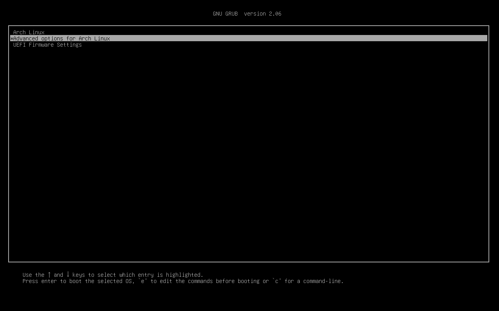
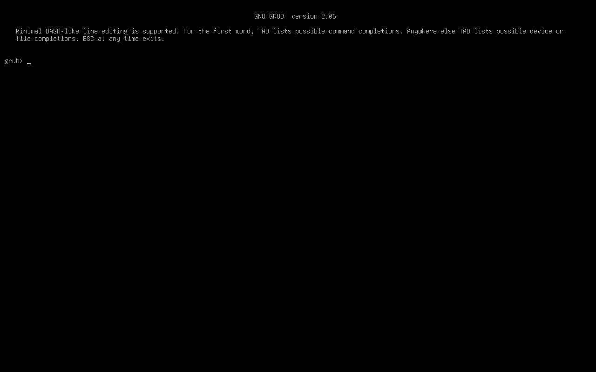
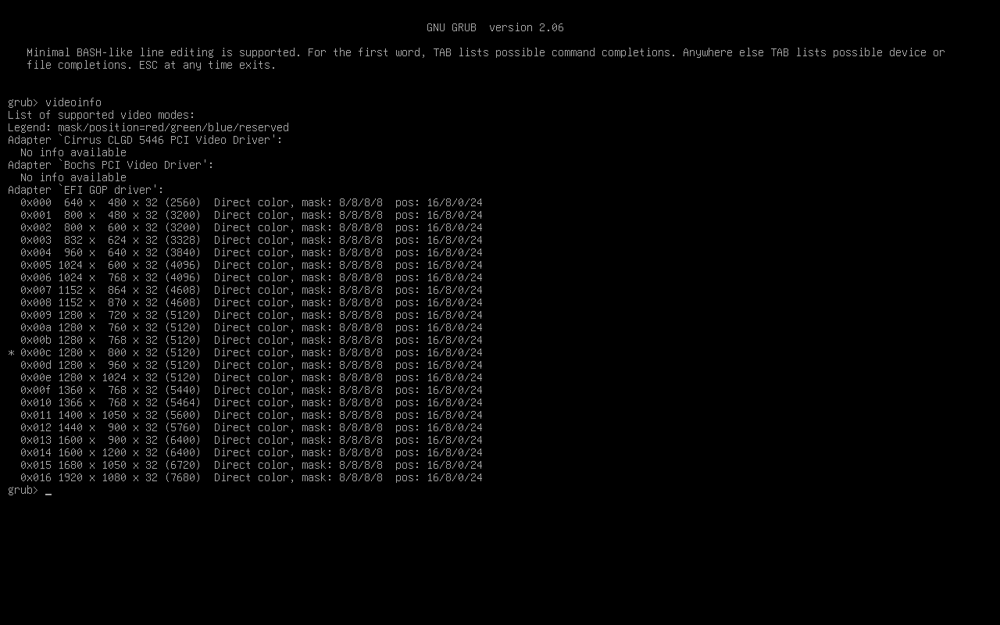

## System

- Arch
- CUI

## Check Available Resolutions

Open a GRUB terminal to check available resolutions.




You can get a list of available resolution by running videoinfo.



## Setting the Resolution

Modify /etc/default/grub to set the resolution, referring to the list. Basically, you should change GRUB_GFXMODE and GRUB_GFX_PAYLOAD_LINUX as follows. 

However, in my environment, if I did not add nomodeset to GRUB_CMDLINE_LINUX_DEFAULT, the resolution remains low after kernel boot.

```text
...
GRUB_CMDLINE_LINUX_DEFAULT="loglevel=3 quiet nomodeset"
...
# The resolution used on graphical terminal
# note that you can use only modes which your graphic card supports via VBE
# you can see them in real GRUB with the command `vbeinfo'
GRUB_GFXMODE=1920x1080x32

# Uncomment to allow the kernel use the same resolution used by grub
GRUB_GFXPAYLOAD_LINUX=keep
...
```
