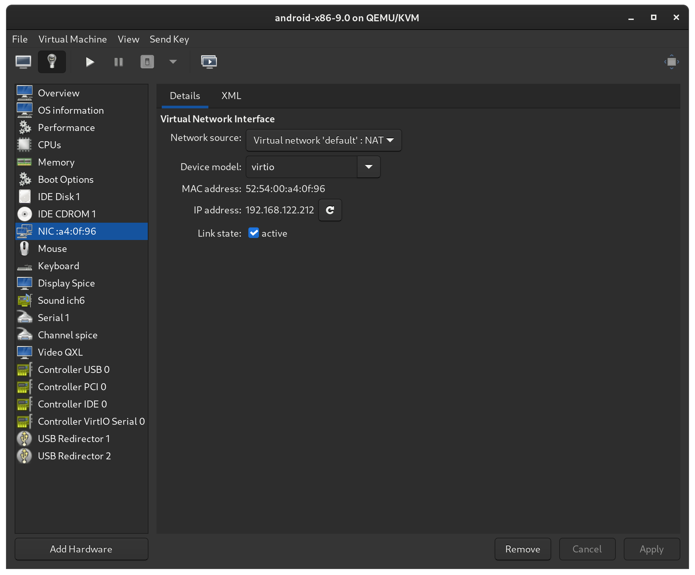

## System Setup

- Host: Linux KVM
- Guest: Android x86, Lineage OS

## Install

### **Download OS image (*.iso)**

- Download \*.iso from https://www.android-x86.org/

### **Configuration of Virtual Machine Manager**

### **Install**

