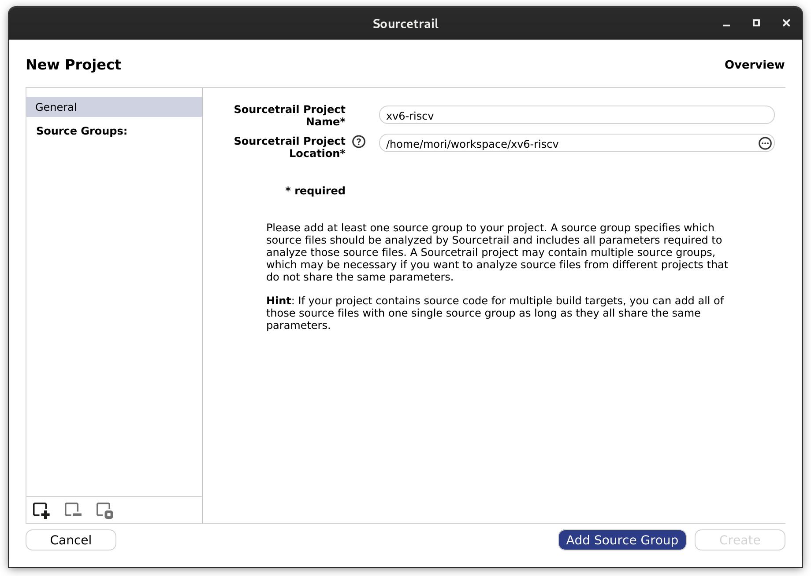
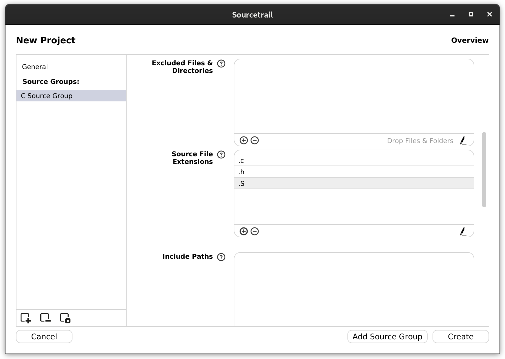

import Tabs from '@theme/Tabs';
import TabItem from '@theme/TabItem';

## Doxygen

### Install

<Tabs groupId="doxygen" queryString>
  <TabItem value="arch" label="Arch">
  ```sh
sudo pacman -S doxygen
  ```
  </TabItem>
  <TabItem value="ubuntu" label="Ubuntu">
  ```sh
sudo apt install doxygen
  ```
  </TabItem>
</Tabs>

### Configuration

Doxyfile is generated by running following commands.

```sh
doxygen -g
```

Here is an example of generating documents for [xv6-riscv](https://github.com/mit-pdos/xv6-riscv).

```diff
35c35
< PROJECT_NAME           = "My Project"
---
> PROJECT_NAME           = "xv6 RISC-V"
61c61
< OUTPUT_DIRECTORY       =
---
> OUTPUT_DIRECTORY       = /home/mori/workspace/xv6-riscv-docs
71c71
< CREATE_SUBDIRS         = NO
---
> CREATE_SUBDIRS         = YES
480c480
< EXTRACT_ALL            = NO
---
> EXTRACT_ALL            = YES
486c486
< EXTRACT_PRIVATE        = NO
---
> EXTRACT_PRIVATE        = YES
504c504
< EXTRACT_STATIC         = NO
---
> EXTRACT_STATIC         = YES
877c877
< INPUT                  =
---
> INPUT                  = /home/mori/workspace/xv6-riscv
906,951c906
< FILE_PATTERNS          = *.c \
<                          *.cc \
<                          *.cxx \
<                          *.cpp \
<                          *.c++ \
<                          *.java \
<                          *.ii \
<                          *.ixx \
<                          *.ipp \
<                          *.i++ \
<                          *.inl \
<                          *.idl \
<                          *.ddl \
<                          *.odl \
<                          *.h \
<                          *.hh \
<                          *.hxx \
<                          *.hpp \
<                          *.h++ \
<                          *.l \
<                          *.cs \
<                          *.d \
<                          *.php \
<                          *.php4 \
<                          *.php5 \
<                          *.phtml \
<                          *.inc \
<                          *.m \
<                          *.markdown \
<                          *.md \
<                          *.mm \
<                          *.dox \
<                          *.py \
<                          *.pyw \
<                          *.f90 \
<                          *.f95 \
<                          *.f03 \
<                          *.f08 \
<                          *.f18 \
<                          *.f \
<                          *.for \
<                          *.vhd \
<                          *.vhdl \
<                          *.ucf \
<                          *.qsf \
<                          *.ice
---
> FILE_PATTERNS          = *.c *.h *.S
957c912
< RECURSIVE              = NO
---
> RECURSIVE              = YES
1088c1043
< SOURCE_BROWSER         = NO
---
> SOURCE_BROWSER         = YES
1094c1049
< INLINE_SOURCES         = NO
---
> INLINE_SOURCES         = YES
1107c1062
< REFERENCED_BY_RELATION = NO
---
> REFERENCED_BY_RELATION = YES
1113c1068
< REFERENCES_RELATION    = NO
---
> REFERENCES_RELATION    = YES
1197c1152
< HTML_OUTPUT            = html
---
> HTML_OUTPUT            = .
1820c1775
< GENERATE_LATEX         = YES
---
> GENERATE_LATEX         = NO
2416c2371
< UML_LOOK               = NO
---
> UML_LOOK               = YES
2489c2444
< CALL_GRAPH             = NO
---
> CALL_GRAPH             = YES
2501c2456
< CALLER_GRAPH           = NO
---
> CALLER_GRAPH           = YES
```

### Run Doxygen

The document is generated by running `doxygen` in the directory which has Doxyfile. Otherwise, it is done by running `doxygen` with the file path to Doxyfile.

```sh
doxygen
```

```sh
doxygen foo/bar/Doxygen
```

### Sample

[xv6-riscv-docs](https://forest0923.gitlab.io/xv6-riscv-docs/)

## Sourcetrail

### Install

For Arch Linux, you can install it from the AUR. For Ubuntu, you need to download it from [GitHub: CoatiSoftware/Sourcetrail](https://github.com/CoatiSoftware/Sourcetrail/releases).

<Tabs groupId="sourcetrail" queryString>
  <TabItem value="arch" label="Arch">
```sh
paru -S sourcetrail
```
  </TabItem>
</Tabs>

### Create Projects

When Sourcetrail is started, the following screen is displayed, so specify the project name and the directory containing the source code. 

Similar to the doxygen example, here is the documentation for the RISC-V version of xv6.



When you click `Add Source Group`, the following screen will be displayed, so select the appropriate one for your source code and click `Next`.


On the next screen, specify the directories you wish to create the documents or ignore.


You can also specify file extensions.



Finally, press `Create` to create the document.

### Sample

unlike Doxygen, it cannot export documents as html, but you can see source code more graphically.


