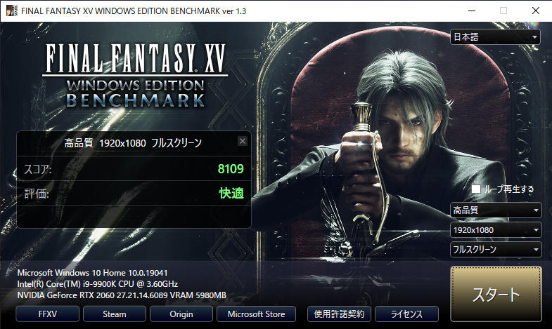

GPU passthrough is a technology that allows VMs to directly access hardware (GPU), and is expected to provide high graphics performance even in a virtualized environment. This page describes how to pass-through an Nvidia GPU to Windows 10 on KVM.

## System

- Host: Arch Linux
- Guest: Windows 10
- CPU: Intel Core-i9 9900K (8 cores, 16 threads)
- GPT: Nvidia RTX 2060
- Memory: 32 GB

## Grub

Change the Grub configuration and generate a config file with grub-mkconfig.

```sh
sudo vim /etc/default/grub
```

```diff
- GRUB_CMDLINE_LINUX_DEFAULT="loglevel=3 quiet"
+ GRUB_CMDLINE_LINUX_DEFAULT="loglevel=3 quiet intel_iommu=on vfio_iommu_type1.allow_unsafe_interrupts=1 iommu=pt"

```

```sh
sudo vim /etc/modules-load.d/vfio-pci.conf
```

```diff
+ pci_stub
+ vfio
+ vfio_iommu_type1
+ vfio_pci
+ kvm
+ kvm_intel
```

```sh
sudo grub-mkconfig -o /boot/grub/grub.cfg
reboot
```

## Isolating the GPU

Find the ID of the device you want to pass through. NVIDIA's PCI devices can be found as follows.

```sh
lspci -nn | grep NVIDIA
```

```text
01:00.0 VGA compatible controller [0300]: NVIDIA Corporation TU106 [GeForce RTX 2060 Rev. A] [10de:1f08] (rev a1)
01:00.1 Audio device [0403]: NVIDIA Corporation TU106 High Definition Audio Controller [10de:10f9] (rev a1)
01:00.2 USB controller [0c03]: NVIDIA Corporation TU106 USB 3.1 Host Controller [10de:1ada] (rev a1)
01:00.3 Serial bus controller [0c80]: NVIDIA Corporation TU106 USB Type-C UCSI Controller [10de:1adb] (rev a1)
```

From this output, we know that the IDs are `10de:1f08`, `10de:10f9`, `10de:1ada`, and `10de:1adb`. Based on this, we can configure vfio.

```sh
sudo vim /etc/modprobe.d/vfio.conf
```

```diff
+ options vfio-pci ids=10de:1f08, 10de:10f9, 10de:1ada, 10de:1adb
```

```sh
sudo vim /etc/mkinitcpio.conf
```

```diff
- MODULES=(btrfs)
+ MODULES=(btrfs vfio vfio_iommu_type1 vfio_pci vfio_virqfd nouveau)
```

Create initial ramdisk and reboot.

```sh
sudo mkinitcpio -g /boot/linux-custom.img
Reboot
```

## Create VM

Create a VM using the Virtual Machine Manager. The setting is as follows.

- Overview
  - Chipset: Q35
  - Firmware: UEFI
- CPU
  - Uncheck `Copy host CPU configuration` and choose `host-passthrough` as model.
  - Manualy set CPU topology
    - Sockets: 1
    - Cores: 7
    - Threads: 2
- Memory
  - 16384 MiB
- NIC
  - Network source: Virtual network 'bridge100'
  - Device model: e1000e
- Add usb devices for VM.
- Add PCI devices (GPU).

Since Nvidia GPUs are designed to stop running when they detect that they are running in a virtualized environment, we will edit the XML to prevent detection.

```diff
  <features>
    <acpi/>
    <apic/>
    <hyperv>
      <relaxed state="on"/>
      <vapic state="on"/>
      <spinlocks state="on" retries="8191"/>
+     <vendor_id state="on" value="0123456789ab"/>
    </hyperv>
+   <kvm>
+     <hidden state="on"/>
+   </kvm>
    <vmport state="off"/>
+   <ioapic driver="kvm"/>
  </features>
```

## Benchmark

The following is a comparison of the scores for the native and virtualized environments when running FFBench.

- Native:



- VM:


In games that require network communication, even if only the GPU is passed through, the game will not run comfortably due to network slowdown. In such cases, you can pass through the NIC as well, so that the game can run in almost the same environment as the native.

---

> References
>
> <https://zenn.dev/190ikp/articles/vagrant_libvirt_gpu>
>
> <https://github.com/vanities/GPU-Passthrough-Arch-Linux-to-Windows10>
>
> <https://github.com/bryansteiner/gpu-passthrough-tutorial>
>
> <https://access.redhat.com/documentation/ja-jp/red_hat_enterprise_linux/7/html/virtualization_getting_started_guide/sec-virtualization_getting_started-products-virtualized-hardware-devices>
>
> <https://access.redhat.com/documentation/ja-jp/red_hat_enterprise_linux/7/html/virtualization_deployment_and_administration_guide/sect-pci_devices-pci_passthrough>
