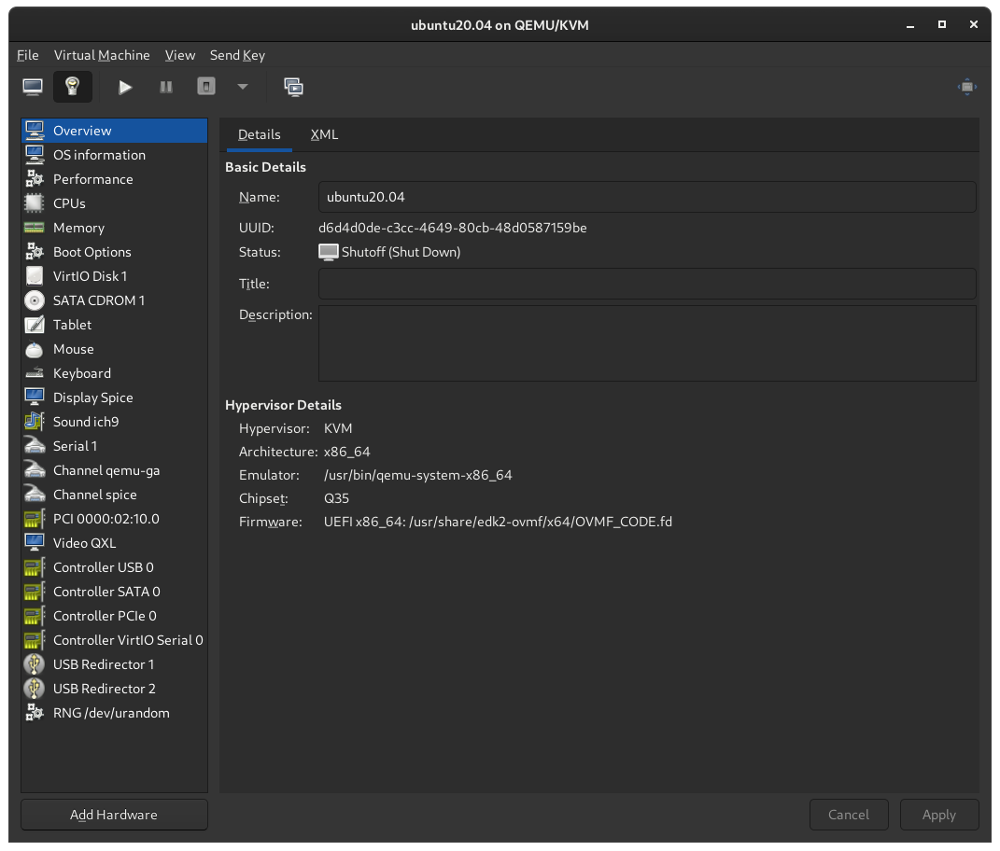
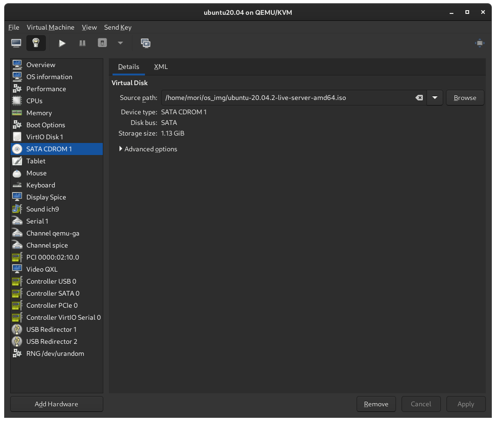
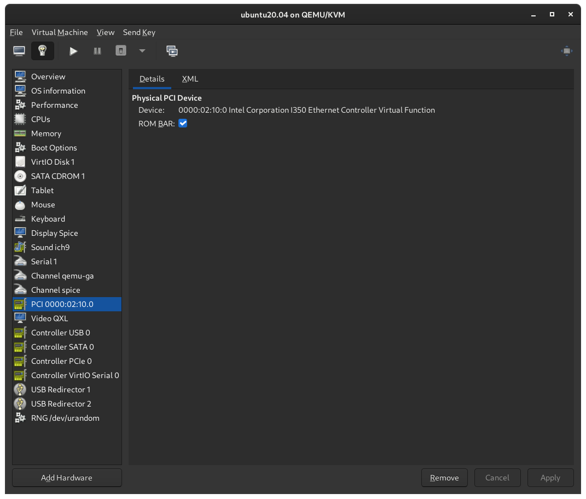
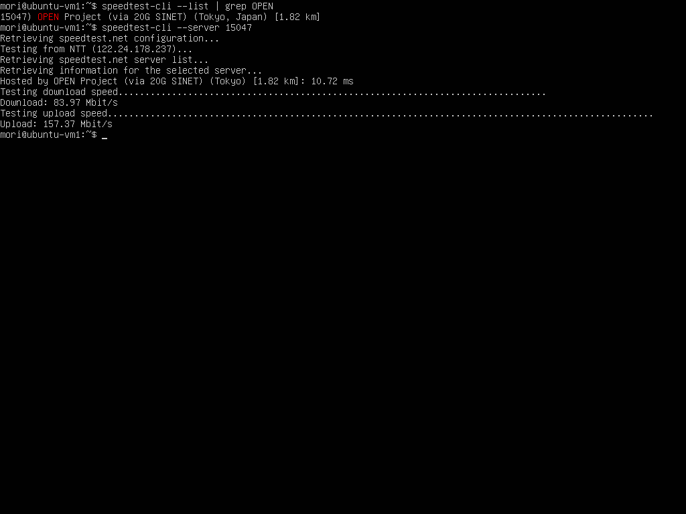

SR-IOV (Single Root I/O Virtualization) is a hardware feature that allows a single physical device to be recognized by a hypervisor as if it were multiple separate devices. For example, a machine with a single NIC that supports SR-IOV can be recognized as if it has multiple NICs by using SR-IOV, and each NIC can be passed through to the VM.

This page contains some notes on using SR-IOV with KVM.

## System Setup

- Hardware
  - CPU: Intel Core-i9 9900K
  - NIC: Intel Corporation I350 Gigabit Network Connection
  - Motherboard: PRIME H310M-AT R2.0
- OS
  - Host: Arch
  - Guest
    - VM1: ubuntu 20.04 server
    - VM2: ubuntu 20.04 server

## Configurations for BIOS

Enable VT-d in the BIOS.

## Enable SR-IOV

Create a configuration file `/etc/modprobe.d/igb.conf` for modprobe.

```sh
sudo vim /etc/modprobe.d/igb.conf
```

```text
options igb max_vfs=4
#blacklist igbvf
```

## Grub

To enable IOMMU, change the Grub configuration and add kernel options.

```sh
sudo vim /etc/default/grub
```

```diff
-GRUB_CMDLINE_LINUX_DEFAULT="loglevel=3 quiet"
+GRUB_CMDLINE_LINUX_DEFAULT="loglevel=3 quiet intel_iommu=on iommu=pt"
```

```sh
sudo grub-mkconfig -o /boot/grub/grub.cfg
reboot
```

### When the Error Occurs

Here is what to do if you get an error in dmesg.

```sh
sudo dmesg | grep igb
```

```text
[    2.070715] igb: Intel(R) Gigabit Ethernet Network Driver
[    2.070717] igb: Copyright (c) 2007-2014 Intel Corporation.
[    2.126386] igb 0000:01:00.0: added PHC on eth0
[    2.126389] igb 0000:01:00.0: Intel(R) Gigabit Ethernet Network Connection
[    2.126389] igb 0000:01:00.0: eth0: (PCIe:5.0Gb/s:Width x4) 80:61:5f:05:e2:ec
[    2.126465] igb 0000:01:00.0: eth0: PBA No: 106300-000
[    2.126465] igb 0000:01:00.0: Using MSI-X interrupts. 8 rx queue(s), 8 tx queue(s)
[    2.180163] igb 0000:01:00.1: added PHC on eth1
[    2.180164] igb 0000:01:00.1: Intel(R) Gigabit Ethernet Network Connection
[    2.180165] igb 0000:01:00.1: eth1: (PCIe:5.0Gb/s:Width x4) 80:61:5f:05:e2:ed
[    2.180238] igb 0000:01:00.1: eth1: PBA No: 106300-000
[    2.180239] igb 0000:01:00.1: Using MSI-X interrupts. 8 rx queue(s), 8 tx queue(s)
[    2.274584] igb 0000:01:00.0 enp1s0f0: renamed from eth0
[    2.317450] igb 0000:01:00.1 enp1s0f1: renamed from eth1
[    5.510141] igb 0000:01:00.0 enp1s0f0: igb: enp1s0f0 NIC Link is Up 1000 Mbps Full Duplex, Flow Control: RX/TX
[    6.363591] igb 0000:01:00.1 enp1s0f1: igb: enp1s0f1 NIC Link is Up 1000 Mbps Full Duplex, Flow Control: RX/TX
[  643.338345] igb 0000:01:00.0: can't enable 2 VFs (bus 02 out of range of [bus 01])
[  687.182846] igb 0000:01:00.0: can't enable 2 VFs (bus 02 out of range of [bus 01])
[  705.005251] igb 0000:01:00.0: can't enable 1 VFs (bus 02 out of range of [bus 01])
```

Add the following options to the kernel options in grub configuration.

```diff
-GRUB_CMDLINE_LINUX_DEFAULT="loglevel=3 quiet intel_iommu=on iommu=pt"
+GRUB_CMDLINE_LINUX_DEFAULT="loglevel=3 quiet intel_iommu=on iommu=pt pci=assign-busses"
```

> `pci=assign-busses`: Make the kernel always assign all PCI bus numbers
>
> https://tldp.org/HOWTO/BootPrompt-HOWTO-4.html

Create grub config file and reboot.

```sh
sudo grub-mkconfig -o /boot/grub/grub.cfg
reboot
```

> Check iommu_group
>
> ```sh
> find /sys/kernel/iommu_groups/ -type l
> ```

## Check support for ACS (Access Control Services)

The following is the list of PCI devices.

```sh
lspci | grep Ethernet
```

```text
01:00.0 Ethernet controller: Intel Corporation I350 Gigabit Network Connection (rev 01)
01:00.1 Ethernet controller: Intel Corporation I350 Gigabit Network Connection (rev 01)
02:10.0 Ethernet controller: Intel Corporation I350 Ethernet Controller Virtual Function (rev 01)
02:10.1 Ethernet controller: Intel Corporation I350 Ethernet Controller Virtual Function (rev 01)
02:10.4 Ethernet controller: Intel Corporation I350 Ethernet Controller Virtual Function (rev 01)
02:10.5 Ethernet controller: Intel Corporation I350 Ethernet Controller Virtual Function (rev 01)
02:11.0 Ethernet controller: Intel Corporation I350 Ethernet Controller Virtual Function (rev 01)
02:11.1 Ethernet controller: Intel Corporation I350 Ethernet Controller Virtual Function (rev 01)
02:11.4 Ethernet controller: Intel Corporation I350 Ethernet Controller Virtual Function (rev 01)
02:11.5 Ethernet controller: Intel Corporation I350 Ethernet Controller Virtual Function (rev 01)
04:00.0 Ethernet controller: Realtek Semiconductor Co., Ltd. RTL8111/8168/8411 PCI Express Gigabit Ethernet Controller (rev 15)
```

Check if ACS is supported.

```sh
sudo lspci -vv | grep "Access Control Services" -C 5
```

```text
...
        Kernel driver in use: pcieport

00:1d.0 PCI bridge: Intel Corporation 200 Series PCH PCI Express Root Port #11 (rev f0) (prog-if 00 [Normal decode])
--
                Device specific mode supported
                Steering table in TPH capability structure
        Capabilities: [1c0 v1] Latency Tolerance Reporting
                Max snoop latency: 71680ns
                Max no snoop latency: 71680ns
        Capabilities: [1d0 v1] Access Control Services
                ACSCap: SrcValid- TransBlk- ReqRedir- CmpltRedir- UpstreamFwd- EgressCtrl- DirectTrans-
                ACSCtl: SrcValid- TransBlk- ReqRedir- CmpltRedir- UpstreamFwd- EgressCtrl- DirectTrans-
        Kernel driver in use: igb
        Kernel modules: igb

--
                Region 3: Memory at 00000000c8060000 (64-bit, prefetchable)
                VF Migration: offset: 00000000, BIR: 0
        Capabilities: [1a0 v1] Transaction Processing Hints
...
```

```text
        Capabilities: [1d0 v1] Access Control Services
                ACSCap: SrcValid- TransBlk- ReqRedir- CmpltRedir- UpstreamFwd- EgressCtrl- DirectTrans-
                ACSCtl: SrcValid- TransBlk- ReqRedir- CmpltRedir- UpstreamFwd- EgressCtrl- DirectTrans-
```

ACSCap is the ACS Capability, +/- indicates supported/not supported.

ACSCtl is the ACS capability that is enabled, +/- indicates enabled/disabled.

## ACS Override Patch

Install linux-vfio and overwrite ACS.

```sh
paru -S linux-vfio
```

Add kernel options and update the grub configuration.

```sh
sudo vim /etc/default/grub
```

```diff
-GRUB_CMDLINE_LINUX_DEFAULT="loglevel=3 quiet intel_iommu=on iommu=pt pci=assign-busses"
+GRUB_CMDLINE_LINUX_DEFAULT="loglevel=3 quiet intel_iommu=on iommu=pt pci=assign-busses pcie_acs_override=downstream"
```

```sh
sudo grub-mkconfig -o /boot/grub/grub.cfg
reboot
```

## Create VMs

Create a VM in Virtual Machine Manager.








## IP info

The network information before and after starting the VM is as follows.

- Before:

```sh
ip a | grep enp1s
```

```text
3: enp1s0f0: <BROADCAST,MULTICAST,UP,LOWER_UP> mtu 1500 qdisc mq state UP group default qlen 1000
    inet 192.168.0.170/24 brd 192.168.0.255 scope global dynamic noprefixroute enp1s0f0
4: enp1s0f1: <BROADCAST,MULTICAST,UP,LOWER_UP> mtu 1500 qdisc mq state UP group default qlen 1000
    inet 192.168.0.171/24 brd 192.168.0.255 scope global dynamic noprefixroute enp1s0f1
6: enp1s0f0v1: <BROADCAST,MULTICAST,UP,LOWER_UP> mtu 1500 qdisc fq_codel state UP group default qlen 1000
    inet 192.168.0.110/24 brd 192.168.0.255 scope global dynamic noprefixroute enp1s0f0v1
7: enp1s0f0v2: <BROADCAST,MULTICAST,UP,LOWER_UP> mtu 1500 qdisc fq_codel state UP group default qlen 1000
    inet 192.168.0.111/24 brd 192.168.0.255 scope global dynamic noprefixroute enp1s0f0v2
8: enp1s0f0v3: <BROADCAST,MULTICAST,UP,LOWER_UP> mtu 1500 qdisc fq_codel state UP group default qlen 1000
    inet 192.168.0.212/24 brd 192.168.0.255 scope global dynamic noprefixroute enp1s0f0v3
10: enp1s0f1v1: <BROADCAST,MULTICAST,UP,LOWER_UP> mtu 1500 qdisc fq_codel state UP group default qlen 1000
    inet 192.168.0.197/24 brd 192.168.0.255 scope global dynamic noprefixroute enp1s0f1v1
11: enp1s0f1v2: <BROADCAST,MULTICAST,UP,LOWER_UP> mtu 1500 qdisc fq_codel state UP group default qlen 1000
    inet 192.168.0.191/24 brd 192.168.0.255 scope global dynamic noprefixroute enp1s0f1v2
12: enp1s0f1v3: <BROADCAST,MULTICAST,UP,LOWER_UP> mtu 1500 qdisc fq_codel state UP group default qlen 1000
    inet 192.168.0.117/24 brd 192.168.0.255 scope global dynamic noprefixroute enp1s0f1v3
19: enp1s0f0v0: <BROADCAST,MULTICAST,UP,LOWER_UP> mtu 1500 qdisc fq_codel state UP group default qlen 1000
    inet 192.168.0.199/24 brd 192.168.0.255 scope global dynamic noprefixroute enp1s0f0v0
20: enp1s0f1v0: <BROADCAST,MULTICAST,UP,LOWER_UP> mtu 1500 qdisc fq_codel state UP group default qlen 1000
    inet 192.168.0.136/24 brd 192.168.0.255 scope global dynamic noprefixroute enp1s0f1v0
```

- After:

```sh
ip a | grep enp1s
```

```text
3: enp1s0f0: <BROADCAST,MULTICAST,UP,LOWER_UP> mtu 1500 qdisc mq state UP group default qlen 1000
    inet 192.168.0.170/24 brd 192.168.0.255 scope global dynamic noprefixroute enp1s0f0
4: enp1s0f1: <BROADCAST,MULTICAST,UP,LOWER_UP> mtu 1500 qdisc mq state UP group default qlen 1000
    inet 192.168.0.171/24 brd 192.168.0.255 scope global dynamic noprefixroute enp1s0f1
6: enp1s0f0v1: <BROADCAST,MULTICAST,UP,LOWER_UP> mtu 1500 qdisc fq_codel state UP group default qlen 1000
    inet 192.168.0.110/24 brd 192.168.0.255 scope global dynamic noprefixroute enp1s0f0v1
7: enp1s0f0v2: <BROADCAST,MULTICAST,UP,LOWER_UP> mtu 1500 qdisc fq_codel state UP group default qlen 1000
    inet 192.168.0.111/24 brd 192.168.0.255 scope global dynamic noprefixroute enp1s0f0v2
8: enp1s0f0v3: <BROADCAST,MULTICAST,UP,LOWER_UP> mtu 1500 qdisc fq_codel state UP group default qlen 1000
    inet 192.168.0.212/24 brd 192.168.0.255 scope global dynamic noprefixroute enp1s0f0v3
10: enp1s0f1v1: <BROADCAST,MULTICAST,UP,LOWER_UP> mtu 1500 qdisc fq_codel state UP group default qlen 1000
    inet 192.168.0.197/24 brd 192.168.0.255 scope global dynamic noprefixroute enp1s0f1v1
11: enp1s0f1v2: <BROADCAST,MULTICAST,UP,LOWER_UP> mtu 1500 qdisc fq_codel state UP group default qlen 1000
    inet 192.168.0.191/24 brd 192.168.0.255 scope global dynamic noprefixroute enp1s0f1v2
12: enp1s0f1v3: <BROADCAST,MULTICAST,UP,LOWER_UP> mtu 1500 qdisc fq_codel state UP group default qlen 1000
    inet 192.168.0.117/24 brd 192.168.0.255 scope global dynamic noprefixroute enp1s0f1v3
```

## Speedtest

I ran a speed test on the host and VM to check the speed. I was expecting to get near-native speed with SR-IOV, but the overhead was unexpectedly large.

- Host

```test
mori@arch-server ~ % speedtest-cli --server 15047
Retrieving speedtest.net configuration...
Testing from NTT (122.24.178.237)...
Retrieving speedtest.net server list...
Retrieving information for the selected server...
Hosted by OPEN Project (via 20G SINET) (Tokyo) [1.82 km]: 50.513 ms
Testing download speed................................................................................
Download: 83.80 Mbit/s
Testing upload speed......................................................................................................
Upload: 98.05 Mbit/s
```

- VM1



- VM2


## References

https://downloadmirror.intel.com/13663/eng/readme_5.5.2.txt

https://qiita.com/m10i/items/980a350f898f28eac613

https://metonymical.hatenablog.com/entry/2018/04/11/193408

https://github.com/k8snetworkplumbingwg/sriov-network-device-plugin/blob/master/docs/vf-setup.md

https://www.heiko-sieger.info/iommu-groups-what-you-need-to-consider/

https://wiki.archlinux.org/index.php/PCI_passthrough_via_OVMF#Bypassing_the_IOMMU_groups_(ACS_override_patch)

https://access.redhat.com/documentation/ja-jp/red_hat_enterprise_linux/7/html/virtualization_deployment_and_administration_guide/sect-iommu-deep-dive

https://access.redhat.com/documentation/ja-jp/red_hat_enterprise_linux/7/html/virtualization_deployment_and_administration_guide/app-iommu
